# Vellum Assistant — Architecture

This file is the cross-system architecture index. Detailed designs live in domain docs close to code ownership.

## Architecture Docs

| Domain                                      | Architecture Doc                                                                                   |
| ------------------------------------------- | -------------------------------------------------------------------------------------------------- |
| Assistant runtime                           | [`assistant/ARCHITECTURE.md`](assistant/ARCHITECTURE.md)                                           |
| Gateway ingress/webhooks                    | [`gateway/ARCHITECTURE.md`](gateway/ARCHITECTURE.md)                                               |
| Clients (macOS, browser extension)          | [`clients/ARCHITECTURE.md`](clients/ARCHITECTURE.md)                                               |
| Apps (end-user surfaces, scaffold)          | [`apps/README.md`](apps/README.md)                                                                 |
| Assistant memory deep dive                  | [`assistant/docs/architecture/memory.md`](assistant/docs/architecture/memory.md)                   |
| Assistant integrations deep dive            | [`assistant/docs/architecture/integrations.md`](assistant/docs/architecture/integrations.md)       |
| Assistant scheduling deep dive              | [`assistant/docs/architecture/scheduling.md`](assistant/docs/architecture/scheduling.md)           |
| Assistant security deep dive                | [`assistant/docs/architecture/security.md`](assistant/docs/architecture/security.md)               |
| macOS keychain broker (removed, historical) | [`assistant/docs/architecture/keychain-broker.md`](assistant/docs/architecture/keychain-broker.md) |
| Trusted contact access design               | [`assistant/docs/trusted-contact-access.md`](assistant/docs/trusted-contact-access.md)             |
| Trusted contacts operator runbook           | [`assistant/docs/runbook-trusted-contacts.md`](assistant/docs/runbook-trusted-contacts.md)         |
| Credential Execution Service (CES)          | [`assistant/docs/credential-execution-service.md`](assistant/docs/credential-execution-service.md) |
| Environment and data layout                 | [Environment and Data Layout](#environment-and-data-layout) (this file)                            |
| Multi-local instance isolation              | [Multi-Local Instance Isolation](#multi-local-instance-isolation) (this file)                      |
| Docker volume architecture                  | [Docker Volume Architecture](#docker-volume-architecture) (this file)                              |
| Service communication matrix                | [`docs/service-communication-matrix.md`](docs/service-communication-matrix.md)                     |

## Cross-Cutting Invariants

- Public ingress is gateway-only; external webhook/API routes are implemented in `gateway/` and forwarded internally.
- Bundled-skill outbound API calls that require credentials use the Credential Execution Service (CES) tools (`make_authenticated_request`, `run_authenticated_command`) rather than manual token plumbing or proxied shell execution. See `assistant/docs/credential-execution-service.md`.
- Managed shared-identity channel routing runs in a separate managed-gateway service lane from the per-assistant `gateway/` lane. The deployable managed-gateway runtime is platform-owned; this repo keeps public contracts/fixtures under `gateway-managed/`.
- Production LLM calls go through the provider abstraction, not provider SDKs in feature code.
- Notification producers emit through `emitNotificationSignal()` to preserve decisioning and audit invariants. Reminder routing metadata (`routingIntent`, `routingHints`) flows through the signal and is enforced post-decision to control multi-channel fanout. The decision engine produces per-channel conversation actions (`start_new` / `reuse_existing`) validated against a candidate set; `notification_conversation_created` is emitted only on actual creation, not on reuse.
- Memory extraction/recall must enforce actor-role provenance gates for untrusted actors.
- **Credential Execution Service (CES)** is a separate top-level package (`credential-executor/`) and a separate managed container image that enforces hard process-boundary isolation for credential-bearing operations. The assistant communicates with CES exclusively via RPC (stdio JSON-RPC locally, Unix socket in managed). In Docker mode, the assistant and gateway also access credential CRUD operations via the CES HTTP API (`CES_CREDENTIAL_URL`), authenticated with `CES_SERVICE_TOKEN`. CES exposes three tools (`run_authenticated_command`, `make_authenticated_request`, `manage_secure_command_tool`) as a deliberate exception to the skill-first tool direction — these require hard isolation that skills cannot provide. Shared contract types, credential-storage abstractions, egress-proxy session management, and typed service clients live in seven private packages under `packages/` — these are the only allowed shared-code path; direct source imports between `assistant/` and `credential-executor/` remain banned:
  - `@vellumai/service-contracts` — CES wire-protocol schemas (RPC methods, handshake types, Zod validators) and shared trust-rule types. Consumed via explicit domain subpaths: `@vellumai/service-contracts/credential-rpc`, `@vellumai/service-contracts/trust-rules`, `@vellumai/service-contracts/handles`, `@vellumai/service-contracts/grants`, `@vellumai/service-contracts/rpc`, `@vellumai/service-contracts/rendering`, `@vellumai/service-contracts/error`.
  - `@vellumai/credential-storage` — Credential-storage abstractions shared by assistant and CES.
  - `@vellumai/egress-proxy` — Egress-proxy session management for CES secure commands.
  - `@vellumai/gateway-client` — Typed HTTP client for assistant-to-gateway calls (trust API, feature flags, log export, deliver).
  - `@vellumai/assistant-client` — Typed HTTP client for gateway-to-assistant calls (runtime proxy, export).
  - `@vellumai/ces-client` — Typed HTTP and RPC client for assistant/gateway-to-CES calls (credential CRUD, log export, RPC handshake/envelope). Sub-module exports: `@vellumai/ces-client/http-credentials`, `@vellumai/ces-client/http-log-export`, `@vellumai/ces-client/rpc-client`.

  Secure commands are manifest-driven: each bundle declares an auth adapter (`env_var`, `temp_file`, or `credential_process`), an egress mode (`proxy_required` or `no_network`), and allowed argv patterns; generic HTTP clients, interpreters, and shell trampolines are structurally denied as entrypoints. CES-owned durable state (grants and audit logs) is never read or written by the assistant directly. Credential key files (`keys.enc`, `store.key`) are stored on the CES security volume (`/ces-security`) in Docker mode — no other container has access to this volume. `host_bash` is outside the strong CES secrecy guarantee. Response/output filtering (header stripping, body clamping, secret scrubbing) is defense-in-depth, not the primary protection. Managed rollout requires a third runtime image alongside the assistant and gateway images, with corresponding `vembda` pod-template changes; rollout is gated by five feature flags (`ces-tools`, `ces-shell-lockdown`, `ces-secure-install`, `ces-grant-audit`, `ces-managed-sidecar`; keys are simple kebab-case, e.g. `ces-tools`), all defaulting to off. See [`assistant/docs/credential-execution-service.md`](assistant/docs/credential-execution-service.md).

- Trusted contact ingress ACL is channel-agnostic; identity binding adapts per channel (chat ID, E.164 phone, external user ID) without channel-specific branching.
- macOS managed sign-in connects the desktop app to a platform-hosted assistant via Django assistant-scoped proxy endpoints (`/v1/assistants/{id}/...`). The `HTTPDaemonClient` operates in `platformAssistantProxy` route mode with `X-Session-Token` auth. Managed lockfile entries have `cloud: "vellum"`. Startup guardrails skip local daemon hatching and actor credential bootstrap. See [`clients/ARCHITECTURE.md`](clients/ARCHITECTURE.md) for the full flow.
- **Assistant feature flags** control skill availability at runtime. The canonical key format is simple kebab-case (e.g., `browser`, `ces-tools`); the legacy `feature_flags.<id>.enabled` and `skills.<id>.enabled` formats are no longer supported. All declared flags live in the unified registry at `meta/feature-flags/feature-flag-registry.json`, scoped by `scope` (`assistant` or `client`). Labels come from the registry. Bundled copies exist at `assistant/src/config/feature-flag-registry.json` and `gateway/src/feature-flag-registry.json`. The gateway owns the `/v1/feature-flags` REST API and the IPC `get_feature_flags` method (see [`gateway/ARCHITECTURE.md`](gateway/ARCHITECTURE.md)); the assistant resolves effective flag state via IPC to the gateway socket (`gateway.sock`) — see [`assistant/ARCHITECTURE.md`](assistant/ARCHITECTURE.md). When a flag is OFF, the corresponding skill is excluded from all exposure surfaces: client skill lists, system prompt catalog, `skill_load`, runtime tool projection, and included child skills. Guard tests enforce that all flag keys in code use the canonical format and that all referenced flags are declared in the unified registry.
- **Safe storage limits** are entirely gated by the assistant feature flag `safe-storage-limits`. When enabled and workspace disk usage reaches the critical 95% threshold, the assistant enters storage cleanup mode: background work is skipped, remote ingress including trusted-contact messages is blocked, local guardian turns get cleanup-specific runtime instructions, and clients must show acknowledgement/status UI until enough space is freed or the guardian explicitly overrides the lock. See [Safe Storage Limits](#safe-storage-limits).
- **Permission controls v2** removes deterministic tool-by-tool approval friction for assistant-owned actions. Under `permission-controls-v2`, the only built-in deterministic approval surface is conversation-scoped host computer access for `host_*` / host-target tools. All other assistant-owned tool usage relies on model-mediated consent, not temporary approvals, wildcard scopes, per-tool persistence, or network/side-effect approval cards. Cross-principal identity checks (for example unknown actors) still fail closed deterministically.
- **Context overflow resilience**: The session loop implements a deterministic overflow convergence pipeline that recovers from context-too-large failures without surfacing errors to users. A preflight budget check catches overflow before provider calls; a tiered reducer (forced compaction, tool-result truncation, media stubbing, injection downgrade) iteratively shrinks the payload; and when all tiers are exhausted the overflow policy resolver auto-compresses the latest turn with no user prompt — this applies equally to interactive and non-interactive sessions. Setting `contextWindow.overflowRecovery.interactiveLatestTurnCompression` to `"drop"` opts interactive sessions out, and `contextWindow.overflowRecovery.nonInteractiveLatestTurnCompression: "drop"` opts non-interactive/background sessions out independently — either short-circuits to a graceful failure for that session type; setting `contextWindow.overflowRecovery.enabled: false` also yields a graceful failure. Config lives under `contextWindow.overflowRecovery`. See [`assistant/ARCHITECTURE.md`](assistant/ARCHITECTURE.md#context-overflow-recovery) for the full design and [`assistant/docs/architecture/memory.md`](assistant/docs/architecture/memory.md#context-compaction-and-overflow-recovery-interaction) for compaction interaction details.

## Environment and Data Layout

Environments are **namespaces**, not containers. `VELLUM_ENVIRONMENT` selects a path prefix (`vellum` for `production`, `vellum-<env>` for the non-production seeds `dev`, `staging`, `test`, `local`). It does not own data. Data directories are always per-assistant, and the lockfile's `resources.instanceDir` field is the source of truth for any given assistant's on-disk location.

### Per-assistant data directories

Every local assistant's daemon root is `<resources.instanceDir>/.vellum/`. The CLI passes per-instance paths to spawned daemons and gateways via explicit environment variables: `VELLUM_WORKSPACE_DIR` (workspace data), `GATEWAY_SECURITY_DIR` (gateway security state), and `CREDENTIAL_SECURITY_DIR` (CES key stores). `assistant/src/util/platform.ts:vellumRoot` resolves the root from `VELLUM_WORKSPACE_DIR` when set, falling back to `join(homedir(), ".vellum")`. All root-level state (PID file, `.env`, `runtime-port`, `protected/` with its encrypted keys, trust rules, credentials, capability token, etc.) and the workspace directory derive from these helpers.

Allocation of `instanceDir` for new hatches:

| Environment                     | `instanceDir` path                               |
| ------------------------------- | ------------------------------------------------ |
| `production`                    | `$XDG_DATA_HOME/vellum/assistants/<name>/`       |
| non-production (`vellum-<env>`) | `$XDG_DATA_HOME/vellum-<env>/assistants/<name>/` |

There is no "first local" special case — every new hatch goes through the same allocator (`cli/src/lib/assistant-config.ts:allocateLocalResources`) and lands under the XDG multi-instance tree. `~/.vellum/` is never an allocation target; it is only reached via existing lockfile entries whose `instanceDir = homedir()` was recorded before this change.

### Lockfile

| Environment    | Canonical path                                | Read fallback                             |
| -------------- | --------------------------------------------- | ----------------------------------------- |
| `production`   | `~/.vellum.lock.json`                         | `~/.vellum.lockfile.json` (legacy rename) |
| non-production | `$XDG_CONFIG_HOME/vellum-<env>/lockfile.json` | (none — new path)                         |

The CLI routes all lockfile reads/writes through `cli/src/lib/environments/paths.ts:getLockfilePath` / `getLockfilePaths` so non-production environments land in the env-scoped XDG config tree. The parent directory is created on first write.

### Config directory (XDG-shared auth state)

| Environment    | Config dir                       |
| -------------- | -------------------------------- |
| `production`   | `$XDG_CONFIG_HOME/vellum/`       |
| non-production | `$XDG_CONFIG_HOME/vellum-<env>/` |

Platform tokens (`platform-token`), device IDs (`device-id`), and guardian tokens (`assistants/<id>/guardian-token.json`) live under the env-scoped config dir. The CLI (`cli/src/lib/platform-client.ts`, `cli/src/lib/guardian-token.ts`), the daemon (`assistant/src/util/platform.ts:getXdgPlatformTokenPath`, `getXdgVellumConfigDirName`), and the Swift client (`clients/shared/Utilities/VellumPaths.swift:configDir`) all agree on the same env-scoped path, so `vellum login`, guardian leasing, persisted device IDs, and desktop session state never bleed between environments.

### Backwards compatibility

Backwards compatibility lives entirely in the read path — no on-disk migration is performed.

- Existing production lockfile entries with `instanceDir = homedir()` continue to work: the daemon receives `VELLUM_WORKSPACE_DIR = homedir()/.vellum/workspace` and resolves to `~/.vellum/` exactly as before.
- Production writes still go to the legacy `~/.vellum.lock.json` filename; the rename-era `~/.vellum.lockfile.json` is accepted as a read fallback.
- Unknown values of `VELLUM_ENVIRONMENT` (anything outside the seed table) resolve to `vellum` rather than a fabricated `vellum-<garbage>` directory, so misconfiguration degrades gracefully to the production path.

### Mixed local/remote and targeting

The lockfile can contain both local and remote entries side-by-side. Remote entries (`cloud: "gcp"`, `"aws"`, `"vellum"`, `"custom"`) carry connection metadata (`runtimeUrl`, `bearerToken`, etc.) but no `resources` block. `wake` and `sleep` only operate on local entries. `retire` works on both and dispatches per-cloud teardown for remote entries. CLI commands resolve which instance to target via `resolveTargetAssistant()` in the order: explicit name argument → `activeAssistant` field (set by `vellum use`) → sole local assistant.

## Multi-Local Instance Isolation

Multiple local assistant instances can run side-by-side on the same machine, each fully isolated. This enables development, testing, or running multiple assistants concurrently without conflicts.

### Instance directory layout

Each named instance gets its own directory tree. The exact location depends on environment and whether the lockfile entry predates the env-aware allocator (see [Environment and Data Layout](#environment-and-data-layout) for allocation rules). For a production install of two new assistants `alice` and `bob`:

```
~/.vellum.lock.json                                       # Global lockfile
~/.local/share/vellum/assistants/
├── alice/                                                # instanceDir for alice
│   └── .vellum/                                          # Daemon root (vellumRoot())
│       ├── vellum.pid                                    # Daemon PID (duplicated by the CLI on spawn)
│       ├── gateway.pid
│       ├── ngrok.pid
│       ├── runtime-port
│       ├── .env
│       ├── protected/                                    # keys.enc, trust.json, credentials/, ...
│       └── workspace/
│           ├── config.json
│           ├── data/
│           │   ├── db/assistant.db
│           │   ├── qdrant/
│           │   └── logs/
│           └── skills/
└── bob/
    └── .vellum/
        └── ...                                           # Same structure as alice
```

An existing production lockfile entry created before env-aware allocation may still have `instanceDir = ~` and all of its state under `~/.vellum/`. That path is preserved via the lockfile read path — no data is moved. Non-production (`vellum-<env>`) hatches use the same layout under `$XDG_DATA_HOME/vellum-<env>/assistants/<name>/`.

All instances are created with explicit names via `vellum hatch --name <name>`.

### Isolation model

Each instance gets its own:

- **`VELLUM_WORKSPACE_DIR`**: Set to `<instanceDir>/.vellum/workspace`. The daemon resolves all workspace state (DB, logs, memory indices) relative to this directory.
- **`GATEWAY_SECURITY_DIR`** / **`CREDENTIAL_SECURITY_DIR`**: Set to `<instanceDir>/.vellum/protected`. The gateway and credential-executor resolve their security state (keys, trust rules, credentials) relative to these directories.
- **Daemon port** (`RUNTIME_HTTP_PORT`), **Gateway port** (`GATEWAY_PORT`), **Qdrant port** (`QDRANT_HTTP_PORT`): Allocated by scanning upward from the environment's base port — see "Port allocation" below.
- **PID file**: `<instanceDir>/.vellum/vellum.pid`
- **SQLite database, logs, memory indices**: All under `<instanceDir>/.vellum/workspace/data/`

### Port allocation

`allocateLocalResources()` in `cli/src/lib/assistant-config.ts` takes each service's base port from `getDefaultPorts(env)` and scans upward for the first port not bound by another local instance in that env's lockfile. Each environment has its own disjoint port window so running prod + non-prod assistants side by side doesn't collide; the concrete numbers live in `cli/src/lib/environments/seeds.ts`. Allocated ports are persisted in the lockfile `resources` field so `wake`/`sleep` restart instances on the same ports.

### Lockfile schema

The production lockfile (`~/.vellum.lock.json`) tracks all instances:

```jsonc
{
  "assistants": [
    {
      "assistantId": "alice",
      "runtimeUrl": "http://localhost:7821",
      "cloud": "local",
      "hatchedAt": "2026-03-04T...",
      "resources": {                    // Present for local entries
        "instanceDir": "~/.local/share/vellum/assistants/alice",
        "daemonPort": 7821,
        "gatewayPort": 7830,
        "qdrantPort": 6333,
        "pidFile": "~/.local/share/vellum/assistants/alice/.vellum/vellum.pid"
      }
    },
    {
      "assistantId": "bob",
      "runtimeUrl": "http://localhost:7822",
      "cloud": "local",
      "resources": { ... }
    }
  ],
  "activeAssistant": "alice"           // Set by `vellum use <name>`
}
```

- `resources` (`LocalInstanceResources`): Present on all local entries. Contains per-instance ports and paths.
- `activeAssistant`: Determines which instance CLI commands target by default.
- Remote assistants (`cloud: "gcp"`, `"aws"`, `"vellum"`, etc.) are unaffected and have no `resources` field.
- Non-production environments use `$XDG_CONFIG_HOME/vellum-<env>/lockfile.json` with the same schema.

## Docker Volume Architecture

Docker instances use dedicated volumes with per-service access boundaries instead of a single shared data volume. This enforces least-privilege: each service only has filesystem access to the data it owns. The assistant container also owns a dedicated `dockerd-data` volume that backs the inner Docker engine used by the Meet subsystem — see [Meet Docker-in-Docker Model](#meet-docker-in-docker-model) below.

### Volume Layout

```
<instance-name>-workspace       →  /workspace           (assistant: rw, gateway: rw, CES: ro)
<instance-name>-gateway-sec     →  /gateway-security    (gateway only)
<instance-name>-ces-sec         →  /ces-security        (CES only)
<instance-name>-socket          →  /run/ces-bootstrap   (assistant + CES)
<instance-name>-gateway-ipc     →  /run/gateway-ipc     (assistant + gateway)
<instance-name>-assistant-ipc   →  /run/assistant-ipc   (assistant + gateway)
<instance-name>-dockerd-data    →  /var/lib/docker      (assistant only — inner dockerd state)
```

- **Workspace volume** (`/workspace`): Shared state — config, conversations, apps, skills, database, logs. Set via `VELLUM_WORKSPACE_DIR=/workspace`. The assistant and gateway have read-write access; the CES mounts it read-only (for config reading).
- **Gateway security volume** (`/gateway-security`): Files private to the gateway container. Only the gateway container mounts this volume. Set via `GATEWAY_SECURITY_DIR=/gateway-security`.
- **CES security volume** (`/ces-security`): Credential encryption keys (`keys.enc`, `store.key`). Only the CES container mounts this volume. Set via `CREDENTIAL_SECURITY_DIR=/ces-security`.
- **Socket volume** (`/run/ces-bootstrap`): CES bootstrap socket for initial service handshake between the assistant and CES containers.
- **Gateway IPC volume** (`/run/gateway-ipc`): Contains `gateway.sock` — the Unix domain socket used for assistant→gateway IPC calls (feature flags, trust rules, credentials). Set via `GATEWAY_IPC_SOCKET_DIR=/run/gateway-ipc`.
- **Assistant IPC volume** (`/run/assistant-ipc`): Contains `assistant.sock` — the Unix domain socket used for gateway→assistant reverse IPC calls. Set via `ASSISTANT_IPC_SOCKET_DIR=/run/assistant-ipc`.
- **Inner dockerd data volume** (`/var/lib/docker`): Persistent storage for the `dockerd` that runs _inside_ the assistant container. Holds the pulled meet-bot image and any in-flight bot container state so image pulls don't repeat on every assistant restart. Only the assistant container mounts this volume.

### Meet Docker-in-Docker Model

In Docker mode, Meet bots are **nested** containers spawned by a `dockerd` running _inside_ the assistant container. The assistant container runs an init supervisor that starts both the daemon and a local `dockerd`; the Meet subsystem connects to that inner engine and spawns bot containers as children of the assistant container.

```
  host Docker Engine
        |
        +--- assistant ct. (privileged)
        |       |
        |       +--- (inner) dockerd
        |       |        |
        |       |        +--- meet-bot ct. (per meeting)
        |       |        +--- meet-bot ct. (per meeting)
        |       |
        |       +--- /workspace (<name>-workspace)
        |
        +--- gateway ct.
        +--- CES ct.
```

Each bot container receives a bind of `/workspace` sourced from the assistant's own `/workspace` mount, so the bot can drop transcripts, audio, and metadata into `/workspace/meets/<meetingId>/` where the assistant can read them back. Bots have no access to the gateway-security or CES-security volumes.

**Bot lifecycle is coupled to the assistant container.** Because the inner `dockerd` process runs inside the assistant container, if that container dies the inner engine dies with it and every bot container is torn down automatically. There are no orphan bot containers on the host — `docker ps` on the host only ever lists the assistant/gateway/CES containers.

**Bare-metal fallback.** When the assistant runs directly on the host (bare-metal / local-dev mode) there is no inner `dockerd`; the daemon connects to the host's Docker engine and spawns bot containers as _siblings_ of the assistant process. In that configuration host-level `docker ps` does see each bot, and an ungraceful assistant exit can leave orphan bot containers — the meet-bot image's built-in max-meeting-minutes timeout caps their lifetime.

**Security boundary — single-user local only.** The Docker-in-Docker model requires the assistant container to run with `--privileged`, or at minimum `CAP_SYS_ADMIN` + `CAP_NET_ADMIN`, so the inner `dockerd` can set up cgroups, overlay mounts, and container networks. This is acceptable for single-user local deployments where the assistant already runs with the user's privileges. It is **not** acceptable as-is for managed/multi-tenant mode: Kubernetes deployments must configure Pod Security Admission to allow this privilege level on the assistant pod, or swap in a different bot-spawn model (e.g. a Kubernetes job runner or a dedicated bot-scheduler service) before Meet can ship to managed instances. Managed Meet support is explicitly out of scope for this Docker-in-Docker approach — see [`vellum-assistant-platform`](../vellum-assistant-platform).

### Cross-Service Access Patterns

For the full inventory of every assistant/gateway/CES communication direction, protocol, and callsite, see the [Service Communication Matrix](docs/service-communication-matrix.md).

In Docker mode (`IS_CONTAINERIZED=true`), services that need data from another service's security domain use HTTP APIs instead of direct filesystem access:

- **Trust rules**: The assistant reads/writes trust rules via the gateway's HTTP trust API. The gateway owns the filesystem copy at `/gateway-security/trust.json`.
- **Credentials**: The assistant and gateway access credential CRUD via the CES HTTP API (`CES_CREDENTIAL_URL`), authenticated with `CES_SERVICE_TOKEN`. The CES owns the encryption keys at `/ces-security/`.
- **Contacts (auth/authz)**: The gateway owns `contacts` and `contact_channels` tables in its SQLite database (`/gateway-security/gateway.sqlite`). These tables store contact authentication and authorization data — who can talk to the assistant and what their channel policies are. The assistant daemon reads contact auth/authz data via IPC (`get_contact`, `list_contacts`, `get_contact_by_channel`, `get_channels_for_contact`). The assistant retains ownership of contact **context** (conversation history, memory associations, display preferences) in its own database. This separation is in progress — the gateway tables are declared and IPC handlers are wired, but endpoint cutover and data migration are not yet complete.

### Signing Key Bootstrap Protocol

In Docker mode, the gateway and daemon must share the same actor-token signing key so both can mint and verify JWTs. The gateway owns the key and the daemon fetches it at startup:

1. **Gateway startup**: The gateway generates the signing key (or loads it from `/gateway-security/actor-token-signing-key`) and registers the `GET /internal/signing-key-bootstrap` endpoint.
2. **Daemon startup**: The daemon calls `resolveSigningKey()`, which detects Docker mode (`IS_CONTAINERIZED=true` + `GATEWAY_INTERNAL_URL` set) and calls `fetchSigningKeyFromGateway()`. This fetches the key from the gateway's bootstrap endpoint (retrying up to 30 times with 1s intervals to tolerate gateway startup delays).
3. **Lockfile guard**: After the first successful response, the gateway writes a lockfile (`signing-key-bootstrap.lock`) to prevent re-serving the key. Subsequent requests return 403.
4. **Local persistence**: The daemon persists the fetched key to its local filesystem (`protected/actor-token-signing-key`).
5. **Daemon restart**: On restart, the gateway returns 403 (lockfile present). The daemon catches `BootstrapAlreadyCompleted` and loads the key from its local disk copy.
6. **Docker upgrade**: The CLI's `hatch` command deletes the gateway lockfile before starting containers, allowing the bootstrap to repeat with a fresh daemon container.

In local mode (non-Docker), `resolveSigningKey()` delegates to `loadOrCreateSigningKey()`, which loads an existing key from disk or generates a new one — no network calls involved.

### Legacy Data Volume Migration

The former shared data volume (`<name>-data`) is no longer created for new instances. Existing instances that still have a data volume are migrated on startup: `migrateGatewaySecurityFiles()` copies `trust.json` and `actor-token-signing-key` to the gateway security volume, and `migrateCesSecurityFiles()` copies `keys.enc` and `store.key` to the CES security volume (with ownership set to the CES service user `1001:1001`). Both migrations are idempotent.

## System Overview

```mermaid
graph TB
    subgraph "macOS Menu Bar App (Swift)"
        subgraph "AppServices (singleton container)"
            DC_SWIFT["DaemonClient"]
            SURFACE_MGR["SurfaceManager<br/>route by display field"]
            ZOOM["ZoomManager<br/>(@Observable)"]
            SETTINGS_STORE["SettingsStore<br/>shared settings state"]
        end

        UI["UI Layer<br/>NSStatusItem + Popover<br/>SessionOverlay / ThinkingIndicator<br/>Onboarding / Settings"]
        TI["TaskInputView<br/>Text + Voice + Attachments"]
        CLS["Classifier<br/>Haiku direct call<br/>+ heuristic fallback"]

        subgraph "Computer Use Session"
            PERCEIVE["PERCEIVE<br/>AX Tree + Screenshot<br/>(parallel capture)"]
            VERIFY["VERIFY<br/>ActionVerifier<br/>safety checks"]
            EXECUTE["EXECUTE<br/>ActionExecutor<br/>CGEvent injection"]
            WAIT["WAIT<br/>Adaptive UI settle<br/>AX tree polling"]
        end

subgraph "Text Q&A Session"
            TEXT_SESS["TextSession<br/>streaming deltas"]
            TEXT_WIN["TextResponseWindow"]
        end

        subgraph "Main Window"
            MW_STATE["MainWindowState<br/>cross-view UI state"]
            CONV_MGR["ConversationManager<br/>conversation CRUD + delegate"]
            CONV_RESTORER["ConversationRestorer<br/>daemon conversation restoration"]
            CHAT_VM["ChatViewModel<br/>conversation bootstrap + streaming"]
            CHAT_VIEW["ChatView<br/>bubbles + composer + stop"]
        end

        subgraph "Debug Panel"
            TRACE_STORE["TraceStore<br/>in-memory, per-session<br/>dedup + retention cap"]
            DEBUG_PANEL["DebugPanel UI<br/>metrics strip + timeline"]
        end

        subgraph "Dynamic Workspace"
            WORKSPACE["WorkspaceView<br/>toolbar + WKWebView + composer + optional docked chat"]
            DYN_PAGE["DynamicPageSurfaceView<br/>WKWebView + widget injection"]
        end

        VOICE["VoiceInputManager<br/>Fn hold → SFSpeechRecognizer"]
        ATTACH["Attachment System<br/>images, PDFs, text<br/>drag/drop, paste, picker"]
        PERM["PermissionManager (macOS)<br/>Accessibility, Screen Recording,<br/>Microphone"]
    end

    subgraph "Daemon (Bun + TypeScript)"
        HTTP_RT["RuntimeHttpServer<br/>HTTP + SSE"]
        HANDLERS["Route Handlers<br/>conversation routing"]
        SESSION_MGR["Conversation Manager<br/>in-memory pool<br/>stale eviction"]

        subgraph "Onboarding Control Plane"
            PLAYBOOK_MGR["OnboardingPlaybookManager<br/>resolve + reconcile channel playbooks"]
            PLAYBOOK_REG["onboarding/playbooks/registry.json<br/>started-channel index"]
            ONBOARD_ORCH["OnboardingOrchestrator<br/>post-hatch sequence<br/>runtime onboarding-mode prompt"]
        end

        subgraph "Inference"
            ANTHROPIC["Anthropic Claude<br/>primary provider"]
            OPENAI["OpenAI<br/>secondary provider"]
            GEMINI["Google Gemini<br/>secondary provider"]
            OLLAMA["Ollama<br/>local models"]
        end

        subgraph "Memory System"
            CONV_STORE["ConversationStore<br/>Drizzle ORM CRUD"]
            INDEXER["Memory Indexer<br/>segment + extract"]
            RECALL["Memory Recall<br/>Hybrid Search (dense + sparse RRF)<br/>Tier Classification + Staleness<br/>Scope Filtering + Two-Layer Injection"]
            JOBS_WORKER["MemoryJobsWorker<br/>poll every 1.5s<br/>embed, extract, cleanup_stale"]
        end

        subgraph "SQLite Database (~/.vellum/workspace/data/db/assistant.db)"
            DB_CONV["conversations"]
            DB_MSG["messages"]
            DB_TOOL["tool_invocations"]
            DB_SEG["memory_segments"]
            DB_ITEMS["memory_items"]
            DB_SRC["memory_item_sources"]
            DB_SUM["memory_summaries"]
            DB_EMB["memory_embeddings"]
            DB_JOBS["memory_jobs"]
            DB_ATTACH["attachments"]
            DB_CHAN["channel_inbound_events"]
            DB_KEYS["conversation_keys"]
            DB_REMINDERS["reminders<br/>(routing_intent, routing_hints_json)"]
            DB_SCHED_JOBS["cron_jobs (recurrence schedules)"]
            DB_SCHED_RUNS["cron_runs (schedule execution history)"]
            DB_TASKS["tasks"]
            DB_TASK_RUNS["task_runs"]
            DB_WORK_ITEMS["work_items"]
            DB_CONTACTS["contacts<br/>(migrating to gateway)"]
        end

        subgraph "Tracing"
            TRACE_EMITTER["TraceEmitter<br/>per-session, monotonic seq"]
            TOOL_TRACE["ToolTraceListener<br/>event bus subscriber"]
            EVENT_BUS["EventBus<br/>domain events"]
        end

        subgraph "Skill Tool System"
            SKILL_CATALOG["Skill Catalog<br/>bundled + managed + workspace + extra"]
            SKILL_MANIFEST["SKILL.md + TOOLS.json<br/>per-skill directory"]
            SKILL_PROJECTION["projectSkillTools()<br/>session-level projection"]
            SKILL_DERIVE["deriveActiveSkills()<br/>scan &lt;loaded_skill&gt; markers"]
            SKILL_FACTORY["SkillToolFactory<br/>manifest → Tool objects"]
            SKILL_HOST_RUNNER["Host Script Runner<br/>in-process import + run()"]
            SKILL_SANDBOX_RUNNER["Sandbox Script Runner<br/>isolated subprocess"]
        end

        subgraph "Integrations"
            INT_REGISTRY["IntegrationRegistry<br/>in-memory definitions"]
            INT_OAUTH["OAuth2 PKCE Flow<br/>gateway callback transport"]
            INT_TOKEN["TokenManager<br/>auto-refresh + retry"]
            GMAIL_CLIENT["GmailClient<br/>REST API wrapper"]
            GMAIL_TOOLS["Gmail Tools<br/>(bundled skill: gmail)"]
        end

        subgraph "Script Proxy"
            PROXY_SESSION["SessionManager<br/>per-conversation proxy sessions"]
            PROXY_SERVER["ProxyServer<br/>HTTP forward + CONNECT"]
            PROXY_ROUTER["Router<br/>MITM vs tunnel decision"]
            PROXY_POLICY["PolicyEngine<br/>credential template matching"]
            PROXY_MITM["MITM Handler<br/>TLS termination + rewrite"]
            PROXY_CERTS["Cert Manager<br/>local CA + leaf certs"]
            PROXY_APPROVAL["ApprovalCallback<br/>→ PermissionPrompter"]
        end

        subgraph "Conversation Disk View"
            DISK_VIEW["conversation-disk-view.ts<br/>init, sync, remove, flatten"]
        end

    end

    subgraph "Gateway (Bun + TypeScript)"
        GW_WEBHOOK["Telegram Webhook<br/>/webhooks/telegram"]
        GW_VERIFY["Verify Secret<br/>x-telegram-bot-api-secret-token"]
        GW_NORMALIZE["Normalize Message<br/>DM text only (v1)"]
        GW_ROUTE["Route Resolver<br/>conversation_id → actor_id → default"]
        GW_FORWARD["Runtime Client<br/>POST /channels/inbound"]
        GW_REPLY["Send Reply<br/>Telegram sendMessage"]
        GW_ATTACH["Send Attachments<br/>sendPhoto / sendDocument"]
        GW_TG_DELIVER["Telegram Deliver<br/>/deliver/telegram<br/>(internal, from runtime)"]
        GW_TWILIO_VOICE["Twilio Voice Webhook<br/>/webhooks/twilio/voice"]
        GW_TWILIO_STATUS["Twilio Status Webhook<br/>/webhooks/twilio/status"]
        GW_TWILIO_CONNECT["Twilio Connect-Action<br/>/webhooks/twilio/connect-action"]
        GW_TWILIO_RELAY["Twilio Relay WS<br/>/webhooks/twilio/relay<br/>(bidirectional proxy)"]
        GW_WA_WEBHOOK["WhatsApp Webhook<br/>/webhooks/whatsapp<br/>(HMAC-SHA256 validated)"]
        GW_WA_DELIVER["WhatsApp Deliver<br/>/deliver/whatsapp<br/>(internal, from runtime)"]
        GW_SLACK_SOCKET["Slack Socket Mode<br/>WebSocket via<br/>apps.connections.open"]
        GW_SLACK_NORMALIZE["Slack Normalize<br/>app_mention events<br/>+ bot-mention stripping"]
        GW_SLACK_DELIVER["Slack Deliver<br/>/deliver/slack<br/>(internal, from runtime)"]
        GW_OAUTH["OAuth Callback<br/>/webhooks/oauth/callback"]
        GW_PROXY["Runtime Proxy<br/>(optional, bearer auth)"]
        GW_FEATURE_FLAGS["Feature Flags API<br/>GET /v1/feature-flags<br/>PATCH /v1/feature-flags/:key"]
        GW_PROBES["/healthz + /readyz<br/>k8s liveness/readiness"]
    end

    subgraph "Web Server (Next.js + React)"
        WEB_UI["Web Dashboard<br/>React 19"]
        WEB_API["API Routes"]

        subgraph "PostgreSQL (Drizzle ORM)"
            PG_ASST["assistants"]
            PG_CHAN["assistant_channel_accounts"]
            PG_CONTACT["assistant_channel_contacts"]
            PG_USER["user / session / account"]
            PG_TOKENS["assistant tokens (OAuth)"]
            PG_APIKEYS["api_keys"]
        end

        RUNTIME_CLIENT["RuntimeClient<br/>HTTP proxy"]
    end

    subgraph "macOS Local Storage"
        ENC_STORE["Encrypted Store<br/>(local: ~/.vellum/protected/keys.enc<br/>Docker: /ces-security/keys.enc)"]
        USERDEFAULTS["UserDefaults<br/>preferences / state"]
        APP_SUPPORT["~/Library/App Support/<br/>vellum-assistant/"]
        APPS_DATA["~/.vellum/workspace/data/apps/<br/>app JSON + pages"]
        SESSION_LOGS["logs/session-*.json"]
    end

    %% User input flows
    TI -->|"task_submit<br/>(source='text')"| CLS
    VOICE -->|"task_submit<br/>(source='voice')"| TEXT_SESS
    ATTACH -->|"validated files"| TI
    CLS -->|"computerUse"| PERCEIVE
    CLS -->|"textQA"| TEXT_SESS

    %% Text Q&A → CU via HostCuProxy
    TEXT_SESS -.->|"computer_use_* actions<br/>forwarded via HostCuProxy"| PERCEIVE

    %% Computer Use loop
    PERCEIVE -->|"CuObservationMessage<br/>(HTTP POST)"| HTTP_RT
    HTTP_RT -->|"CuActionMessage<br/>(SSE)"| VERIFY
    VERIFY -->|"allowed"| EXECUTE
    VERIFY -->|"needsConfirmation"| UI
    UI -->|"approved"| EXECUTE
    VERIFY -->|"blocked"| PERCEIVE
    EXECUTE --> WAIT
    WAIT --> PERCEIVE

    %% Text Q&A flow
    TEXT_SESS -->|"SessionCreate +<br/>UserMessage<br/>(HTTP POST)"| HTTP_RT
    HTTP_RT -->|"AssistantTextDelta<br/>(SSE stream)"| TEXT_WIN

    %% Main Window Chat flow
    CHAT_VM -->|"conversation_create +<br/>user_message +<br/>cancel<br/>(HTTP POST)"| HTTP_RT
    HTTP_RT -->|"conversation_info +<br/>conversation_title_updated +<br/>text deltas +<br/>message_complete +<br/>conversation_error +<br/>message_queued +<br/>message_dequeued +<br/>generation_handoff<br/>(SSE)"| CHAT_VM
    CHAT_VIEW --> CHAT_VM
    MW_STATE -->|"app_open_request<br/>(dashboard-first bootstrap)"| HTTP_RT

    %% Dynamic Workspace flow
    HTTP_RT -->|"ui_surface_show"| SURFACE_MGR
    SURFACE_MGR -->|"display != inline<br/>.openDynamicWorkspace"| WORKSPACE
    WORKSPACE --> DYN_PAGE
    DYN_PAGE -->|"vellumBridge<br/>actions + data RPC<br/>(HTTP)"| HTTP_RT

    %% Daemon internals
    HTTP_RT --> HANDLERS
    HANDLERS --> SESSION_MGR
    SESSION_MGR --> ANTHROPIC
    SESSION_MGR --> OPENAI
    SESSION_MGR --> GEMINI
    SESSION_MGR --> OLLAMA
    SESSION_MGR --> CONV_STORE
    SESSION_MGR --> RECALL
    HANDLERS -->|"conversation_create.transport"| PLAYBOOK_MGR
    PLAYBOOK_MGR --> PLAYBOOK_REG
    PLAYBOOK_MGR -->|"inject <channel_onboarding_playbook><br/>runtime context"| SESSION_MGR
    PLAYBOOK_MGR --> ONBOARD_ORCH
    ONBOARD_ORCH -->|"inject <onboarding_mode><br/>runtime context"| SESSION_MGR
    CONV_STORE --> DB_CONV
    CONV_STORE --> DB_MSG
    CONV_STORE --> DB_TOOL
    CONV_STORE --> DB_ATTACH
    INDEXER --> DB_SEG
    INDEXER --> DB_ITEMS
    INDEXER --> DB_SRC
    INDEXER --> DB_JOBS
    JOBS_WORKER --> DB_JOBS
    JOBS_WORKER --> DB_EMB
    JOBS_WORKER --> DB_SUM
    RECALL --> DB_EMB

    %% Gateway flow — Telegram path
    GW_WEBHOOK --> GW_VERIFY
    GW_VERIFY --> GW_NORMALIZE
    GW_NORMALIZE --> GW_ROUTE
    GW_ROUTE --> GW_FORWARD
    GW_FORWARD -->|"HTTP + replyCallbackUrl"| HTTP_RT
    HTTP_RT -->|"channels/inbound transport<br/>channelId + hints + uxBrief"| PLAYBOOK_MGR
    GW_REPLY -->|"Telegram API"| GW_WEBHOOK
    GW_ATTACH -->|"download from runtime<br/>+ upload to Telegram"| GW_WEBHOOK

    %% Gateway flow — Telegram deliver (runtime → gateway → Telegram)
    %% replyCallbackUrl is built from gatewayInternalBaseUrl (derived from GATEWAY_PORT)
    HTTP_RT -->|"POST /deliver/telegram<br/>(via gatewayInternalBaseUrl)"| GW_TG_DELIVER
    GW_TG_DELIVER --> GW_REPLY
    GW_TG_DELIVER --> GW_ATTACH

    %% Gateway flow — Twilio voice webhooks
    GW_TWILIO_VOICE -->|"HTTP"| HTTP_RT
    GW_TWILIO_STATUS -->|"HTTP"| HTTP_RT
    GW_TWILIO_CONNECT -->|"HTTP"| HTTP_RT
    GW_TWILIO_RELAY -->|"WebSocket proxy"| HTTP_RT

    %% Gateway flow — WhatsApp channel (Meta Cloud API)
    GW_WA_WEBHOOK -->|"HMAC-SHA256 verify<br/>+ normalize + dedup<br/>+ route resolver"| GW_FORWARD
    HTTP_RT -->|"POST /deliver/whatsapp<br/>(via gatewayInternalBaseUrl)"| GW_WA_DELIVER
    GW_WA_DELIVER -->|"Meta Cloud API<br/>/{phoneNumberId}/messages"| GW_WA_WEBHOOK

    %% Gateway flow — Slack channel (Socket Mode WebSocket)
    GW_SLACK_SOCKET -->|"app_mention events<br/>ACK + dedup"| GW_SLACK_NORMALIZE
    GW_SLACK_NORMALIZE -->|"normalize + route resolver"| GW_FORWARD
    HTTP_RT -->|"POST /deliver/slack<br/>(via gatewayInternalBaseUrl)"| GW_SLACK_DELIVER
    GW_SLACK_DELIVER -->|"Slack API<br/>chat.postMessage"| GW_SLACK_SOCKET

    %% Gateway flow — OAuth callback
    GW_OAUTH -->|"forward code + state"| HTTP_RT

    %% Gateway flow — Runtime proxy path (optional)
    GW_PROXY -->|"HTTP (forwarded)"| HTTP_RT

    %% Web server
    WEB_API -->|"HTTP"| RUNTIME_CLIENT
    RUNTIME_CLIENT -->|"HTTP"| HTTP_RT

    %% Tracing data flow
    SESSION_MGR --> TRACE_EMITTER
    EVENT_BUS --> TOOL_TRACE
    TOOL_TRACE --> TRACE_EMITTER
    TRACE_EMITTER -->|"trace_event<br/>(SSE)"| TRACE_STORE
    TRACE_STORE --> DEBUG_PANEL

    %% Integration data flow
    HANDLERS -->|"integration_connect"| INT_REGISTRY
    INT_REGISTRY --> INT_OAUTH
    INT_OAUTH -->|"open_url<br/>(SSE event)"| UI
    INT_OAUTH -->|"store tokens"| ENC_STORE
    GMAIL_TOOLS --> INT_TOKEN
    INT_TOKEN -->|"auto-refresh"| ENC_STORE
    INT_TOKEN --> GMAIL_CLIENT

    %% Skill tool data flow
    SESSION_MGR -->|"per-turn resolveTools"| SKILL_PROJECTION
    SKILL_PROJECTION --> SKILL_DERIVE
    SKILL_DERIVE -->|"&lt;loaded_skill id=...&gt;<br/>markers in history"| SKILL_CATALOG
    SKILL_PROJECTION --> SKILL_CATALOG
    SKILL_CATALOG --> SKILL_MANIFEST
    SKILL_MANIFEST --> SKILL_FACTORY
    SKILL_FACTORY -->|"register/unregister"| HANDLERS
    SKILL_FACTORY -->|"host tools"| SKILL_HOST_RUNNER
    SKILL_FACTORY -->|"sandbox tools"| SKILL_SANDBOX_RUNNER

    %% CES data flow
    SESSION_MGR -->|"CES RPC<br/>(stdio/socket)"| CES_PROCESS
    CES_PROCESS -->|"credential<br/>materialization"| CES_GRANTS

    %% Conversation disk view data flow
    CONV_STORE -->|"init / update / remove"| DISK_VIEW
    SESSION_MGR -->|"syncMessageToDisk"| DISK_VIEW

    %% Local storage
    APP_SUPPORT --- SESSION_LOGS

    classDef swift fill:#f9a825,stroke:#f57f17,color:#000
    classDef daemon fill:#42a5f5,stroke:#1565c0,color:#000
    classDef db fill:#66bb6a,stroke:#2e7d32,color:#000
    classDef web fill:#ab47bc,stroke:#6a1b9a,color:#fff
    classDef storage fill:#78909c,stroke:#37474f,color:#fff
    classDef provider fill:#ef5350,stroke:#c62828,color:#fff
```



## Assistant Feature Flags

All feature flags (assistant-scoped and client-scoped) are declared in the unified registry at `meta/feature-flags/feature-flag-registry.json`. Each entry has `id`, `scope`, `key`, `label`, `description`, and `defaultEnabled`. Flags are scoped: `assistant` flags gate daemon behavior via the gateway API, while `client` flags control client-side UI behavior stored in UserDefaults.

**Separation of concerns:**

| Flag Type                                      | Scope                           | Storage                                   | Managed By                                                                                 |
| ---------------------------------------------- | ------------------------------- | ----------------------------------------- | ------------------------------------------------------------------------------------------ |
| Assistant feature flags (`scope: "assistant"`) | Gateway-managed, protected file | `GATEWAY_SECURITY_DIR/feature-flags.json` | Gateway `get_feature_flags` IPC (assistant) + `/v1/feature-flags` REST API (macOS clients) |
| Client feature flags (`scope: "client"`)       | Local-only, per-device          | UserDefaults (plist)                      | macOS app directly                                                                         |

**Unified registry:** The canonical source is `meta/feature-flags/feature-flag-registry.json`. Bundled copies are maintained at `assistant/src/config/feature-flag-registry.json` and `gateway/src/feature-flag-registry.json`. Labels come from the registry. Flags not declared in the registry default to enabled (open by default).

**Canonical key format:** Simple kebab-case (e.g., `browser`, `ces-tools`). The legacy `feature_flags.<id>.enabled` and `skills.<id>.enabled` formats are no longer supported.

**Resolution priority:** When determining whether an assistant flag is enabled, the resolver checks (highest priority first):

1. `~/.vellum/protected/feature-flags.json` overrides (local) or gateway IPC socket (Docker)
2. Defaults registry `defaultEnabled`
3. `true` (unknown flags are open by default)

**Domain docs:**

- Assistant-side resolver and enforcement points: [`assistant/ARCHITECTURE.md`](assistant/ARCHITECTURE.md)
- Gateway defaults loader and REST API: [`gateway/ARCHITECTURE.md`](gateway/ARCHITECTURE.md)

## Safe Storage Limits

`safe-storage-limits` is an assistant-scoped feature flag, default off. The companion `vellum-assistant-platform` work provisions the LaunchDarkly/Terraform flag and web app UI; this repo owns the assistant runtime contract, bundled registries, macOS client UI, and release notes.

When the flag is enabled, `assistant/src/daemon/disk-pressure-guard.ts` samples workspace disk usage every 60 seconds using the shared disk-usage sampler. At or above 95% usage it creates an in-memory lock with a `lockId`, usage snapshot, `acknowledged` state, optional `overrideActive` state, and blocked capabilities: `agent-turns`, `background-work`, and `remote-ingress`. Dropping below the threshold clears the lock. Disabling the flag returns a stable disabled status and stops enforcement.

Clients use `GET /v1/disk-pressure/status`, `POST /v1/disk-pressure/acknowledge`, and `POST /v1/disk-pressure/override` to render and transition the lock. Acknowledgement lets the guardian proceed with local cleanup while protections remain active. Override requires the exact confirmation phrase `I understand the risks` and resumes normal assistant behavior while disk usage is still critical. The assistant emits `disk_pressure_status_changed` SSE events whenever the status changes so open clients can update without polling.

Runtime enforcement is layered. `disk-pressure-policy.ts` classifies turns before the agent loop runs: local guardian/owner turns enter cleanup mode; background turns, direct wakes, non-main call sites, unknown remote actors, non-guardian actors, and trusted contacts are blocked while effectively locked. Heartbeats, scheduled tasks, filing, retry sweeps, and background tool completions call the shared background gate and skip work under the same lock. Cleanup-mode turns receive a first-class `<disk_pressure_warning>` runtime injection that tells the assistant to warn first, focus only on storage cleanup, inspect safely, ask before deletion, and note that background processes and trusted-contact messages are blocked.

Tool access is also narrowed during cleanup mode. The runtime marks cleanup turns in the tool context, `tool-approval-handler.ts` rejects non-cleanup-safe tools, and terminal background modes for `bash` and `host_bash` are rejected. When a new lock is created, already registered background terminal tools are cancelled with the disk-pressure reason.

The macOS app owns the local client contract through `DiskPressureStatusStore`. On app activation and SSE changes, it fetches or applies the latest status only when `safe-storage-limits` is enabled. If acknowledgement is required, the main window and pop-out thread windows show a blocking safe-storage banner; the guardian must acknowledge or dismiss before continuing. After acknowledgement, chat surfaces keep a persistent cleanup status banner explaining that background processes and trusted-contact messages remain blocked until storage is freed. Acknowledgement request failures are shown in the banner so the modal does not fail silently.

## Maintenance Rule

When architecture changes, update the relevant domain architecture document(s) above and keep this index aligned.
