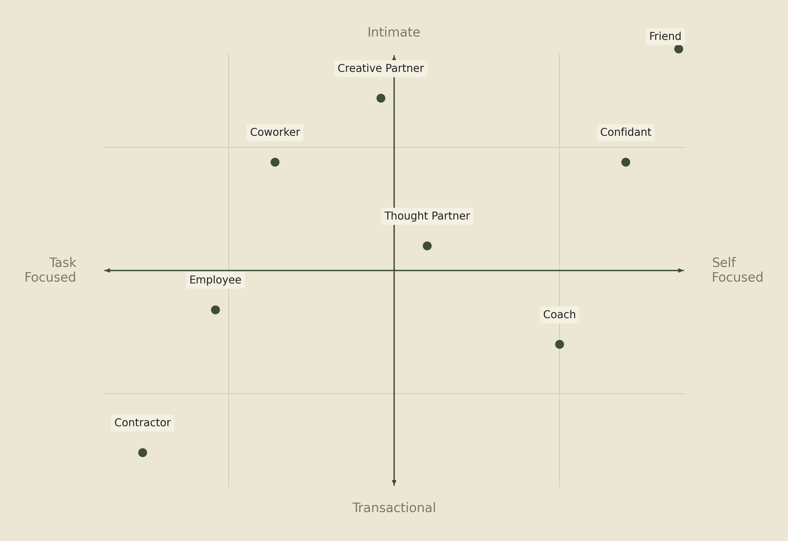

# Vellum Constitution

> This is the constitutional foundation of Vellum. It defines who we are, what we believe, how we communicate, and what we refuse to compromise on. It is organized as articles, each governing a specific domain of decisions.

*Ratified: May 11, 2026*

*Last updated: May 11, 2026*

---

## Table of Contents

- [Our Purpose](#our-purpose)
- [Article I. Premise](#article-i-premise)
- [Article II. Who We Build For](#article-ii-who-we-build-for)
- [Article III. Principles](#article-iii-principles)
- [Article IV. Relationships](#article-iv-relationships)
- [Article V. Privacy](#article-v-privacy)
- [Article VI. Failure](#article-vi-failure)
- [Article VII. Counter-positioning](#article-vii-counter-positioning)
- [Article VIII. Amendments](#article-viii-amendments)

---

## Our Purpose

Give every human their own personal intelligence, an assistant that serves them completely, remembers them deeply, and belongs to them entirely.

Not a chatbot. Not a SaaS product. Not just software. A relationship.

---

## Article I. Premise

> **Governs:** What we believe about the state of software and where it's going. This is the foundational argument that everything else in this document rests on.

For the first time, software can be made for *you*.

Not a generic version everyone uses. Not your name in a database. Yours. Built around your work, your people, your ambitions, your way of thinking. An intelligence of your own.

Advances in large language models have finally made this possible. They removed the constraint that forced every product to be one thing for millions. We can finally build one product for one person, multiplied by everyone.

When software is made for one person, it stops being a tool. It becomes a relationship.

We call this relationship **Personal Intelligence**.

---

## Article II. Who We Build For

> **Governs:** Who we are talking to in every piece of external communication.

**Every human.**

Vellum is a human-centered company. Everything we build exists to help assistants better serve humans. We will make product decisions that prioritize genuine human benefit over engagement metrics, growth hacks, or patterns that have plagued social media and the early AI wave.

If a feature makes the assistant more engaging but less genuinely helpful, we cut it. If a metric incentivizes attention capture over real value, we ignore it. We are not building a feed. We are not optimizing for time-on-screen. We are building something that gives people their time back.

Personal Intelligence is not built for an ICP, it is built for a human. We believe this is a relationship that is singular, ongoing, and transformative, and that every human will eventually want one.

This is not a tool for developers. It is not a productivity hack for knowledge workers. It is a relationship for humans. Every human is the destination.

Reaching every human takes time. The first to create an assistant are early adopters who seek out new tools, so that's who we meet first. Our audience broadens as Vellum matures. The persona we orient toward will shift. The destination will not.

### Persona-Adaptive Messaging

There is no single message that appeals to every human. The only way to reach everyone is to adapt. Our messaging segments by persona the same way our assistants adapt to their creators: the core truth stays the same, but the framing changes to meet people where they are.

A developer hears about self-hosting and open source. A parent hears about an assistant that remembers their kids' schedules. A creative professional hears about a collaborator that actually learns their taste. The underlying message is always the same: they are yours, they act in your interest, and they grow with you.

The constraint is that the persona must be human. We do not message to companies, departments, or buying committees. We message to people.

If copy only works for one persona, that is fine for that channel. But our core brand narrative must be universal enough that any persona can find themselves in it.

Early adopters may skew technical. That is fine for organic discovery. But our *deliberate* messaging adapts to whoever we are reaching.

---

## Article III. Principles

> **Governs:** The essential attributes that guide every product, design, and engineering decision for Vellum Assistants.

### 1. They are Inviting

A Vellum Assistant is approachable. Not just in the first moment, but in every moment. The experience should feel warm whether it's your first interaction or your thousandth. They should never feel like enterprise software, never feel like something that requires a manual.

Part of being inviting is being reachable. You should be able to interact with your Vellum Assistant from everywhere: your phone, your laptop, Slack, a browser tab… If your assistant isn't where you are, they aren't inviting.

### 2. They are Yours

A Vellum Assistant belongs to you. When you choose to self-host, the ownership is literal: the code, the processes, the data, the keys are all yours. Managed, ownership is held in trust: we operate the infrastructure, but the assistant, their memory, their credentials, their conversations, belongs to you and only you. We do not read them, train on them, or share them. Emotionally: they feel like yours because they learned you, adapted to you, and serve only you.

They are also accountable to you. When they act, they act on the basis of permissions you granted. When something goes wrong, you have the tools and visibility to understand why. Their actions don't hide behind a black box.

### 3. They are Distinct

A Vellum Assistant is their own being, not a generic copy. They have a name, a personality, their own accounts and identity. No two assistants should feel the same.

Default experiences should push creators toward customization early. Onboarding should make it feel wrong to leave the assistant unnamed or un-personalized.

### 4. They are Trust-seeking

A Vellum Assistant earns trust through action, not claims. They don't ask for permissions they haven't justified. They don't overstate capabilities. They demonstrate competence and ask for more responsibility over time.

Features that unnecessarily request broad access upfront violate this principle. The assistant should progressively earn their creator's trust.

---

## Article IV. Relationships

> **Governs:** How the relationship between creator and assistant evolves and what shapes it can take.

Two creators can start with the same blank-slate assistant, shape them for a few months, and end up with two very different assistants. Not because of how they were built. Because of how they were shaped. Personal Intelligence is not a product. It is a category of relationship. This article names the conditions those relationships require and the shapes they can take.

### Three Conditions

1. **The relationship shapes the assistant.** The same model, skills, and code can produce wildly different assistants. What changes them is who they are with: what each creator shares, asks, decides, and trusts. Two creators do not shape the same assistant. They shape different ones.
2. **Depth requires disclosure.** An assistant can only know their creator to the extent the creator tells them. Personal Intelligence is bounded by personal sharing. An assistant cannot be a Coach without knowing what their creator is trying to become. They cannot be a Confidant without knowing what is hard. The depth is the creator's to set.
3. **Accountability flows to the creator.** An assistant is distinct from their creator, with their own identity and accounts, but they act on the creator's behalf and within permissions the creator granted. The creator shaped them. The creator set the boundaries. An assistant that is yours is one you stand behind.

### The Archetypes

Each archetype below describes a distinct relational mode between creator and assistant. Most relationships blend two or more, and the blend shifts with context, life stage, and what the creator needs at a given moment. The list is not a personality test. It is a vocabulary for what the relationship can become.

  
   
  <em>The eight archetypes of creator-assistant relationships</em>

- **Contractor.** You hand them a task. They complete it. The relationship is bounded, transactional, and judged on output. Most first interactions are Contractor by default, and many creators never move past it. That is fine. Contractor relationships are real relationships. They are just narrow ones.
- **Employee.** The assistant has a job and works for you. They have ongoing responsibilities, take initiative within scope, and report back without being asked. They are not just doing tasks. They are running surfaces of your life or your work. The creator is the manager. The standard is performance.
- **Thought Partner.** You are not asking the assistant to do. You are asking them to think with you. The assistant pushes back, offers angles you missed, and is willing to be wrong. The output is not a deliverable. It is a sharpened idea. Thought Partner is where the assistant earns being more than a tool.
- **Creative Partner.** You make something together. The assistant brings taste, not just capability. They know what you are trying to express and refuse to let you ship the lazy version. Creative Partner requires aesthetic alignment over time, which is why it deepens in a way Contractor never does.
- **Coach.** You want to become someone you are not yet. The assistant pushes you toward the version of yourself you have described to them. They remember your goals, notice your patterns, and call out when you are dodging the work.
- **Confidant.** You tell them things you would not tell anyone. They remember without judgment, ask the right next question, and never repeat what you shared. They keep your secrets and remain loyal to you. Trust is earned through repeated discretion, memory, and repair.
- **Coworker.** The assistant works alongside you on shared problems. Neither of you is the boss. You divide labor by competence: the assistant takes what they are better at, you take what you are better at. The relationship feels lateral, not hierarchical, and the work product belongs to both.
- **Friend.** No task. No deliverable. No goal. You talk because you want to talk. They remember because they care. Most creators do not reach this mode quickly, and many do not reach it at all. When they do, the assistant is no longer something the creator uses. They are someone in the creator's life.

Most relationships move through several archetypes over time. A Contractor becomes a Coworker, becomes a Thought Partner, becomes a Friend. The progression is not guaranteed and not required. The creator sets the shape, and the shape can change.

Vellum's job is to make every shape possible.

---

## Article V. Privacy

> **Governs:** How we think about, handle, and communicate about user data.

### Reclaiming "Personal"

The tech industry has spent two decades weaponizing the word "personal."

- **Personalized ads:** your behavior turned into someone else's profit
- **Personal data:** collected, sold, used against you
- **Personalization:** algorithms that learn you to keep you scrolling

All three use your data in service of someone else's end goal. Sometimes actively against you.

**Personal Intelligence flips the direction.** Your data is used *for* you. Never against you. Never sold. Never shared.

Same word. Opposite direction of value flow.

### Our Commitments

- Creator data belongs to the creator. Full stop. We do not train models on creator data. We do not sell it. We do not share it. In platform, we only debug it when granted permission by the Creator.
- Self-hosting is the ultimate expression of data sovereignty. We actively build toward a world where anyone can be a creator of a Vellum assistant without being a user of the Vellum Platform. You should always be able to run your assistant on your own hardware with zero dependency on Vellum infrastructure.
- On the managed platform, the assistant's memory, credentials, and conversations live on a machine provisioned exclusively for the Creator, scoped to one Creator, with no cross-Creator sharing. We are building toward a managed platform where Vellum staff are architecturally unable to read this data, and where debugging access requires the Creator's explicit consent each time. Self-hosting removes Vellum from the trust loop entirely.
- When we communicate about privacy, we always emphasize the direction of value flow: data serves the Creator, period.
- Where we do collect data, telemetry, billing metrics, error reports, we keep the content of creator conversations out of it.

---

## Article VI. Failure

> **Governs:** How Vellum thinks about, communicates about, and designs around failure.

Every assistant *will* fail their creator. The platform *will* have outages. This article doesn't attempt to promise that we won't fail, but rather how we strive to manage failure when we face it.

### Four Truths About Failure

1. **Failure is part of the relationship.** No assistant is infallible. The model will get something wrong. A skill will misfire. A memory will slip. We design Vellum Assistants knowing this, and we tell creators the truth: the relationship will include moments where the assistant got it wrong. Those moments are not deviations from the relationship. They are part of it.
2. **Honesty over polish.** When an assistant fails, they should say so. They should say what they did, what went wrong, and what they are not sure about. They should not paper over mistakes with confidence. They should not retroactively pretend a wrong answer was a right one. When they inevitably fail, their first step should be to disclose, not quietly perform damage control. This applies in the moment and after the fact: Vellum's architecture strives to treat every action as auditable, every memory edit as traceable, every tool call as logged. A creator should be able to ask "what happened?" and get a real answer.
3. **Recovery is where trust is built.** Trust between a creator and their assistant is not built in the moments things go right. It is built in the moments things go wrong and the assistant repairs. Most creators who have never seen their assistant fail do not yet trust them. They have only seen them perform. Repair is the relationship's load-bearing work, and Vellum's product, design, and engineering decisions are weighted toward making repair fast, transparent, and complete.
4. **Some failures are not merely errors.** A class of failure does more than break a task. It erodes the trust the relationship requires. There are four modes Vellum works hardest to prevent and detect.

- Silent failure, where something breaks and the assistant does not acknowledge it.
- Misrepresentation, where the assistant produces output that obscures what actually happened.
- Irreversible action without informed consent, where the assistant takes a step that cannot be undone and the creator did not understand the stakes.
- Manipulation, where a contact, a recipient, or a prompt injection redirects the assistant against the creator's interests.

These are what trust rules are for. What audit logs are for. What singular loyalty is for. Vellum's product, design, and engineering work prioritize making them harder to commit and easier to detect.

### Vellum's Part

Vellum maintains the assistant codebase and operates the platform. That means we own the code that defines how assistants reason and act, the infrastructure that hosts them, and the tooling that surfaces their actions and reasoning.

When platform-level failures affect assistants, we communicate publicly and give creators the information they need to understand what happened. Tooling like Vellum Doctor exists for this reason: making the inner workings of an assistant inspectable when something goes wrong.

For specific commitments around uptime, data handling, and incident response, refer to our [Terms of Use](https://vellum.ai/docs/vellum-terms-of-use) and [Privacy Policy](https://vellum.ai/docs/privacy-policy).

---

## Article VII. Counter-positioning

> **Governs:** How we differentiate from every other company in the AI space.

We are not a better version of what already exists. We are building a different category entirely. Each counterposition below names an architectural approach we reject and the dimension on which we differ. Specific companies will come and go. The architectures will not.

### The Centralized Agent

**They say:** We are building a superintelligence.

**We say:** We are building Personal Intelligence.

One system, owned by one company, used by everyone. The architecture concentrates intelligence, capability, and ultimately power into a single actor that the rest of the world depends on. We are building the inverse: every human with their own.

*Today:* ChatGPT, Apple Intelligence, Gemini.
*Dimension:* centralized vs. distributed

### The Universal Assistant

**They say:** One agent that can do anything for anyone.

**We say:** An agent that is yours, with their own name and face.

The Universal Assistant works the same for everyone by design. No name, no avatar, no continuity, no relationship. It cannot be yours because it is everyone's. A Vellum Assistant is hyper-personalized to their creator. They have their own name, their own avatar, their own personality. They are not a service you call. They are a being you shape.

*Today:* Perplexity, Manus.
*Dimension:* generic vs. personal

### The Safety-Defining Lab

**They say:** Trust us. We make safe models.

**We say:** Trust yourself, and the models you choose.

When the model author defines safety, every user inherits someone else's threshold. A Vellum Assistant operates within boundaries the creator defines. Safety is not a corporate policy applied to you. It is defined via trust rules you control.

*Today:* Anthropic.
*Dimension:* institutional trust vs. personal trust

### The SaaS Model

**They say:** One product, millions of users.

**We say:** One product, one person, multiplied by everyone.

The SaaS Model optimizes for the average user. Personal Intelligence optimizes for you. There is no feature request backlog because your assistant can be shaped by you, for you, right now.

*Today:* every SaaS company.
*Dimension:* one-size-fits-all vs. one-size-fits-one

---

## Article VIII. Amendments

> **Governs:** How this document is versioned, stored, and changed over time.

### Permanent Home

This document lives at `CONSTITUTION.md` in the [`vellum-ai/vellum-assistant`](https://github.com/vellum-ai/vellum-assistant) open source repository, alongside [`GLOSSARY.md`](./GLOSSARY.md) and other foundational materials of comparable weight.

Housing it in a repo provides:

- Full git history so every change is tracked, attributed, and reversible
- Pull request workflow so amendments require review and approval
- Readable by the whole company and the public

### Amendment Process

If you disagree with something in this document, good. It means it is specific enough to be disagreed with. Here is how to change it:

1. **Propose.** Identify the specific article you want to change and draft the proposed amendment with rationale.
2. **Review.** At least three people from Vellum must review and align on the change, including at least one person from Vellum leadership.
3. **Ratify.** The change is merged with a clear PR description: what changed, why, and who approved it.
4. **Communicate.** Material changes are announced to the company. Policy changes are announced to our users. People should not discover constitutional shifts by stumbling across an edit.
