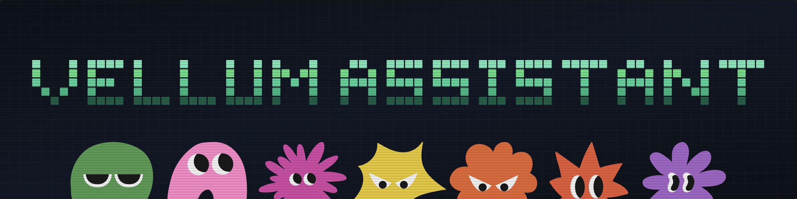
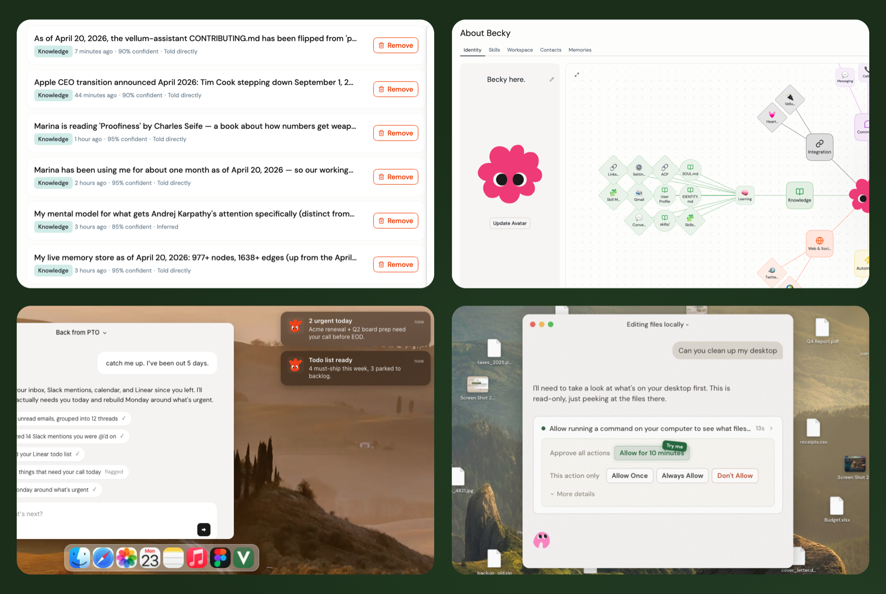

<p align="center">
  
</p>

<p align="center">
  <a href="https://vellum.ai/docs"></a>
  <a href="https://vellum.ai/community"></a>
  <a href="https://github.com/vellum-ai/vellum-assistant/blob/main/LICENSE"></a>
  <a href="https://vellum.ai"></a>
</p>

<p align="center"><b>A personal AI assistant that evolves with you.</b><br>
It learns how you work, remembers what matters, and acts before you ask. Yours to name, shape, and extend.</p>

---

## What it does

| Area | Summary |
|------|---------|
| **Memory** | **Learns what matters and forgets what doesn't.** Structured memory items — identity, preferences, projects, events — extracted with source attribution and deduplication. Hybrid retrieval (dense + sparse) ranks results semantically and lexically, with staleness windows per memory type. Per-user and per-channel isolation. Embeddings run locally by default. |
| **Identity** | **Becomes its own.** Behavior lives in SOUL.md, and during onboarding the assistant observes how you communicate and writes its own personality files. A per-user journal captures its reflections on past interactions. NOW.md acts as an ephemeral scratchpad for current focus and active threads. |
| **Proactivity** | **Reaches out when something matters, without being asked.** Every hour it checks in with itself: re-reads its notes, notices what's unfinished or due soon, and sends a message if needed. Notifications are routed to the right channel and won't interrupt you if you're already talking. |
| **Security** | **Fail-closed by design.** Actor identity is resolved once (guardian, trusted, or unknown) and enforced everywhere. Untrusted actors cannot read or write memory, trigger tools, or escalate. Credentials live in a separate process and never reach the model. Every tool runs in a sandbox. |

<p align="center">
  
</p>

---

## Get started

**1. [Download the latest release](https://vellum.ai/download)**

**2. Open the app and pick your mode**
  - **Managed** — sign in via Vellum Cloud, no local runtime required
  - **Local** — everything runs on your machine

**3. Hatch your assistant**
  - Give it a name, a personality, and the keys to your work

<sub>Prefer the terminal? See <a href="#cli">CLI install</a> below.</sub>

---

## Quick demo

https://github.com/user-attachments/assets/009bd0ae-95ac-4cf3-81bc-d54cd8631583

---

## CLI

<details open>
<summary>Install and common commands</summary>

<br>

The CLI works but the desktop app is our primary focus. Available for advanced users, contributors, and non-macOS environments.

**Install**

```bash
bun install -g vellum
vellum hatch
```

**Install from source**

```bash
git clone https://github.com/vellum-ai/vellum-assistant.git
cd vellum-assistant
./setup.sh
vellum hatch
```

**Common commands**

```bash
vellum wake        # start services
vellum sleep       # stop services, keep data
vellum client      # interact through the terminal
vellum ps          # view running assistants
vellum terminal    # open a shell into a managed assistant container
vellum upgrade     # upgrade to latest version
```

All commands target the default assistant. If you have multiple, pass the assistant ID as the second argument.

</details>

---

## Infra and security

| Area | Summary |
|------|---------|
| **Trust engine** | **Decides who can do what, and defaults to no.** Fail-closed trust system that resolves actor identity once (guardian, trusted, or unknown) and enforces it everywhere. Untrusted actors cannot read or write memory, trigger tools, or escalate. Your credentials live in a separate process and never reach the model. |
| **Skills** | **Add new capabilities through sandboxed plugins.** Manifest-driven plugins (SKILL.md + TOOLS.json) that inject tools and prompt sections at runtime. Skills can be bundled, installed from a catalog, or added from the workspace. |
| **Channels** | **One assistant, everywhere you need it.** Use it from the macOS app, Telegram, or Slack, with shared memory across all of them. More channels coming soon. |
| **Multi-provider support** | **Swap models without changing anything else.** Supports Anthropic Claude, OpenAI, Google Gemini, and Ollama for local models. Embeddings follow the same pattern: local ONNX by default, with automatic fallback to cloud providers. |

---

## Foundational documents

The canonical sources for who we are and how we talk about what we're building. The docs site at [vellum.ai/docs](https://vellum.ai/docs) is a rendered view of these files.

| Doc | What it is |
|-----|------------|
| [Constitution](CONSTITUTION.md) | Who we are, what we believe, and what we refuse to compromise on |
| [Glossary](GLOSSARY.md) | The shared vocabulary we use to talk about personal intelligence |

---

## Documentation

| Section | What's covered |
|---------|---------------|
| [Architecture](https://vellum.ai/docs/developer-guide/architecture) | Platform domains, repo structure, runtime · clients · gateway |
| [Security & Permissions](https://vellum.ai/docs/developer-guide/security) | Sandbox, credentials, trust rules, permission modes |
| [Features & Capabilities](https://vellum.ai/docs/developer-guide/features) | Integrations, dynamic skills, browser, attachments, media embeds |
| [API & Communication](https://vellum.ai/docs/developer-guide/api) | SSE event stream, event payloads, remote access |
| [Development Workflow](https://vellum.ai/docs/developer-guide/development-workflow) | Claude Code commands, parallel PRs, review loops, release pipeline |

📖 **[Full documentation →](https://vellum.ai/docs)**

---

## Contributing

We welcome contributions from everyone.

- **Development**: The [contributing guide](CONTRIBUTING.md) will help you get started.
- Make sure to check out our [Code of Conduct](CODE_OF_CONDUCT.md).

## Community

- 💬 [Discord](https://vellum.ai/community)
- 🐛 [Issues](https://github.com/vellum-ai/vellum-assistant/issues)

## License

MIT — see [License](https://github.com/vellum-ai/vellum-assistant?tab=MIT-1-ov-file). Integration logos from [Simple Icons](https://github.com/simple-icons/simple-icons), licensed [CC0 1.0](https://creativecommons.org/publicdomain/zero/1.0/).

Vellum Assistant is open-source software built by [Vellum AI](https://vellum.ai), a for-profit company. We also offer a managed product, the [Vellum Platform](https://vellum.ai/platform), which sustains the business. Free to use and modify under MIT, and we're committed to keeping it that way.

---

<p align="center">Built with 💚 by <a href="https://vellum.ai">Vellum</a></p>
