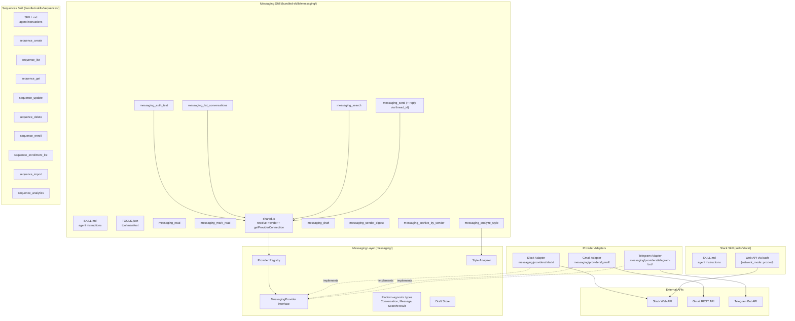
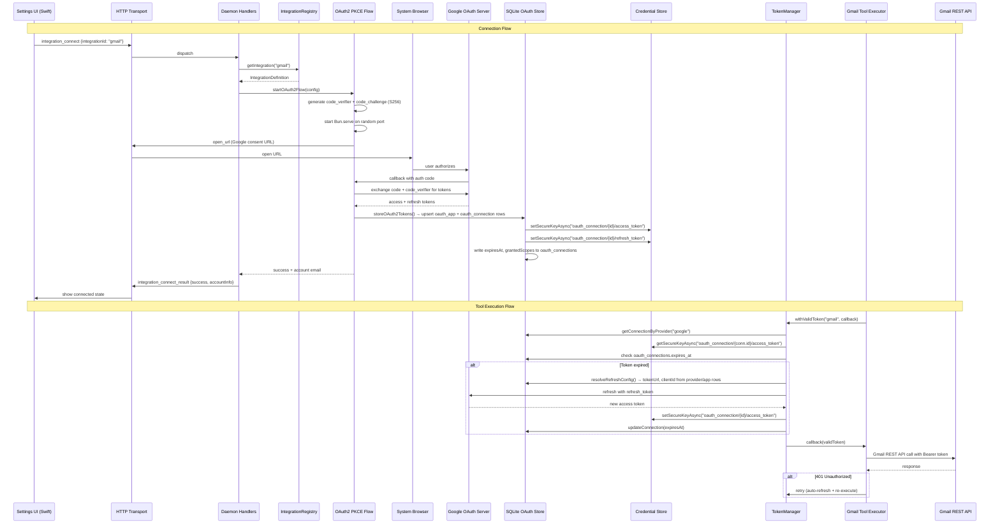
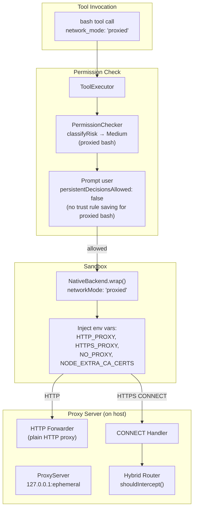
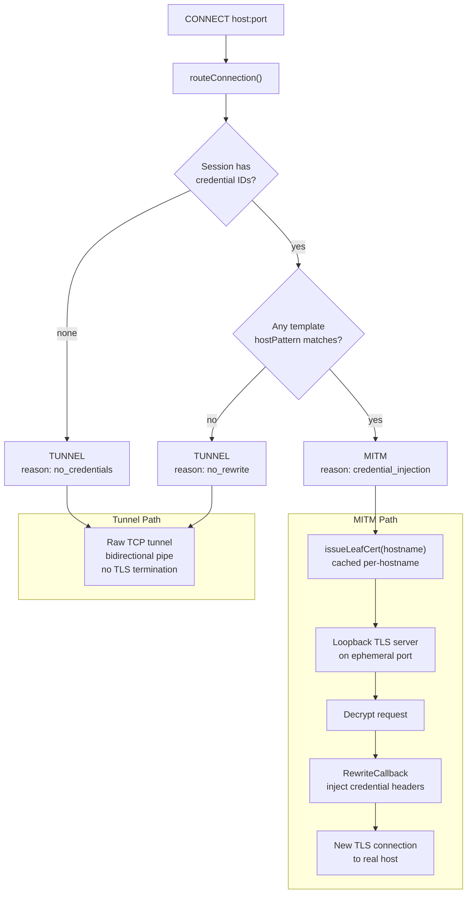
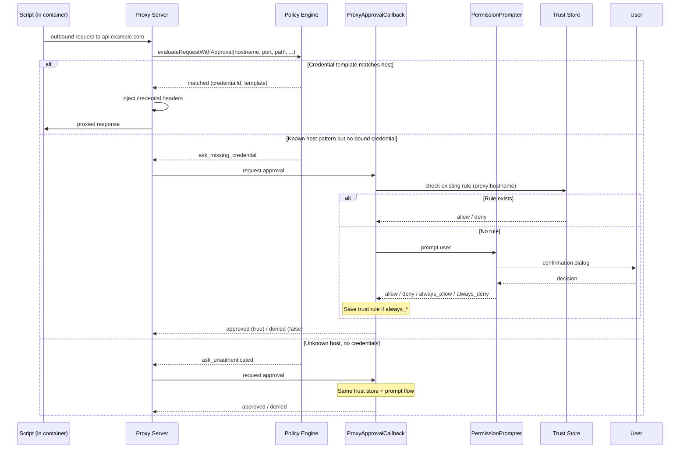
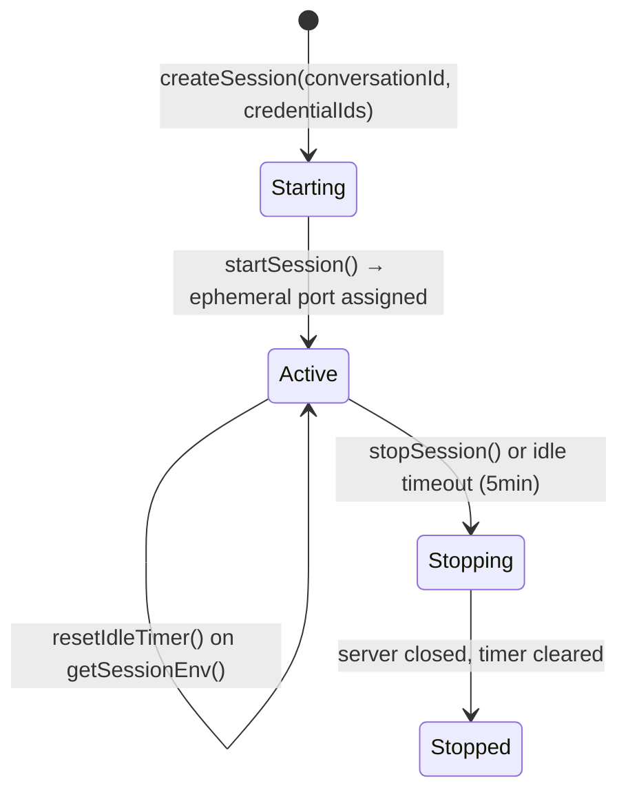
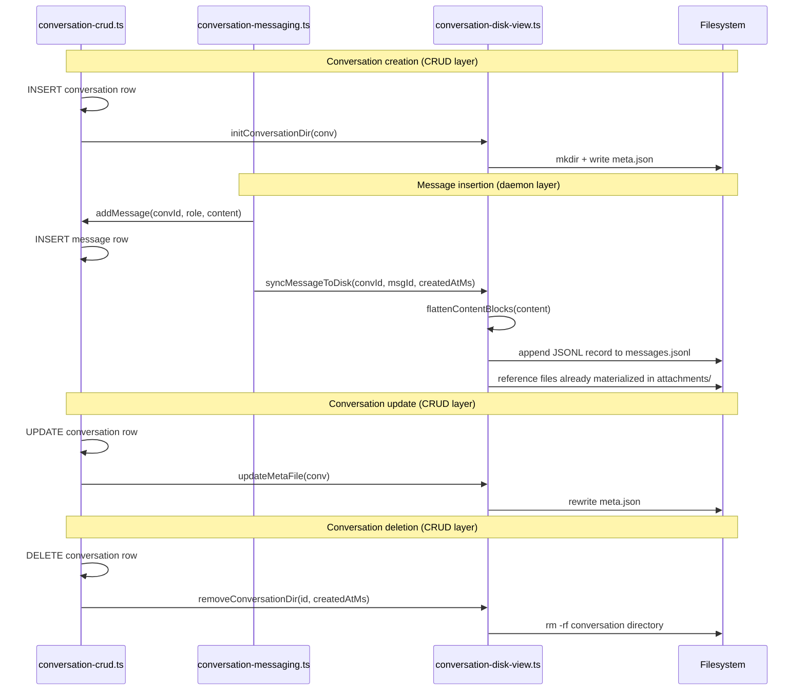

# Integrations Architecture

OAuth, messaging adapters, script proxy, and conversation disk view architecture.

## Integrations — OAuth2 + Unified Messaging

The integration framework lets Vellum connect to third-party services via OAuth2. The architecture follows these principles:

- **Secrets never reach the LLM** — OAuth tokens are stored in the credential vault and accessed exclusively through the `TokenManager`, which provides tokens to tool executors via `withValidToken()`. The LLM never sees raw tokens.
- **PKCE or client_secret flows** — Desktop apps use PKCE by default (S256). Providers that require a client secret (e.g. Slack) pass it during the OAuth2 flow and store it in credential metadata for autonomous refresh.
- **Unified messaging layer** — All messaging platforms implement the `MessagingProvider` interface. Generic tools delegate to the provider, so adding a new platform is just implementing one adapter + an OAuth setup skill.
- **Provider registry** — Messaging providers register at daemon startup. The registry tracks which providers have stored credentials, enabling auto-selection when only one is connected.

### Unified Messaging Architecture



### Data Flow



### Key Design Decisions

| Decision                                   | Rationale                                                                                                                                                                                                                                                                                         |
| ------------------------------------------ | ------------------------------------------------------------------------------------------------------------------------------------------------------------------------------------------------------------------------------------------------------------------------------------------------- |
| PKCE by default, optional client_secret    | Desktop apps prefer PKCE; some providers (Slack) require a secret, which is stored in the credential store (`oauth_app/{id}/client_secret`) for autonomous refresh                                                                                                                                |
| Shared connect orchestrator                | All OAuth providers route through `orchestrateOAuthConnect()`, which resolves profiles, resolves scopes, runs the flow, stores tokens, and verifies identity. Adding a provider is a declarative profile entry, not new orchestration code                                                        |
| Canonical credential naming                | All reads and writes use `client_id`/`client_secret` as canonical field names                                                                                                                                                                                                                     |
| Caller-driven callback transport           | Transport (`loopback` or `gateway`) is chosen per-flow via the `callbackTransport` option on the connect API, defaulting to loopback. Desktop clients use loopback (no tunnel needed); web clients can pass `callback_transport: "gateway"`. Provider configuration no longer dictates transport. |
| Unified `MessagingProvider` interface      | All platforms implement the same contract; generic tools work immediately for new providers                                                                                                                                                                                                       |
| Provider auto-selection                    | If only one provider is connected, tools skip the `platform` parameter — seamless single-platform UX                                                                                                                                                                                              |
| Token expiry in SQLite oauth-store         | `oauth_connections.expires_at` column tracks token expiry; `TokenManager` reads it for proactive refresh with 5min buffer. No separate metadata store needed                                                                                                                                      |
| Confidence scores on medium-risk tools     | LLM self-reports confidence (0-1); enables future trust calibration without blocking execution                                                                                                                                                                                                    |
| Platform-specific extension tools          | Operations unique to one platform (e.g. Gmail labels, Slack reactions) are separate tools, not forced into the generic interface                                                                                                                                                                  |
| Identity verification before token storage | OAuth2 tokens are only persisted after a successful identity verification call, preventing storage of invalid or mismatched credentials                                                                                                                                                           |

### Source Files

| File                                             | Role                                                                                                   |
| ------------------------------------------------ | ------------------------------------------------------------------------------------------------------ |
| `assistant/src/security/oauth2.ts`               | OAuth2 flow: PKCE or client_secret, Bun.serve callback, token exchange                                 |
| `assistant/src/security/token-manager.ts`        | `withValidToken()` — auto-refresh, 401 retry, expiry buffer                                            |
| `assistant/src/messaging/provider.ts`            | `MessagingProvider` interface                                                                          |
| `assistant/src/messaging/provider-types.ts`      | Platform-agnostic types (Conversation, Message, SearchResult)                                          |
| `assistant/src/messaging/registry.ts`            | Provider registry: register, lookup, list connected                                                    |
| `assistant/src/messaging/style-analyzer.ts`      | Writing style extraction from message corpus                                                           |
| `assistant/src/messaging/draft-store.ts`         | Local draft storage (platform/id JSON files)                                                           |
| `assistant/src/messaging/providers/slack/`       | Slack adapter, client, types                                                                           |
| `assistant/src/messaging/providers/gmail/`       | Gmail adapter, client, types                                                                           |
| `assistant/src/config/bundled-skills/messaging/` | Core messaging skill (send, read, search, reply across platforms)                                      |
| `assistant/src/config/bundled-skills/sequences/` | Email sequence management skill (drip campaigns, enrollment, analytics)                                |
| `assistant/src/watcher/providers/gmail.ts`       | Gmail watcher using History API                                                                        |
| `assistant/src/watcher/providers/github.ts`      | GitHub watcher for PRs, issues, review requests, and mentions                                          |
| `assistant/src/watcher/providers/linear.ts`      | Linear watcher for assigned issues, status changes, and @mentions                                      |
| `assistant/src/oauth/seed-providers.ts`          | Provider seed data: injection templates, identity config, setup metadata (seeded to DB on startup)     |
| `assistant/src/oauth/connect-orchestrator.ts`    | Shared OAuth connect orchestrator: profile resolution, scope resolution, flow execution, token storage |
| `assistant/src/oauth/connect-types.ts`           | Shared types: `AvailableScopes`, `OAuthConnectResult`                                                  |
| `assistant/src/oauth/token-persistence.ts`       | Token storage helper: persists tokens, metadata, and runs post-connect hooks                           |
| `assistant/src/daemon/handlers/oauth-connect.ts` | Generic OAuth connect handler (`oauth_connect_start` / `oauth_connect_result`)                         |

---

## OAuth Extensibility — DB-Driven Provider Config, Scope Policy, and Connect Orchestrator

The OAuth extensibility layer makes adding a new OAuth provider a fully declarative operation. All provider configuration — protocol fields (auth URLs, token URLs, scopes), behavioral fields (identity verification, injection templates, setup metadata), and display metadata — is stored in the `oauth_providers` SQLite table and seeded on startup via `seed-providers.ts`. The shared **connect orchestrator** handles the full flow from provider resolution through token storage.

### Provider Configuration (DB-Driven)

All provider config lives in the `oauth_providers` table. Built-in providers are seeded on every startup by `assistant/src/oauth/seed-providers.ts`, which upserts rows from the `PROVIDER_SEED_DATA` constant. Custom providers can be registered via the CLI (`assistant oauth providers register`).

Each provider row includes:

| Column group              | Fields                                                                                                                           | Purpose                                                                                |
| ------------------------- | -------------------------------------------------------------------------------------------------------------------------------- | -------------------------------------------------------------------------------------- |
| **Protocol**              | `authUrl`, `tokenUrl`, `tokenEndpointAuthMethod`, `extraParams`, `loopbackPort`                                                  | OAuth2 flow parameters                                                                 |
| **Scopes**                | `defaultScopes`, `availableScopes`                                                                                               | Default scopes for connect flow; informational available scopes for assistant context  |
| **Identity verification** | `identityUrl`, `identityMethod`, `identityHeaders`, `identityBody`, `identityResponsePaths`, `identityFormat`, `identityOkField` | Data-driven identity verifier fetches human-readable account info after token exchange |
| **Injection templates**   | `injectionTemplates`                                                                                                             | Auto-applied credential injection rules for the script proxy                           |
| **Setup metadata**        | `displayName`, `description`, `dashboardUrl`, `appType`, `setupNotes`, `requiresClientSecret`                                    | Metadata for the generic OAuth setup skill                                             |
| **Ping config**           | `pingUrl`, `pingMethod`, `pingHeaders`, `pingBody`                                                                               | Health-check endpoint for `assistant oauth ping`                                       |

### Scope Resolution

Scope resolution is simple — no validation layer:

1. No requested scopes → uses `defaultScopes`.
2. Requested scopes provided → uses the requested scopes directly (no validation — the OAuth provider rejects invalid scopes).
3. `availableScopes` is informational context surfaced via CLI for the assistant to consult.

### Connect Orchestrator

`assistant/src/oauth/connect-orchestrator.ts` exports `orchestrateOAuthConnect(options)`, which runs the full OAuth2 flow:

1. **Receive canonical provider name** — the orchestrator receives the canonical provider name directly (e.g. `google`, `slack`).
2. **Load provider row** — reads all config from the `oauth_providers` DB table.
3. **Compute scopes** — uses requested scopes directly, or falls back to `defaultScopes`.
4. **Build OAuth config** — assemble protocol-level config from the DB provider row.
5. **Run flow** — interactive (opens browser, blocks until completion) or deferred (returns auth URL for the caller to deliver).
6. **Verify identity** — runs the generic data-driven identity verifier using the provider row's identity columns.
7. **Store tokens** — `storeOAuth2Tokens()` persists access/refresh tokens, client credentials, and metadata.

Result is a discriminated union: `{ success, deferred, grantedScopes, accountInfo }` or `{ success: false, error }`.

### Generic Daemon HTTP API

`assistant/src/daemon/handlers/oauth-connect.ts` handles `oauth_connect_start` messages. The handler:

1. Resolves client credentials from the credential store using canonical names (`client_id`, `client_secret`).
2. Validates that required credentials exist (including `client_secret` when the provider requires it).
3. Delegates to `orchestrateOAuthConnect()`.
4. Sends `oauth_connect_result` back to the client.

This replaces provider-specific handlers — any provider in the registry can be connected through the same message pair.

### Adding a New OAuth Provider

1. **Add seed data** to `PROVIDER_SEED_DATA` in `assistant/src/oauth/seed-providers.ts`:
   - Set protocol fields: `authUrl`, `tokenUrl`, `defaultScopes`, `availableScopes`, `loopbackPort`.
   - Set identity verification: `identityUrl`, `identityMethod`, `identityHeaders`, `identityResponsePaths`, `identityFormat`.
   - Set injection templates: `injectionTemplates` for providers whose tokens should be auto-injected by the script proxy.
   - Set setup metadata: `displayName`, `dashboardUrl`, `appType` enable the generic OAuth setup skill to guide users through app creation.
   - Note: callback transport (`loopback` or `gateway`) is chosen per-flow by the caller, not per-provider. All providers support both transports.
2. **Alternatively, register dynamically** via the CLI: `assistant oauth providers register <key> --auth-url ... --token-url ...`.
3. **No handler code needed** — the generic `oauth_connect_start` handler and the connect orchestrator handle the flow automatically.

### Key Source Files

| File                                             | Role                                                                        |
| ------------------------------------------------ | --------------------------------------------------------------------------- |
| `assistant/src/oauth/seed-providers.ts`          | Provider seed data and startup seeding                                      |
| `assistant/src/oauth/connect-orchestrator.ts`    | Shared connect orchestrator (profile → scopes → flow → tokens)              |
| `assistant/src/oauth/connect-types.ts`           | Shared types (`AvailableScopes`, `OAuthConnectResult`)                      |
| `assistant/src/oauth/token-persistence.ts`       | Token storage: credential store writes, metadata upsert, post-connect hooks |
| `assistant/src/oauth/identity-verifier.ts`       | Generic data-driven identity verifier (reads config from provider DB row)   |
| `assistant/src/daemon/handlers/oauth-connect.ts` | Generic `oauth_connect_start` / `oauth_connect_result` handler              |

---

---

## Script Proxy — Proxied Bash Execution and Credential Injection

Scripts executed via the `bash` tool can optionally run through a per-session HTTP proxy. The proxy subsystem extends the existing credential storage and permission systems rather than introducing parallel mechanisms. The session manager uses `createProxyServer()` with a fully configured MITM handler, policy callback, and rewrite callback — so credential injection, policy enforcement, and approval prompting are all active at runtime. `host_bash` is explicitly unaffected: only the `bash` tool participates in proxied-mode checks.

### Proxied Bash Execution Path

When a bash command requires network access with credential injection, the sandbox backend switches from `network=none` to `network=bridge` and injects proxy environment variables so all HTTP/HTTPS traffic routes through the session proxy.



### Hybrid MITM + Tunnel Routing

The proxy uses a two-mode routing strategy for HTTPS CONNECT requests. Only connections to hosts that match a credential injection template are MITM-intercepted; all other HTTPS traffic passes through a plain TCP tunnel with no TLS termination.



**MITM path**: The proxy issues a leaf certificate signed by a local CA (`proxy-ca/ca.pem`), terminates TLS on a loopback ephemeral port, reads the decrypted HTTP request, calls the `RewriteCallback` to inject credential headers, and forwards the rewritten request over a fresh TLS connection to the real upstream. The local CA cert is injected into the container via `NODE_EXTRA_CA_CERTS`.

**Tunnel path**: For hosts that do not require credential injection, the proxy establishes a raw TCP tunnel (bidirectional pipe) and never sees the plaintext traffic. This avoids the overhead and security exposure of unnecessary TLS termination.

### Proxy Policy Engine and Approval Loop

The policy engine evaluates each outbound request against credential injection templates and determines whether credentials should be injected, whether the user should be prompted, or whether the request should pass through unauthenticated.



**Policy decisions** are deterministic and structured:

| Decision                 | Meaning                                                                    |
| ------------------------ | -------------------------------------------------------------------------- |
| `matched`                | Exactly one credential template matches the host — inject it               |
| `ambiguous`              | Multiple credential templates match — caller must disambiguate             |
| `missing`                | Credentials exist but none match this host — no rewrite                    |
| `unauthenticated`        | No credentials configured for the session                                  |
| `ask_missing_credential` | A known template pattern matches but no credential is bound to the session |
| `ask_unauthenticated`    | Completely unknown host — prompt for unauthenticated access                |

**Trust rule persistence**: The `createProxyApprovalCallback` in `conversation-tool-setup.ts` is wired into the session startup path and routes policy "ask" decisions through the existing `PermissionPrompter` UI. Trust rules use the `network_request` tool name (not `proxy:*`) with URL-based scope patterns (e.g., `https://api.example.com/*`), aligning with the `buildCommandCandidates()` allowlist generation in `checker.ts`.

**Proxied bash permission restriction**: The `ToolExecutor` sets `persistentDecisionsAllowed = false` when the bash tool is invoked with `network_mode: 'proxied'`. This prevents users from saving permanent trust rules for proxied bash commands, since the proxy session's credential scope can change between invocations.

### Session Lifecycle



Each proxy session is bound to a conversation and tracks authorized credential IDs. The `SessionManager` enforces a per-conversation limit (default 3 concurrent sessions). Sessions auto-stop after 5 minutes of inactivity. `stopAllSessions()` is called on daemon shutdown.

### Local CA and Certificate Management

The proxy generates and manages a local Certificate Authority for MITM interception:

| Component  | Location                                   | Purpose                                                  |
| ---------- | ------------------------------------------ | -------------------------------------------------------- |
| CA cert    | `{dataDir}/proxy-ca/ca.pem`                | Self-signed root cert (valid 10 years, permissions 0644) |
| CA key     | `{dataDir}/proxy-ca/ca-key.pem`            | CA private key (permissions 0600)                        |
| Leaf certs | `{dataDir}/proxy-ca/issued/{hostname}.pem` | Per-hostname certs (cached, verified against current CA) |

`ensureLocalCA()` is idempotent — it only generates the CA if the files do not already exist. Leaf certificates are cached and revalidated via `X509Certificate.checkIssued()` to detect stale certs from a previous CA.

### Log Sanitization

All proxy logging passes through sanitization helpers (`logging.ts`) that redact credential values before they reach logs or lifecycle events:

- `sanitizeHeaders()` — replaces values of sensitive header keys (e.g. `Authorization`) with `[REDACTED]`
- `sanitizeUrl()` — redacts query parameter values for sensitive param names (e.g. `api_key`)
- `createSafeLogEntry()` — combines both into a log-safe request snapshot

### Security Invariants

1. **Credential values never reach the LLM** — The proxy injects credentials at the network layer; the model only sees tool results, never the injected headers or query parameters.
2. **Minimal MITM surface** — Only hosts matching a credential injection template are MITM-intercepted. All other HTTPS traffic passes through an opaque TCP tunnel.
3. **CA key isolation** — The CA private key has 0600 permissions and never leaves the host filesystem. Container processes only receive the CA cert via `NODE_EXTRA_CA_CERTS`.
4. **No persistent trust rules for proxied bash** — `persistentDecisionsAllowed: false` prevents saving trust rules that could auto-allow proxied commands across sessions with different credential scopes.
5. **Auditable routing** — Every CONNECT routing decision carries a deterministic `RouteReason` code (`mitm:credential_injection`, `tunnel:no_rewrite`, `tunnel:no_credentials`) for audit and testing.

### Credential Proxy Injection

The proxy subsystem intercepts outbound HTTPS requests and injects stored credentials via header injection. Key behaviors:

- **Wildcard host patterns** (`*.example.com`) match both subdomains and the bare apex domain (`example.com`)
- **Specificity selection**: When one credential has both exact and wildcard templates for the same host, the most specific match wins (exact > wildcard)
- **Cross-credential ambiguity**: When multiple credentials match the same host, injection is blocked (fail-closed)
- **Credential references**: The shell tool accepts both UUIDs and `service/field` format (e.g., `fal/api_key`); unknown references fail fast before command execution
- **Diagnostic logging**: Policy and rewrite decisions are logged with structured traces that never include secret values

### Key Source Files

| File                                                          | Role                                                                                                                    |
| ------------------------------------------------------------- | ----------------------------------------------------------------------------------------------------------------------- |
| `assistant/src/tools/network/script-proxy/server.ts`          | Proxy server factory — HTTP forwarding, CONNECT handling, MITM dispatch                                                 |
| `assistant/src/tools/network/script-proxy/policy.ts`          | Policy engine — evaluates requests against credential templates                                                         |
| `assistant/src/tools/network/script-proxy/mitm-handler.ts`    | MITM TLS interception — loopback TLS server, request rewrite, upstream forwarding                                       |
| `assistant/src/tools/network/script-proxy/connect-tunnel.ts`  | Plain CONNECT tunnel — raw TCP bidirectional pipe                                                                       |
| `assistant/src/tools/network/script-proxy/http-forwarder.ts`  | HTTP proxy forwarder — absolute-URL form forwarding with policy callback                                                |
| `assistant/src/tools/network/script-proxy/session-manager.ts` | Session lifecycle — create, start, stop, idle timeout, env var generation                                               |
| `assistant/src/tools/network/script-proxy/certs.ts`           | Local CA management — ensureLocalCA, issueLeafCert, getCAPath                                                           |
| `assistant/src/tools/network/script-proxy/logging.ts`         | Log sanitization (header/URL redaction) and safe decision trace builders for policy and credential resolution           |
| `assistant/src/tools/network/script-proxy/types.ts`           | Type definitions — session, policy decisions, approval callback                                                         |
| `assistant/src/tools/executor.ts`                             | `persistentDecisionsAllowed` gate — disables trust rule saving for proxied bash                                         |
| `assistant/src/daemon/conversation-tool-setup.ts`             | `createProxyApprovalCallback` — wired into session startup, uses `network_request` tool name with URL-based trust rules |
| `assistant/src/permissions/checker.ts`                        | `network_request` trust rule matching and risk classification (Medium)                                                  |

### Runtime Wiring Summary

The proxy subsystem is fully wired, including credential injection. The session manager's `startSession()` calls `createProxyServer()` with:

- **MITM handler config**: `mitmHandler` is configured with the local CA path and a `rewriteCallback` that performs per-credential specificity-based template selection — for each credential it picks the most specific matching header template (exact > wildcard), blocks on same-credential equal-specificity ties or cross-credential ambiguity, and for the winning `header`-type template resolves the secret from secure storage and sets the outbound header. Wildcard patterns (`*.fal.run`) match the bare apex domain (`fal.run`) via apex-inclusive matching.
- **Policy callback**: `evaluateRequestWithApproval()` is called via the `policyCallback`; for `'matched'` decisions it injects credential headers (reading the secret value at injection time), while `'ambiguous'` decisions are blocked and `'ask_*'` decisions route through the approval callback
- **Approval callback**: `createProxyApprovalCallback()` from `conversation-tool-setup.ts` routes approval prompts through the `PermissionPrompter`, using the `network_request` tool name with URL-based trust rules
- **networkMode plumbing**: `shell.ts` passes `{ networkMode }` to `wrapCommand()`, which forwards it to the native backend
- **Session lifecycle**: `createSession` / `startSession` / `stopSession` with idle timeout and per-conversation limits

---

## Conversation Disk View — Filesystem-Based Conversation Access

The conversation disk view projects conversation metadata, messages, and attachments to a browsable filesystem layout under `~/.vellum/workspace/conversations/`. This enables the assistant to search, read, and manipulate conversation data (including media attachments) using standard file tools (`read_file`, `glob`, `grep`) rather than dedicated asset search tools.

### Directory Layout

Each conversation is projected to a directory named `{isoDate}_{id}`:

```
~/.vellum/workspace/conversations/
  2025-01-15T10-30-00.000Z_abc123/
    meta.json             # Conversation metadata (id, title, type, channel, timestamps)
    messages.jsonl        # Flattened message log (one JSON object per line)
    attachments/          # Decoded attachment files (original filenames, collision-safe)
      photo.png
      document.pdf
```

### Write-Through Sync

The disk view is updated at the daemon level, not automatically by the DB CRUD layer. Conversation creation, metadata updates, and deletion are synced from `conversation-crud.ts`, but message sync (`syncMessageToDisk`) is only called from daemon-level code paths (e.g. `conversation-messaging.ts`) — not from the CRUD `addMessage()` function. This means `messages.jsonl` reflects messages processed through the daemon's messaging pipeline, not every message write. All disk writes are best-effort; failures are logged but never thrown, so the disk view cannot break DB operations.

> **Privacy note:** Conversation disk-view files live under `~/.vellum/workspace/conversations/`. Workspace files are not included in diagnostic log exports ("Send logs to Vellum"). For conversation-scoped exports, conversation data is included as structured JSON tables (e.g. `messages.json`, `llm-request-logs.json`), not as a raw database dump.



### Content Flattening

Message content (stored as JSON `ContentBlock[]` in the DB) is flattened for the JSONL log:

- **Text blocks** are concatenated into a single `content` string.
- **Tool use blocks** are extracted into a `toolCalls` array (`{ name, input }`).
- **Tool result blocks** are extracted into a `toolResults` array.
- **Image/file blocks** are skipped — they are represented via the `attachments/` subdirectory instead.

### Attachment Projection

Attachments are materialized into `conversations/<conversation>/attachments/` as soon as they are linked to a message. During disk-view sync, the JSONL record reuses those filenames directly and only falls back to materializing legacy rows that have not been projected yet. Filename collisions are still resolved by appending a numeric suffix (e.g., `photo-2.png`, `photo-3.png`).

### Backfill Migration

Existing conversations created before the disk view was introduced are backfilled by workspace migration `009-backfill-conversation-disk-view`, which replays all conversations and their messages through the disk-view sync functions.

### Key Source Files

| File                                                                        | Role                                                                                  |
| --------------------------------------------------------------------------- | ------------------------------------------------------------------------------------- |
| `assistant/src/memory/conversation-disk-view.ts`                            | Disk view module — init, update, sync, remove, content flattening                     |
| `assistant/src/memory/conversation-crud.ts`                                 | DB CRUD layer — calls init, update, and remove disk-view functions (not message sync) |
| `assistant/src/daemon/conversation-messaging.ts`                            | Daemon messaging pipeline — calls `syncMessageToDisk` after message insertion         |
| `assistant/src/workspace/migrations/009-backfill-conversation-disk-view.ts` | Backfill migration for pre-existing conversations                                     |

---

## Claude Subscription Bridge — Agentic Provider via Claude Max OAuth

The `claude-subscription` provider lets users on a Claude Max plan drive a Vellum assistant — including skill execution, CES-protected tools, and audit — without an Anthropic API key. Instead of calling `api.anthropic.com` directly (those OAuth tokens are rejected as `429 rate_limit_error`), it spawns the user's local `claude` CLI via the `@anthropic-ai/claude-agent-sdk` package and routes the SDK's tool calls back into Vellum's `ToolExecutor` through an in-process MCP server.

The full architecture, security audit, threat model, and test plan live in [`claude-subscription-bridge.md`](./claude-subscription-bridge.md). The picker UX (install/login/disabled-flag hints) is documented in [`claude-subscription-picker-setup-hint.md`](./claude-subscription-picker-setup-hint.md) with the implementation plan in [`claude-subscription-picker-setup-hint-plan.md`](./claude-subscription-picker-setup-hint-plan.md).

Operational runbook (diagnosing tool failures, falling back to API-key Anthropic, clearing stale OAuth) is at [`runbook-claude-subscription.md`](../runbook-claude-subscription.md).

### Why it's an integration

This provider is structurally closer to the OAuth integrations above than to other LLM providers: it depends on an out-of-band OAuth flow (`claude login`) the user runs in their terminal, a credential vault (macOS Keychain entry `Claude Code-credentials` or `~/.claude/.credentials.json` on Linux/Windows), and a separate process (`claude` CLI subprocess) that the daemon spawns for every send. The bridge enforces Vellum's tool-execution invariants on top of an SDK that has its own tool loop — see §3 of the bridge doc for the per-invariant verification status.

### Files to know

| File                                                                | Role                                                                                                       |
| ------------------------------------------------------------------- | ---------------------------------------------------------------------------------------------------------- |
| `assistant/src/providers/claude-subscription/client.ts`             | Provider + MCP bridge + retry + concurrency cap                                                            |
| `assistant/src/providers/claude-subscription/errors.ts`             | `ClaudeSubscriptionBridgeError` hierarchy + classifier (Phase 3.2 — user-actionable error copy)            |
| `assistant/src/providers/provider-availability.ts`                  | CLI + Keychain probe (with `ClaudeSubscriptionProbes` DI for hermetic tests)                               |
| `assistant/src/memory/bridged-tool-calls-store.ts`                  | Per-tool-call telemetry store (Phase 3.1)                                                                  |
| `assistant/src/agent/loop.ts` (bridge closure)                      | Forwards `invocation.onChunk` + `sensitiveBindings`; emits `claude_subscription.tool_call` log + telemetry |
| `clients/macos/vellum-assistant/Features/Chat/ComposerSettingsMenu.swift` | Picker row + setup-hint UX                                                                                 |
| `meta/feature-flags/feature-flag-registry.json`                     | `claude-subscription-provider` flag                                                                        |

---
