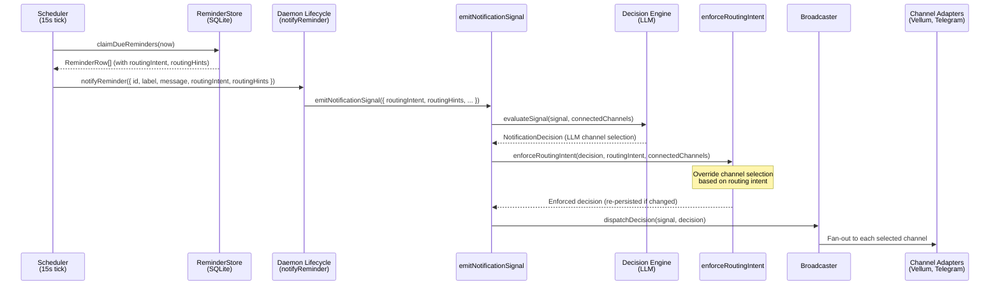
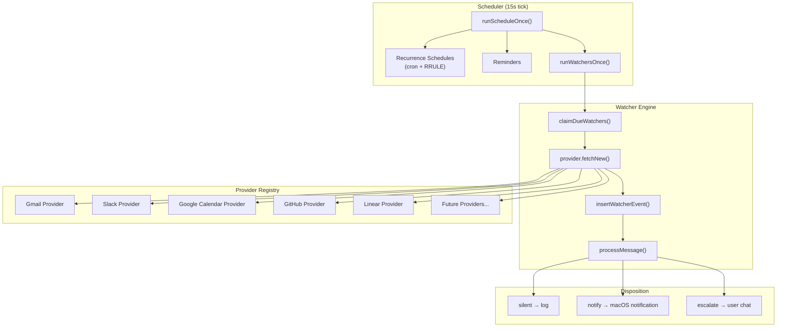
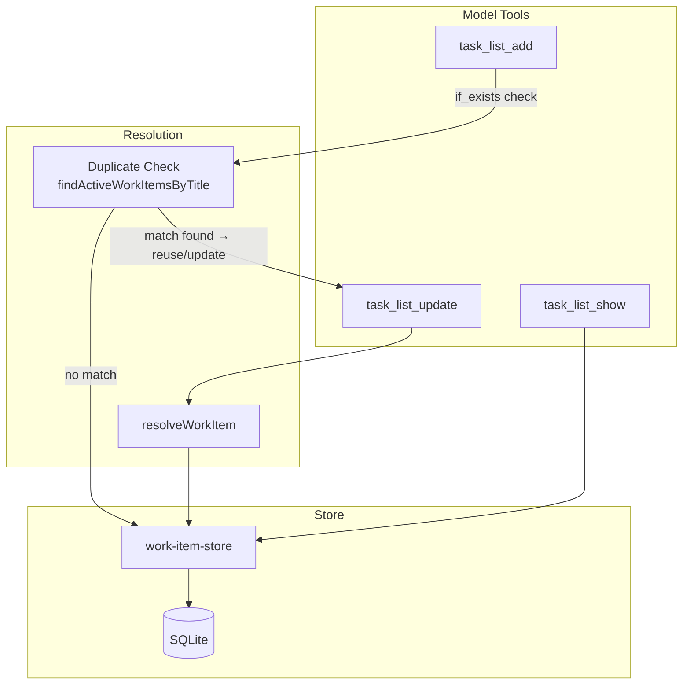

# Scheduling Architecture

Recurring schedules, watchers, and queued task execution architecture.

## Recurrence Schedules — Cron and RRULE Dual-Syntax Engine

The scheduler supports two recurrence syntaxes for recurring tasks:

- **Cron** — Standard 5-field cron expressions (e.g., `0 9 * * 1-5` for weekday mornings). Evaluated via the `croner` library.
- **RRULE** — iCalendar recurrence rules (RFC 5545). RRULE sets (multiple `RRULE` lines, `RDATE`/`EXDATE` exclusions) are parsed via `rrulestr` with `forceset: true`.

### Supported RRULE Lines

| Line      | Purpose                                                    | Example                                       |
| --------- | ---------------------------------------------------------- | --------------------------------------------- |
| `DTSTART` | Start date/time anchor (required)                          | `DTSTART:20250101T090000Z`                    |
| `RRULE:`  | Recurrence rule (one or more; multiple lines form a union) | `RRULE:FREQ=WEEKLY;BYDAY=MO,WE,FR`            |
| `RDATE`   | Add one-off dates not covered by the RRULE pattern         | `RDATE:20250704T090000Z`                      |
| `EXDATE`  | Exclude specific dates from the recurrence set             | `EXDATE:20251225T090000Z`                     |
| `EXRULE`  | Exclude an entire series defined by a recurrence pattern   | `EXRULE:FREQ=YEARLY;BYMONTH=12;BYMONTHDAY=25` |

Bounded recurrence is supported via `COUNT` (e.g., `RRULE:FREQ=DAILY;COUNT=30`) and `UNTIL` (e.g., `RRULE:FREQ=WEEKLY;UNTIL=20250331T235959Z`) parameters on `RRULE` lines.

**Exclusion precedence:** EXDATE and EXRULE exclusions always take precedence over RRULE and RDATE inclusions. A date that matches both an inclusion and an exclusion is excluded.

### Syntax Detection

The `detectScheduleSyntax()` function auto-detects which syntax an expression uses by checking for RRULE markers (`RRULE:`, `DTSTART`, `FREQ=`). When creating or updating a schedule, the caller can explicitly specify `syntax: 'cron' | 'rrule'`, or the system infers it from the expression string via `normalizeScheduleSyntax()`.

### Naming

The database column is named `cron_expression` and the Drizzle table is `cronJobs` for historical reasons. Code aliases `scheduleJobs` and `scheduleRuns` are preferred in new code. The canonical API field is `expression` with an explicit `syntax` discriminator.

### Key Source Files

| File                                          | Responsibility                                                                      |
| --------------------------------------------- | ----------------------------------------------------------------------------------- |
| `assistant/src/schedule/recurrence-types.ts`  | `ScheduleSyntax` type, `detectScheduleSyntax()`, `normalizeScheduleSyntax()`        |
| `assistant/src/schedule/recurrence-engine.ts` | Validation (`isValidScheduleExpression`), next-run computation, RRULE set detection |
| `assistant/src/schedule/schedule-store.ts`    | CRUD operations, claim-based polling                                                |
| `assistant/src/schedule/scheduler.ts`         | 15-second tick loop, fires due schedules and reminders                              |
| `assistant/src/memory/schema.ts`              | `cronJobs` / `scheduleJobs` table, `scheduleSyntax` column                          |

---

## Reminder Routing — Trigger-Time Multi-Channel Delivery

Reminders support optional routing metadata that controls how the notification pipeline fans out delivery across channels when a reminder fires. This allows a single reminder to reach the user on multiple channels (desktop, Telegram) without requiring duplicate reminders.

### Routing Metadata Model

Two columns on the `reminders` table carry routing metadata:

| Column               | Type        | Default            | Description                                                                     |
| -------------------- | ----------- | ------------------ | ------------------------------------------------------------------------------- |
| `routing_intent`     | TEXT        | `'single_channel'` | Controls channel coverage: `single_channel`, `multi_channel`, or `all_channels` |
| `routing_hints_json` | TEXT (JSON) | `'{}'`             | Free-form hints for the decision engine (e.g. preferred channels)               |

### Trigger-Time Data Flow

When the scheduler fires a reminder, routing metadata flows through the full notification pipeline:



### Enforcement Behavior

The `enforceRoutingIntent()` step runs after the LLM produces a channel selection but before deterministic checks. It acts as a post-decision guard:

| Intent           | Enforcement Rule                                                                                  |
| ---------------- | ------------------------------------------------------------------------------------------------- |
| `single_channel` | No override. The LLM's channel selection stands.                                                  |
| `multi_channel`  | If the LLM selected < 2 channels and 2+ are connected, expand to at least two connected channels. |
| `all_channels`   | Replace the LLM's selection with all connected channels.                                          |

When enforcement changes the decision, the updated `selectedChannels` and annotated `reasoningSummary` are re-persisted to `notification_decisions` so the audit trail reflects what was actually dispatched.

### Single-Reminder Fanout

One reminder creates one notification signal. The routing intent on that single signal controls how many channels receive the notification. The notification pipeline handles per-channel copy rendering, conversation pairing, and delivery through existing adapters. No duplicate reminders are needed for multi-channel delivery.

### Connected Channels at Fire Time

Channel availability is resolved when the signal is emitted (not when the reminder is created):

- **Vellum** — always connected (local HTTP)
- **Telegram** — connected when an active guardian binding exists

If a channel becomes unavailable between reminder creation and fire time, it is silently excluded from delivery. The routing intent enforcement operates only on channels that are connected at fire time.

### Key Source Files

| File                                             | Responsibility                                                                  |
| ------------------------------------------------ | ------------------------------------------------------------------------------- |
| `assistant/src/tools/reminder/reminder-store.ts` | CRUD with `routingIntent` and `routingHints` fields                             |
| `assistant/src/memory/schema.ts`                 | `reminders` table schema with `routing_intent` and `routing_hints_json` columns |
| `assistant/src/schedule/scheduler.ts`            | Claims due reminders and passes routing metadata to the notifier                |
| `assistant/src/daemon/lifecycle.ts`              | Wires the reminder notifier to `emitNotificationSignal()` with routing metadata |
| `assistant/src/notifications/emit-signal.ts`     | Orchestrates the full pipeline including routing intent enforcement             |
| `assistant/src/notifications/decision-engine.ts` | `enforceRoutingIntent()` post-decision guard                                    |
| `assistant/src/notifications/signal.ts`          | `RoutingIntent` type and `NotificationSignal` fields                            |

---

## Watcher System — Event-Driven Polling

Watchers poll external APIs on an interval, detect new events via watermark-based change tracking, and process them through a background LLM session.



**Key design decisions:**

| Decision                             | Rationale                                                                                            |
| ------------------------------------ | ---------------------------------------------------------------------------------------------------- |
| Watermark-based polling              | Efficient change detection without webhooks; each provider defines its own cursor format             |
| Background conversations             | LLM retains context across polls (e.g. "already replied to this thread"); invisible to user's chat   |
| Circuit breaker (5 errors → disable) | Prevents runaway polling when credentials expire or APIs break                                       |
| Provider interface                   | Extensible: implement `WatcherProvider` for any external API (Gmail, Stripe, Gong, Salesforce, etc.) |
| Optimistic claim locking             | Prevents double-polling in concurrent scheduler ticks                                                |

**Data tables:** `watchers` (config, watermark, status, error tracking) and `watcher_events` (detected events, dedup on `(watcher_id, external_id)`, disposition tracking).

## Task Queue — Conversation-Managed Task Execution

The Task Queue provides an ordered execution pipeline with human-in-the-loop review. Task management happens entirely through conversation — the user creates, updates, runs, and reviews tasks by talking to the assistant. There is no standalone Tasks UI window.

### Terminology

- **Task** — A reusable prompt template stored in the `tasks` table. Each Task has a title, a Handlebars template body, an optional JSON input schema, and can be executed many times (each execution creates a `task_runs` row). Tasks are the definition of something the assistant can do repeatedly — think of them as "Actions."
- **Task Queue** — An ordered list of Tasks queued up for execution and review. Each entry is a `work_items` row pointing to a Task template via `task_id`. The queue tracks run state through a defined lifecycle. "Awaiting review" means the Task ran and its output is ready for the user to inspect before being marked done.
- **WorkItem** — The backend name for a Task Queue entry. Maps 1:1 to a row in the `work_items` table.

### Data Model

The `work_items` table links to the existing `tasks` table and tracks execution state:

| Column                     | Type                | Description                                          |
| -------------------------- | ------------------- | ---------------------------------------------------- |
| `id`                       | text (PK)           | Unique work item identifier                          |
| `task_id`                  | text (FK → `tasks`) | The Task template to execute                         |
| `title`                    | text                | Display title (may differ from the Task's title)     |
| `notes`                    | text                | Optional user-provided notes or context              |
| `status`                   | text                | Lifecycle state (see below)                          |
| `priority_tier`            | integer (0–3)       | Priority bucket; lower = higher priority             |
| `sort_index`               | integer             | Manual ordering within a priority tier               |
| `last_run_id`              | text                | Most recent `task_runs.id` for this item             |
| `last_run_conversation_id` | text                | Conversation used by the last run                    |
| `last_run_status`          | text                | Status of the last run (`completed`, `failed`, etc.) |
| `source_type`              | text                | Reserved — origin type (e.g., `watcher`, `manual`)   |
| `source_id`                | text                | Reserved — origin identifier                         |
| `created_at`               | integer             | Epoch ms                                             |
| `updated_at`               | integer             | Epoch ms                                             |

**Ordering:** `priority_tier ASC, sort_index ASC, updated_at DESC`. Items with a lower priority tier appear first; within a tier, manual `sort_index` controls order; ties broken by most-recently-updated.

### Status Lifecycle

```
queued → running → awaiting_review → done → archived
                 ↘ failed ↗
```

| Status            | Meaning                                                |
| ----------------- | ------------------------------------------------------ |
| `queued`          | Waiting to be executed                                 |
| `running`         | Task is currently executing                            |
| `awaiting_review` | Task ran successfully; output is ready for user review |
| `failed`          | Task execution failed (can be retried → `running`)     |
| `done`            | User reviewed and accepted the output                  |
| `archived`        | Completed item moved out of active view                |

### Data Flow



**Key behaviors:**

- **Conversation-first management** — All task operations (create, update, run, review, delete) are performed through natural language conversation with the assistant, which invokes the model tools (`task_list_add`, `task_list_update`, `task_list_show`) on the user's behalf.
- **`task_list_update`** uses `resolveWorkItem` to find the target work item by work item ID, task ID, or title (case-insensitive exact match). When multiple items match by task ID or title, the resolver applies a deterministic tie-break (lowest priority tier, then earliest `createdAt`).
- **`task_list_add`** has duplicate prevention via the `if_exists` parameter (default: `reuse_existing`). Before creating, it calls `findActiveWorkItemsByTitle` to check for active items with the same title. If a match is found, the tool either returns the existing item (`reuse_existing`), updates it in place (`update_existing`), or proceeds to create a duplicate (`create_duplicate`).
