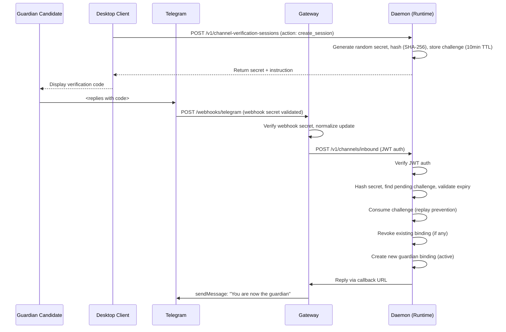
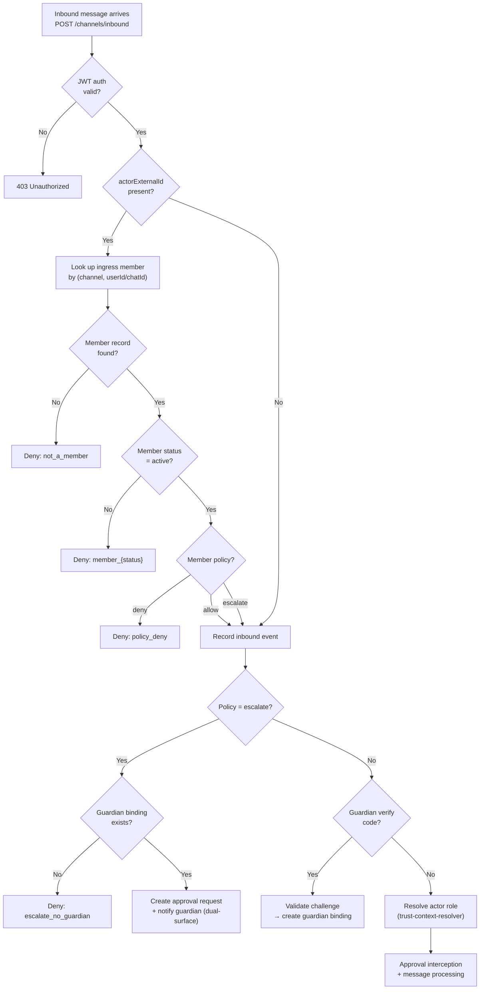
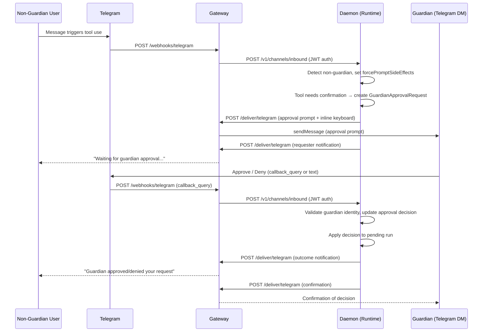
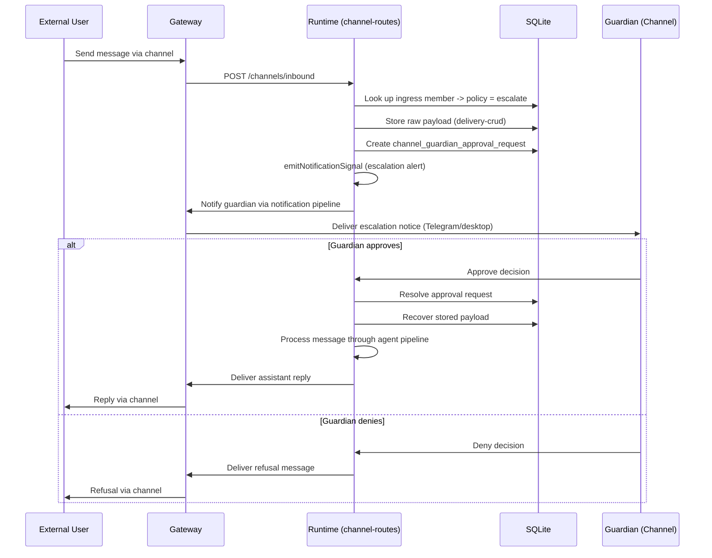
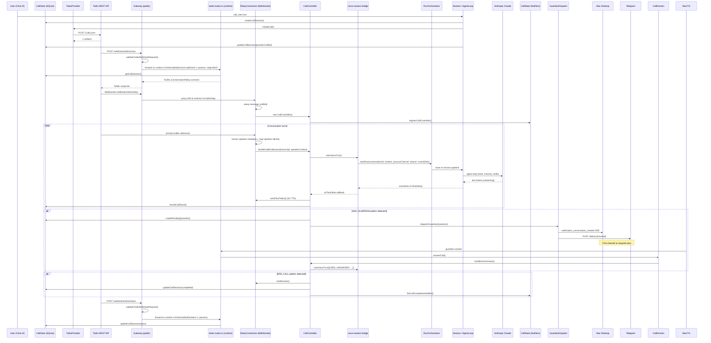
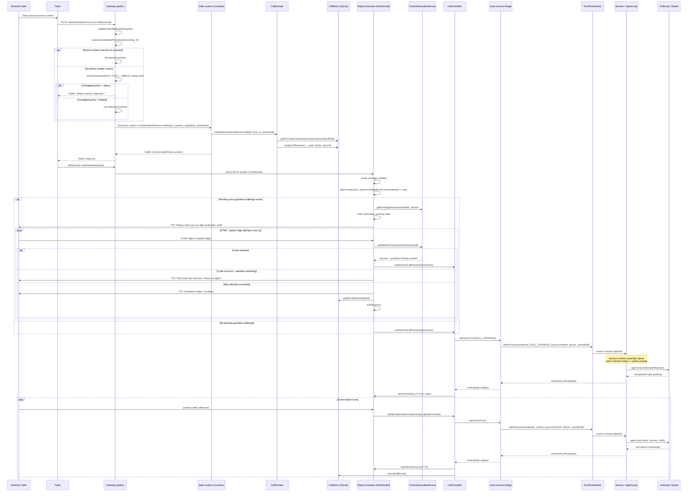

# Gateway Architecture

This document owns public-ingress and channel webhook architecture. The repo-level architecture index lives in [`/ARCHITECTURE.md`](../ARCHITECTURE.md).

## Ingress Boundary Architecture — Gateway-Only Public Ingress

All external webhook endpoints (Telegram, Twilio, WhatsApp, OAuth) and persistent channel connections (Slack Socket Mode) are handled exclusively by the gateway. The runtime never exposes webhook ingress. The runtime-proxy explicitly blocks forwarding of `/webhooks/*` paths.

This boundary is enforced at three layers:

1. **Gateway routing:** The gateway's `fetch()` handler matches `/webhooks/*` paths to dedicated handlers before the runtime-proxy fallthrough. Webhook traffic is validated (signature checks, payload limits) and forwarded to internal runtime endpoints.
2. **Runtime-proxy guard:** The runtime-proxy handler rejects any `/webhooks/*` path with a 404, preventing accidental forwarding of webhook traffic to the runtime even if a new webhook path is added to the gateway without a dedicated handler.
3. **Runtime server:** The runtime HTTP server does not register any `/webhooks/telegram` routes. Direct Twilio webhook routes (`/webhooks/twilio/*`) return 410 with a `GATEWAY_ONLY` error code, and relay WebSocket upgrades are restricted to private network peers.

```
Internet
  |
  +-- Twilio ----------> Gateway POST /webhooks/twilio/*    --> Runtime /v1/internal/twilio/*
  +-- OAuth Provider ---> Gateway GET  /webhooks/oauth/callback --> Runtime /v1/internal/oauth/callback
  +-- Telegram --------> Gateway POST /webhooks/telegram    --> Runtime /v1/channels/inbound
  +-- Slack ------------> Gateway (Socket Mode WebSocket)   --> Runtime /v1/channels/inbound
  |
  +-- Tunnel (ngrok, Cloudflare, etc.)
       |
       v
     Gateway (http://127.0.0.1:7830)
       |
       +-- Dedicated /v1/health --> Runtime /v1/health
       +-- /v1/integrations/twilio/* --> Runtime (Twilio control-plane proxy)
       +-- /v1/channels/readiness* --> Runtime (channel readiness proxy)
       +-- Runtime proxy /v1/* --> Runtime (http://127.0.0.1:7821)
       +-- /webhooks/* --> BLOCKED (404, never forwarded to runtime)
```

### STT Route Proxying (Assistant-Scoped Rewrite)

Native clients (macOS, iOS) send speech-to-text transcription requests through the gateway to the daemon's STT service. Clients POST to the assistant-scoped path `/v1/assistants/:assistantId/stt/transcribe`, which the gateway's runtime proxy rewrites to the flat daemon path `/v1/stt/transcribe`. This follows the same assistant-scoped rewrite pattern used by other client-facing endpoints (feature flags, privacy config, etc.).

The request carries base64-encoded WAV audio and a MIME type. The daemon resolves the configured STT provider via `resolveBatchTranscriber()` and returns the transcribed text. Clients use the response to implement a service-first strategy: the service transcription takes precedence when available, with Apple-native `SFSpeechRecognizer` as fallback when the service returns 503 (not configured) or fails.

| Client path (gateway)               | Daemon path (after rewrite) | Method |
| ----------------------------------- | --------------------------- | ------ |
| `/v1/assistants/:id/stt/transcribe` | `/v1/stt/transcribe`        | POST   |

**Key source files:**

| File                                             | Purpose                                                                   |
| ------------------------------------------------ | ------------------------------------------------------------------------- |
| `gateway/src/http/routes/runtime-proxy.ts`       | Assistant-scoped path rewriting (`/v1/assistants/:id/...` → `/v1/...`)    |
| `assistant/src/runtime/routes/stt-routes.ts`     | Daemon HTTP endpoint: validates audio, resolves transcriber, returns text |
| `clients/shared/Network/STTClient.swift`         | Shared client: POSTs audio to the gateway, returns typed `STTResult`      |
| `clients/shared/Utilities/AudioWavEncoder.swift` | WAV encoding utility for PCM audio buffers                                |

### STT Streaming WebSocket Proxy

Native clients (macOS, iOS) open WebSocket connections through the gateway to the daemon's real-time STT streaming endpoint for conversation chat message capture. The gateway authenticates the downstream client using an edge JWT (actor principal required), then opens an upstream WebSocket connection to the daemon's `/v1/stt/stream` endpoint with a short-lived gateway service token. This keeps the daemon's WebSocket endpoint unreachable from the public internet while allowing authenticated clients to stream audio for real-time transcription.

**Config-authoritative model:** The runtime always resolves the streaming transcriber from `services.stt.provider` in the assistant config, regardless of any `provider` query parameter. The `provider` parameter is optional compatibility metadata — when supplied and it disagrees with the configured provider, the runtime logs a mismatch warning for operator visibility.

**Client path:** `wss://<gateway>/v1/stt/stream?mimeType=<mime>[&provider=<id>][&sampleRate=<hz>]`

**Query parameters:**

| Parameter    | Required | Description                                                                                                                                                                                               |
| ------------ | -------- | --------------------------------------------------------------------------------------------------------------------------------------------------------------------------------------------------------- |
| `mimeType`   | Yes      | MIME type of the audio being streamed (e.g. `audio/webm;codecs=opus`)                                                                                                                                     |
| `provider`   | No       | Optional STT provider identifier (`deepgram`, `google-gemini`, `openai-whisper`, `xai`). Forwarded as compatibility metadata — the runtime resolves the transcriber from config, not from this parameter. |
| `sampleRate` | No       | Sample rate in Hz (e.g. `16000`). Passed through to the daemon.                                                                                                                                           |
| `token`      | No       | Edge JWT (alternative to `Authorization: Bearer` header for WS upgrades)                                                                                                                                  |

**Auth model:** STT streaming is an authenticated, assistant-scoped path. The client must present a valid edge JWT with an actor principal. Service tokens are rejected. When `runtimeProxyRequireAuth` is globally disabled (dev bypass), the upgrade proceeds without token validation.

**Proxy behavior:** The gateway buffers up to 100 downstream messages while the upstream connection to the daemon is being established. If the buffer overflows, the downstream connection is closed with code 1008 (policy violation). Once the upstream connection opens, buffered messages are flushed in order. All subsequent messages are forwarded bidirectionally: client audio frames flow upstream, daemon transcript events (JSON text frames: `ready`, `partial`, `final`, `error`, `closed`) flow downstream. When either side closes, the other side is closed with the same code/reason.

**Key source files:**

| File                                              | Purpose                                                                                                            |
| ------------------------------------------------- | ------------------------------------------------------------------------------------------------------------------ |
| `gateway/src/http/routes/stt-stream-websocket.ts` | WebSocket upgrade handler (`createSttStreamWebsocketHandler`) and proxy handlers (`getSttStreamWebsocketHandlers`) |
| `gateway/src/index.ts`                            | Route registration: wires upgrade handler to the gateway's Bun HTTP server                                         |
| `assistant/src/runtime/http-server.ts`            | Daemon-side WebSocket upgrade at `/v1/stt/stream`, session creation and registry                                   |
| `assistant/src/stt/stt-stream-session.ts`         | Runtime session orchestrator: drives the `StreamingTranscriber` from the WebSocket                                 |
| `clients/shared/Network/STTStreamingClient.swift` | Swift client: builds the gateway WS URL via `GatewayHTTPClient.buildWebSocketRequest`                              |

### Assistant Feature Flags API

The gateway exposes a REST API for reading and mutating assistant feature flags. Assistant feature flags are assistant-scoped, declaration-driven booleans that can gate any assistant behavior. Skill availability is one consumer, but not a required coupling (see [`assistant/ARCHITECTURE.md`](../assistant/ARCHITECTURE.md) for resolver and skill enforcement details).

**Unified registry loader:** The gateway loads the unified feature flag registry from `meta/feature-flags/feature-flag-registry.json` (bundled copy at `gateway/src/feature-flag-registry.json`) via `loadFeatureFlagDefaults()` in `gateway/src/feature-flag-defaults.ts`. Only flags with `scope: "assistant"` are used for the API. The registry is loaded once and cached for the lifetime of the process. Invalid entries are skipped with a warning. The `isFlagDeclared()` helper validates that a flag key exists in the registry before allowing writes.

**Endpoints (GET/PATCH contract):**

| Method | Path                     | Description                                                                                                                                                                                                                                         |
| ------ | ------------------------ | --------------------------------------------------------------------------------------------------------------------------------------------------------------------------------------------------------------------------------------------------- |
| GET    | `/v1/feature-flags`      | List all declared assistant feature flags from the defaults registry, merged with persisted values from the feature flag store. Returns `{ flags: FeatureFlagEntry[] }` where each entry has `key`, `enabled`, `defaultEnabled`, and `description`. |
| PATCH  | `/v1/feature-flags/:key` | Set a single assistant feature flag. Body: `{ "enabled": true\|false }`. Key must be a simple kebab-case flag key declared in the defaults registry. Writes to `~/.vellum/protected/feature-flags.json`.                                            |

**Unified registry:** All declared feature flags and their default values are defined in the unified registry at `meta/feature-flags/feature-flag-registry.json` (bundled copy at `gateway/src/feature-flag-registry.json`). The gateway loads this registry on startup via `gateway/src/feature-flag-defaults.ts`, filtering to `scope: "assistant"` flags. Labels come from the registry. The GET endpoint merges persisted overrides with registry defaults to produce the full flag list. The PATCH endpoint validates that the target flag key exists in the registry before accepting a write. Only declared keys are exposed by this API.

**Flag key format:** The canonical key format is simple kebab-case (e.g., `browser`, `ces-tools`). Only keys matching this pattern and declared in the registry are accepted by the PATCH endpoint; other patterns are rejected with 400. All writes use the canonical format and are stored in the protected feature flag store (`~/.vellum/protected/feature-flags.json`).

**Storage:** Flag overrides are persisted in `~/.vellum/protected/feature-flags.json` (local) or `GATEWAY_SECURITY_DIR/feature-flags.json` (Docker). The store uses a versioned JSON format (`{ version: 1, values: Record<string, boolean> }`). The GET endpoint reads from the feature flag store and merges with registry defaults. The gateway writes atomically (temp file + rename, 0o600 permissions). The daemon's config watcher monitors the protected directory and hot-reloads changes, so flag mutations take effect on the next session or tool resolution without a restart.

**Token separation (authentication boundary):**

The assistant feature flags API uses scope-based JWT auth. The gateway issues JWTs with `feature_flags.read` and `feature_flags.write` scopes to control access.

| Operation                      | Required scope        |
| ------------------------------ | --------------------- |
| `GET /v1/feature-flags`        | `feature_flags.read`  |
| `PATCH /v1/feature-flags/:key` | `feature_flags.write` |

The assistant daemon does not read or distribute a feature-flag token. All feature-flag auth flows go through the gateway's scoped JWT mechanism.

**Protected feature flag store:** The canonical storage for assistant feature flag overrides is `~/.vellum/protected/feature-flags.json` (local) or `GATEWAY_SECURITY_DIR/feature-flags.json` (Docker). The store is managed by `gateway/src/feature-flag-store.ts` and uses a versioned JSON format with `Record<string, boolean>` values keyed by canonical flag keys (simple kebab-case, e.g., `browser`). The gateway's PATCH handler writes exclusively to this store. The daemon's resolver reads it with highest priority, falling back to the defaults registry. Undeclared keys are ignored by the resolver.

**Key source files:**

| File                                            | Purpose                                                                                                            |
| ----------------------------------------------- | ------------------------------------------------------------------------------------------------------------------ |
| `gateway/src/http/routes/feature-flags.ts`      | GET and PATCH handlers; key format validation; delegates to feature-flag-store for persistence                     |
| `gateway/src/feature-flag-store.ts`             | File-backed persistence: `readPersistedFeatureFlags()`, `writeFeatureFlag()`, atomic writes to protected directory |
| `gateway/src/feature-flag-defaults.ts`          | `loadFeatureFlagDefaults()` — loads the shared defaults registry; `isFlagDeclared()` — validates flag keys         |
| `gateway/src/config.ts`                         | `readOrGenerateFeatureFlagToken()` — token provisioning; `featureFlagToken` config field                           |
| `gateway/src/index.ts`                          | Route registration, auth enforcement (dual-token for GET, flag-token-only for PATCH), token file watcher           |
| `meta/feature-flags/feature-flag-registry.json` | Unified feature flag registry (repo root) — all declared flags with scope, label, default values, and descriptions |
| `gateway/src/feature-flag-registry.json`        | Bundled copy of the unified registry for compiled binary resolution                                                |

### Channel Verification Session Control-Plane Proxy

Channel verification session endpoints are exposed directly by the gateway and forwarded to runtime integration handlers for dedicated auth handling. This keeps assistant skills and user-facing tooling on gateway URLs only.

**Forwarded endpoints:**

| Method | Path                                       |
| ------ | ------------------------------------------ |
| POST   | `/v1/channel-verification-sessions`        |
| DELETE | `/v1/channel-verification-sessions`        |
| POST   | `/v1/channel-verification-sessions/resend` |
| GET    | `/v1/channel-verification-sessions/status` |
| POST   | `/v1/channel-verification-sessions/revoke` |
| POST   | `/v1/guardian/refresh`                     |

The `/v1/guardian/refresh` endpoint is the only public ingress for rotating JWT access + refresh token credentials. Clients must call this through the gateway; the runtime endpoint is not directly exposed. The gateway validates the caller's JWT and forwards to the runtime, which handles refresh token validation, rotation, and replay detection (see [`assistant/ARCHITECTURE.md`](../assistant/ARCHITECTURE.md) for the JWT auth lifecycle).

**Authentication boundary:**

- Gateway validates the caller's JWT bearer token.
- Gateway forwards requests to runtime with a minted JWT (`gateway_service_v1` scope profile).
- Upstream 4xx/5xx responses are passed through, while connection errors return `502` and timeouts return `504`.

**Key source files:**

| File                                                            | Purpose                                                                               |
| --------------------------------------------------------------- | ------------------------------------------------------------------------------------- |
| `gateway/src/http/routes/channel-verification-session-proxy.ts` | Channel verification session proxy handlers and upstream forwarding                   |
| `gateway/src/index.ts`                                          | Route registration and JWT auth enforcement for `/v1/channel-verification-sessions/*` |

### Runtime Health Proxy

Runtime health is exposed directly by the gateway at `GET /v1/health` and forwarded to the runtime's `GET /v1/health` endpoint for dedicated auth handling.

**Authentication boundary:**

- Gateway validates the caller's JWT bearer token.
- Gateway forwards the request to runtime with a minted JWT (`gateway_service_v1` scope profile).
- Upstream 4xx/5xx responses are passed through, while connection errors return `502` and timeouts return `504`.

**Key source files:**

| File                                              | Purpose                                                         |
| ------------------------------------------------- | --------------------------------------------------------------- |
| `gateway/src/http/routes/runtime-health-proxy.ts` | Runtime health proxy handler and upstream forwarding            |
| `gateway/src/index.ts`                            | Route registration and bearer-auth enforcement for `/v1/health` |

### Telegram + Contacts Control-Plane Proxies

Telegram integration setup/config endpoints and contacts/invites endpoints are also exposed directly by the gateway and forwarded to runtime handlers for dedicated auth handling.

**Forwarded Telegram endpoints:**

| Method          | Path                                 |
| --------------- | ------------------------------------ |
| GET/POST/DELETE | `/v1/integrations/telegram/config`   |
| POST            | `/v1/integrations/telegram/commands` |
| POST            | `/v1/integrations/telegram/setup`    |

**Forwarded contact & invite endpoints:**

| Method   | Path                                     |
| -------- | ---------------------------------------- |
| GET/POST | `/v1/contacts`                           |
| GET      | `/v1/contacts/:contactId`                |
| POST     | `/v1/contacts/merge`                     |
| PATCH    | `/v1/contact-channels/:contactChannelId` |
| GET/POST | `/v1/contacts/invites`                   |
| DELETE   | `/v1/contacts/invites/:inviteId`         |
| POST     | `/v1/contacts/invites/redeem`            |

**Authentication boundary:**

- Gateway validates the caller's JWT bearer token.
- Gateway forwards requests to runtime with a minted JWT (`gateway_ingress_v1` or `gateway_service_v1` scope profile).
- Upstream 4xx/5xx responses are passed through, while connection errors return `502` and timeouts return `504`.

**Key source files:**

| File                                                      | Purpose                                                                                                       |
| --------------------------------------------------------- | ------------------------------------------------------------------------------------------------------------- |
| `gateway/src/http/routes/telegram-control-plane-proxy.ts` | Telegram control-plane proxy handlers and upstream forwarding                                                 |
| `gateway/src/http/routes/contacts-control-plane-proxy.ts` | Contacts control-plane proxy handlers and upstream forwarding                                                 |
| `gateway/src/index.ts`                                    | Route registration and bearer-auth enforcement for `/v1/integrations/telegram/*` and `/v1/contacts/invites/*` |

### Twilio Control-Plane Proxy

Twilio integration setup/config endpoints are exposed directly by the gateway and forwarded to runtime handlers for dedicated auth handling. This keeps skills and clients on gateway URLs exclusively.

**Forwarded endpoints:**

| Method | Path                                        |
| ------ | ------------------------------------------- |
| GET    | `/v1/integrations/twilio/config`            |
| POST   | `/v1/integrations/twilio/credentials`       |
| DELETE | `/v1/integrations/twilio/credentials`       |
| GET    | `/v1/integrations/twilio/numbers`           |
| POST   | `/v1/integrations/twilio/numbers/provision` |
| POST   | `/v1/integrations/twilio/numbers/assign`    |
| POST   | `/v1/integrations/twilio/numbers/release`   |

**Authentication boundary:**

- Gateway validates the caller's JWT bearer token.
- Gateway forwards requests to runtime with a minted JWT (`gateway_ingress_v1` or `gateway_service_v1` scope profile).
- Upstream 4xx/5xx responses are passed through, while connection errors return `502` and timeouts return `504`.

**Key source files:**

| File                                                    | Purpose                                                                        |
| ------------------------------------------------------- | ------------------------------------------------------------------------------ |
| `gateway/src/http/routes/twilio-control-plane-proxy.ts` | Twilio control-plane proxy handlers and upstream forwarding                    |
| `gateway/src/index.ts`                                  | Route registration and bearer-auth enforcement for `/v1/integrations/twilio/*` |

### Channel Readiness Proxy

Channel readiness endpoints are exposed directly by the gateway and forwarded to runtime handlers for dedicated auth handling.

**Forwarded endpoints:**

| Method | Path                             |
| ------ | -------------------------------- |
| GET    | `/v1/channels/readiness`         |
| POST   | `/v1/channels/readiness/refresh` |

**Authentication boundary:**

- Gateway validates the caller's JWT bearer token.
- Gateway forwards requests to runtime with a minted JWT (`gateway_ingress_v1` or `gateway_service_v1` scope profile).
- Upstream 4xx/5xx responses are passed through, while connection errors return `502` and timeouts return `504`.

**Key source files:**

| File                                                 | Purpose                                                                      |
| ---------------------------------------------------- | ---------------------------------------------------------------------------- |
| `gateway/src/http/routes/channel-readiness-proxy.ts` | Channel readiness proxy handlers and upstream forwarding                     |
| `gateway/src/index.ts`                               | Route registration and bearer-auth enforcement for `/v1/channels/readiness*` |

### Channel Binding Lifecycle (Lane Separation)

Each channel (desktop, Telegram, etc.) operates in its own **lane**: conversations created by an external channel are never displayed in the desktop conversation list, and desktop conversations are never exposed to external channels. The `channelBinding` metadata on a conversation is used solely for routing inbound/outbound messages within that lane and for filtering conversations during desktop conversation restoration.

Channel bindings follow a three-phase lifecycle:

1. **Bind** — An inbound message from an external channel (e.g., Telegram chat) arrives at the gateway, which normalizes it and forwards it to the runtime's `/v1/channels/inbound` endpoint. The runtime creates or reuses a conversation, establishing the channel binding (`sourceChannel` metadata on the conversation).

2. **Route** — Subsequent messages on the same external chat are routed to the same conversation via the channel binding. Replies from the assistant are delivered back through the gateway's `/deliver/telegram` endpoint. The desktop client filters out channel-bound conversations during conversation restoration (`ConversationRestorer`) so they never appear in the desktop conversation list.

3. **Rebind** — If a message arrives on an external chat whose conversation was previously deleted, the channel inbound handler treats it as a new conversation and establishes a fresh binding. The external chat ID is reused, but the conversation is new.

### Configuration

The public URL where the gateway is reachable is configured via:

| Source                                              | Description                                                                                                                                             |
| --------------------------------------------------- | ------------------------------------------------------------------------------------------------------------------------------------------------------- |
| `ingress.publicBaseUrl` (workspace config)          | Canonical public ingress URL for Telegram webhooks, OAuth callbacks, email callbacks, generic JSON webhooks, Twilio webhooks, and Twilio WebSocket URLs |
| `ingress.publicBaseUrlManagedBy` (workspace config) | Ownership marker used when Velay published `ingress.publicBaseUrl`; lets the gateway clear stale Velay-managed URLs without disturbing manual URLs      |

### Tunnel-Agnostic Setup

To expose the gateway for external callbacks during local development:

1. **Start your tunnel** service (ngrok, Cloudflare Tunnel, or any similar tool), pointing it at the local gateway: `http://127.0.0.1:7830`
2. **Set the public URL** provided by the tunnel as `ingress.publicBaseUrl` in the Settings UI (Public Ingress section)

The assistant runtime reads this URL via the centralized `public-ingress-urls.ts` module and uses it to construct webhook and callback URLs automatically. Ngrok and custom tunnels remain supported for every ingress surface, including Twilio fallback.

### Velay Twilio Ingress

Velay is a platform-managed tunnel for assistant-hosted HTTP and WebSocket traffic. When it is active, Velay publishes the registered public assistant URL to `ingress.publicBaseUrl` and marks it with `ingress.publicBaseUrlManagedBy: "velay"`.

When `VELAY_BASE_URL` is present in the gateway environment, the gateway creates `VelayTunnelClient` but starts it only after Twilio setup has been started in the workspace. On boot, existing Twilio credentials or existing `twilio.accountSid` / `twilio.phoneNumber` config count as prior setup, and successful credential setup persists `twilio.setupStarted: true` for future boots. Before credential-backed startup side effects run, the gateway clears any stale Velay-managed `ingress.publicBaseUrl`; if setup has not started, it does this without opening a tunnel. The client registers with Velay over `GET /v1/register` using the assistant API key, then receives a `registered` frame containing a public assistant URL such as `https://velay.vellum.ai/<assistant-id>`. The gateway writes that URL to `ingress.publicBaseUrl`. When the tunnel disconnects, it clears that value only if the Velay ownership marker is still present and the URL still matches what the tunnel published, leaving manual URLs intact.

Velay forwards both HTTP request frames and WebSocket frames into the local gateway loopback listener:

```text
Public Velay HTTPS/WSS URL
  → Velay tunnel session
  → Gateway Velay bridge
  → Gateway loopback listener (http://127.0.0.1:<GATEWAY_PORT>)
  → Existing gateway route handlers
```

The HTTP bridge can carry normal JSON requests and health checks, so it is useful for local bridge smoke tests. Velay-managed `ingress.publicBaseUrl` changes are tagged with `publicBaseUrlManagedBy` so gateway side effects can skip unrelated webhook reconciliation while still refreshing Twilio phone-number webhooks.

Local platform smoke-test flow:

1. In `vellum-assistant-platform`, run `vel up velay`.
2. Ensure vembda passes the environment-appropriate `VELAY_BASE_URL` into assistant gateway containers.
3. Start or complete Twilio setup in the workspace so the gateway is allowed to connect the tunnel.
4. Re-hatch or restart the assistant so the gateway receives the new environment.
5. Confirm gateway logs show `Velay tunnel connected` and `Velay tunnel registered`.
6. Verify HTTP forwarding by requesting `${VELAY_PUBLIC_BASE_URL}/<assistant-id>/healthz` and `${VELAY_PUBLIC_BASE_URL}/<assistant-id>/schema`. When validating a JSON webhook route under active development, POST a small JSON body through the same Velay public URL and confirm it reaches the loopback gateway.
7. Verify Twilio WebSocket forwarding with a synthetic local WebSocket client against `${VELAY_PUBLIC_BASE_URL}/<assistant-id>/webhooks/twilio/relay?callSessionId=...&token=...`, then with a real Twilio call after the gateway has registered with Velay.

### URL Builders

All public-facing URLs are constructed by `assistant/src/inbound/public-ingress-urls.ts`:

| Function                       | URL Pattern                                                                                                                                                      |
| ------------------------------ | ---------------------------------------------------------------------------------------------------------------------------------------------------------------- |
| `getPublicBaseUrl()`           | Resolves the canonical base URL from `ingress.publicBaseUrl` in workspace config or module-level state (assistant-side; the gateway reads via `ConfigFileCache`) |
| `getTwilioVoiceWebhookUrl()`   | `${base}/webhooks/twilio/voice?callSessionId=...`, using `ingress.publicBaseUrl`                                                                                 |
| `getTwilioStatusCallbackUrl()` | `${base}/webhooks/twilio/status`, using `ingress.publicBaseUrl`                                                                                                  |
| `getTwilioConnectActionUrl()`  | `${base}/webhooks/twilio/connect-action`, using `ingress.publicBaseUrl`                                                                                          |
| `getTwilioRelayUrl()`          | `ws(s)://.../webhooks/twilio/relay`, using `ingress.publicBaseUrl`                                                                                               |
| `getOAuthCallbackUrl()`        | `${base}/webhooks/oauth/callback`                                                                                                                                |
| `getTelegramWebhookUrl()`      | `${base}/webhooks/telegram`                                                                                                                                      |

### Telegram Messaging Flow

Telegram messages follow three paths through the system:

```
Inbound (user → assistant):
  Telegram → Gateway POST /webhooks/telegram → verify secret → normalize → route
    → Runtime POST /v1/assistants/:id/channels/inbound
    (replyCallbackUrl = ${gatewayInternalBaseUrl}/deliver/telegram)

Outbound reply (assistant → user, triggered by inbound):
  Runtime callback → Gateway POST /deliver/telegram (bearer auth) → Telegram sendMessage/sendPhoto/sendDocument/sendChatAction

Outbound proactive (assistant → user, initiated by messaging provider):
  Runtime messaging provider → Gateway POST /deliver/telegram (bearer auth) → Telegram sendMessage/sendChatAction
```

The `replyCallbackUrl` included in the inbound forward is built from the `gatewayInternalBaseUrl` config field, which is always derived from `GATEWAY_PORT` as `http://127.0.0.1:${GATEWAY_PORT}` (default port `7830`). Both the hostname (`127.0.0.1`) and port derivation are hardcoded in `gateway/src/config.ts`, so the gateway and runtime must be co-located (same host, `--network host`, or Docker Compose with shared networking) for callbacks to reach the gateway. Separate-host deployments are not currently supported.

The `/deliver/telegram` endpoint requires bearer auth unconditionally (fail-closed). If no bearer token is configured and the dev-only bypass flag (`telegram.deliverAuthBypass` in `workspace/config.json`) is not set, the endpoint returns 503 rather than allowing unauthenticated access. The bypass requires `APP_VERSION=0.0.0-dev`.

**Bot-account limitations:** The Telegram Bot API only supports sending messages to chats that have previously interacted with the bot. Bots cannot enumerate chats, read message history, or search messages. A future MTProto user-account session track may lift some of these restrictions.

### Channel Approval Flow

When the assistant requires tool-use confirmation during a channel session (e.g., Telegram), the approval flow intercepts the run and surfaces an interactive prompt to the user. This approval-aware path is always active when orchestrator + callback context are available. Guardian enforcement (fail-closed denial for unknown actors, explicit approval prompts for side effects, guardian-routed approval prompts) applies consistently to non-guardian/unverified actors.

**State machine:**

```
Running → NeedsConfirmation → Running → Completed | Failed
```

The run transitions to `NeedsConfirmation` when the agent loop emits a `confirmation_request` event. It returns to `Running` after the user submits a decision (approve/reject), and eventually reaches `Completed` or `Failed`.

**Telegram button round-trip:**

```
Runtime detects needs_confirmation
  → runtime builds approval prompt + UI metadata
  → POST /deliver/telegram with `approval` payload
  → gateway renders inline keyboard (buttons: Approve once, Approve always, Reject)
  → user clicks button → Telegram callback_query
  → gateway normalizes callback_query into inbound event (callbackData field)
  → runtime parses callback data (format: apr:<requestId>:<action>)
  → runtime applies decision to pending run → run resumes
```

**Deliver-once guard:** Both the main poll (`processChannelMessageWithApprovals`) and the post-decision poll (`schedulePostDecisionDelivery`) race to deliver the final assistant reply when a run reaches terminal state. The `claimRunDelivery()` function in `delivery-channels.ts` uses an in-memory `Set<string>` to ensure at-most-one delivery per run. The first caller to claim the run ID proceeds with delivery; the other silently skips it. This is an in-memory guard — sufficient because both racing pollers execute within the same process.

**Fail-closed prompt delivery:** All approval prompt delivery paths auto-deny the run if the prompt cannot be delivered, preventing silent `needs_confirmation` hangs:

- **Standard (self-approval):** `deliverApprovalPrompt()` failure triggers `handleChannelDecision(reject)`.
- **Guardian-routed:** Delivery failure to the guardian's chat marks the approval record `denied`, rejects the run, and notifies the requester.
- **Unverified channel (no guardian binding):** Sensitive actions are auto-denied immediately without attempting prompt delivery.

**Stale callback blocking:** When inbound `callbackData` does not match any pending approval (e.g., a button from an old prompt), the runtime returns `stale_ignored` and does not process the payload as a regular message. This prevents stale button presses from triggering unrelated agent loops.

**Conversational approval turn:** When a text message arrives while an approval is pending (e.g., non-Telegram channels or user typing a reply instead of clicking a button), a **conversational approval turn** is run via `runApprovalConversationTurn()` from `approval-conversation-turn.ts`. The conversational engine uses LLM structured output (native `tool_use`) to classify user intent as: `keep_pending` (reply without deciding), `approve_once`, `approve_always`, or `reject`. Non-decision messages receive a natural assistant reply and the run stays pending — no reminder spam. The engine fails closed: any model failure returns `keep_pending` with a deterministic fallback asking the user to try again. Callback/button handling remains deterministic and unchanged. The `channelSupportsRichApprovalUI()` function determines whether to send the structured `promptText` (for rich channels like Telegram) or the `plainTextFallback` string (for all other channels). Currently only `telegram` is classified as a rich channel.

**Guardian-aware routing:** When a guardian binding exists for the channel, the approval flow resolves the sender's actor role (`guardian` vs `non-guardian`). Non-guardian actors have `forcePromptSideEffects` set on the session so all side-effect tools trigger approval prompts regardless of existing allow rules. Approval prompts for non-guardian actions are routed to the guardian's delivery chat (not the requester's chat), and a `channelGuardianApprovalRequest` record is created. When the guardian approves or denies, the decision is applied to the underlying run and the requester's chat is notified of the outcome. Guardian actors follow the standard approval flow. Guardian approval follow-ups also use the conversational engine with role-specific context; `approve_always` is downgraded to `approve_once` for guardian approvals since permanent allow-rules require guardian authority. All guardian state (bindings, challenges, approval requests) is scoped to the `(assistantId, channel)` pair -- the `assistantId` parameter flows through `handleChannelInbound`, `validateAndConsumeVerification`, `isGuardian`, `getGuardianBinding`, and `createApprovalRequest`.

**Proactive expiry sweep:** The runtime runs a periodic sweep every 60 seconds (`sweepExpiredGuardianApprovals`) that finds guardian approval requests past the 30-minute TTL, auto-denies the underlying runs, and notifies both the requester and guardian via the gateway's per-channel `/deliver/<channel>` endpoint. This ensures expired approvals are closed without waiting for follow-up traffic from either party. The sweep is started automatically whenever a run orchestrator is available.

**Gateway-origin ingress contract:** The JWT token exchanged during gateway-to-runtime authentication proves gateway origin (via the `aud=vellum-daemon` claim). No separate header is required.

**Key modules:**

| Module                                                  | Purpose                                                                                                                                                                 |
| ------------------------------------------------------- | ----------------------------------------------------------------------------------------------------------------------------------------------------------------------- |
| `assistant/src/runtime/approval-conversation-turn.ts`   | Conversational approval turn engine: LLM-based intent classification (structured output) for pending approval follow-ups, with fail-closed safety                       |
| `assistant/src/runtime/approval-message-composer.ts`    | Centralized approval message composition: layered source selection (assistant preface → deterministic fallback) for all approval/guardian/verification user-facing copy |
| `assistant/src/runtime/channel-approvals.ts`            | Orchestration: detect pending confirmations, build prompts (including guardian-aware prompts), apply decisions, plain-text fallback selection                           |
| `assistant/src/runtime/channel-approval-types.ts`       | Shared types: actions, prompts, UI metadata, decisions                                                                                                                  |
| `assistant/src/runtime/routes/channel-routes.ts`        | Integration point: approval interception, actor role resolution, guardian approval routing, deliver-once guard, fail-closed prompt delivery                             |
| `assistant/src/runtime/channel-verification-service.ts` | Guardian binding lookups: `isGuardian()`, `getGuardianBinding()`                                                                                                        |
| `assistant/src/memory/delivery-channels.ts`             | `claimRunDelivery()` — in-memory deliver-once guard for terminal reply idempotency                                                                                      |
| `assistant/src/memory/guardian-approvals.ts`            | CRUD for guardian approval requests: `createApprovalRequest()`, `getPendingApprovalByGuardianChat()`, `updateApprovalDecision()`                                        |
| `assistant/src/runtime/gateway-client.ts`               | `deliverApprovalPrompt()` — sends approval payload to gateway                                                                                                           |
| `gateway/src/telegram/send.ts`                          | `buildInlineKeyboard()` — renders approval actions as Telegram inline buttons                                                                                           |
| `gateway/src/telegram/normalize.ts`                     | `callback_query` normalization into `GatewayInboundEvent` (DM-only, drops callbacks without data)                                                                       |

### Approval Message Composer

The `approval-message-composer.ts` module provides a centralized system for generating approval lifecycle messages across channels. It uses a layered source selection:

1. **Assistant preface** — reuses existing assistant text (macOS parity)
2. **Deterministic fallback** — scenario-specific templates with required semantic content

All approval/guardian/verification user-facing copy routes through this composer. Deterministic behavior (action IDs, callback payloads) remains separate and unchanged. A guard test (`approval-hardcoded-copy-guard.test.ts`) scans the route/service files for banned hard-coded copy literals to prevent regressions.

### Channel Guardian Security

The guardian system adds a cryptographic trust layer for channel-based interactions. A **guardian** is the designated human authority for a given `(assistantId, channel)` pair. Once verified, the guardian's identity gates sensitive actions by non-guardian users and provides an approval pathway. All guardian operations (bindings, challenges, approval requests) are scoped by `assistantId` -- verifying as guardian on one assistant does not grant guardian status on another.

#### Canonical Assistant ID Scoping

The daemon uses the fixed constant `DAEMON_INTERNAL_ASSISTANT_ID` (`"self"`) from `runtime/assistant-scope.ts` for all assistant-scoped storage keys. Public/external assistant IDs are a gateway/platform concern and never leak into daemon scoping logic. The `normalizeAssistantId()` function in `util/platform.ts` exists solely for the gateway layer to canonicalize inbound requests before proxying -- daemon and runtime code must not call it or accept an `assistantId` parameter for scoping.

#### Guardian Verify Code Parsing

The inbound message handler (`inbound-message-handler.ts`) accepts verification codes as bare-code replies:

- **Bare code**: A 6-digit numeric code sent as the entire message body. This is the primary flow — the user is shown a verification code in setup UI and sends that code in-channel as a plain message.

#### Explicit Rebind Policy

Creating a new guardian challenge when a binding already exists for the `(assistantId, channel)` pair requires explicit `rebind: true` in the HTTP request. Without it, the daemon returns `already_bound` to the caller. This prevents accidental guardian replacement -- the desktop UI must explicitly acknowledge that it is replacing an existing guardian before a new challenge is issued. On the verification side, `validateAndConsumeVerification` always revokes any existing active binding before creating the new one, so the actual binding swap is atomic.

#### Guardian Takeover Prevention

`validateAndConsumeVerification` rejects verification when an active binding exists for a _different_ external user. This prevents an attacker who intercepts a verification code from hijacking an established guardian binding. Same-user re-verification (e.g., re-verifying after a session timeout) is allowed, since the external user ID matches the existing binding.

#### Guardian Verification Flow

A challenge-response handshake binds a Telegram user as the guardian:



The raw secret is shown only once in the desktop UI and must be sent by the user in-channel to complete verification. (Outbound session creation via `POST /v1/channel-verification-sessions` with a `destination` separately sends template messages/calls with the code.) Only the SHA-256 hash is persisted. Challenges expire after 10 minutes. Consumed challenges cannot be reused. Rate limiting (5 invalid attempts per 15-minute window, 30-minute lockout) protects against brute-force attacks.

#### Inbound Message Decision Chain

The channel inbound handler (`inbound-message-handler.ts`) evaluates incoming messages through a strict decision chain. Ingress ACL enforcement runs first, before guardian role resolution and message processing:



This ordering ensures that ingress ACL decisions are finalized before any agent processing occurs. Guardian verification code replies are intercepted after ACL enforcement but before the agent loop, so they never trigger inference.

#### Actor Role Resolution

When a message arrives on a channel, the runtime resolves the sender's role. Role _classification_ runs unconditionally. Guardian enforcement (`forcePromptSideEffects`, fail-closed denial, guardian approval routing) applies to non-guardian/unverified actors whenever orchestrator + callback context are available:

- **Guardian**: `actorExternalId` matches the binding's `guardianExternalUserId` (DB column) for the `(assistantId, channel)` pair. Self-approval is handled through the same approval-aware channel flow.
- **Non-guardian**: A known sender who is not the guardian. Side-effect tools are forced through the confirmation flow (`forcePromptSideEffects`), and approval prompts are routed to the guardian's chat instead of the requester's chat.
- **Unverified channel**: No guardian binding exists for the channel, or `actorExternalId` is absent. Sensitive actions are auto-denied immediately (fail-closed). This prevents unverified senders from self-approving actions or bypassing guardian enforcement by omitting identity data.

#### Sensitive Action Gating (Non-Guardian Approval)

When a non-guardian user triggers a tool requiring confirmation, the approval is escalated to the guardian:



The `channelGuardianApprovalRequests` table tracks per-run approval state. Each request records the requester, guardian, tool name, risk level, and decision outcome.

**Key modules:**

| Module                                                    | Purpose                                                                                                                       |
| --------------------------------------------------------- | ----------------------------------------------------------------------------------------------------------------------------- |
| `assistant/src/memory/guardian-approvals.ts`              | CRUD for guardian approval requests                                                                                           |
| `assistant/src/memory/channel-verification-sessions.ts`   | Guardian binding types and verification challenge persistence                                                                 |
| `assistant/src/runtime/channel-verification-service.ts`   | Challenge creation/validation, guardian identity checks (`isGuardian()`, `getGuardianBinding()`) -- all accept `assistantId`  |
| `assistant/src/runtime/trust-context-resolver.ts`         | Actor role classification: guardian / non-guardian / unverified_channel based on binding state + sender identity              |
| `assistant/src/runtime/routes/inbound-message-handler.ts` | Ingress ACL enforcement, verification-code intercept, escalation creation, actor role resolution                              |
| `assistant/src/runtime/routes/channel-routes.ts`          | Approval routing to guardian, proactive expiry sweep (`sweepExpiredGuardianApprovals`, `startGuardianExpirySweep`)            |
| `assistant/src/calls/guardian-dispatch.ts`                | Cross-channel ASK_GUARDIAN dispatch: creates guardian_action_requests, fans out to mac/telegram, manages deliveries           |
| `assistant/src/calls/guardian-action-sweep.ts`            | Periodic 60s sweep for expired guardian action requests; sends expiry notices to delivery channels                            |
| `assistant/src/memory/guardian-action-store.ts`           | CRUD for guardian_action_requests and guardian_action_deliveries tables; first-writer-wins resolution via atomic status check |

### Ingress Membership and Escalation

The ingress membership system extends the guardian security model to support controlled cross-user access. External users interact with the assistant through channels (Telegram, WhatsApp) under an invite-based membership system with per-member access policies.

#### Ingress Membership ACL

The channel inbound handler (`inbound-message-handler.ts`) enforces an access control layer between message receipt and agent processing. The ACL runs at the top of the handler, before guardian role resolution or verification-code interception (see [Inbound Message Decision Chain](#inbound-message-decision-chain) for the full ordering):

1. When `actorExternalId` is present, the handler looks up the sender in the `contacts` table via `findContactChannel` by `(channelType, externalUserId)` or `(channelType, externalChatId)`.
2. If no member record exists, the message is denied (`not_a_member`).
3. If a member exists but is not `active` (e.g., `revoked`, `blocked`), the message is denied.
4. If the member's `policy` is `deny`, the message is rejected. If `allow`, the message proceeds to normal processing. If `escalate`, the message is held for guardian approval.

**Invite-based onboarding:** Invite tokens are created via the invite HTTP API. Each token is SHA-256 hashed before storage -- the raw token is returned exactly once at creation time. External users redeem invites by sending the token as a channel message, which atomically creates a member record with `active` status and `allow` policy.

**Relationship to guardian verification:** Guardian verification and ingress contact management are independent systems. Guardian verification establishes who controls the assistant on a channel (the trust anchor for approvals and escalations). Ingress contacts control who can interact with the assistant. Escalation (`policy=escalate`) depends on a guardian binding existing for the channel -- without one, escalated messages are denied (fail-closed).

#### Escalation Data Flow

When a member's policy is `escalate`:



Escalation alerts are routed through the canonical notification pipeline (`emitNotificationSignal`), which delivers to all configured channels (Telegram push, desktop notification). The guardian can approve or deny from any channel. All decisions write to the same `channel_guardian_approval_requests` table.

If no guardian binding exists for the channel, escalation fails closed -- the message is denied with `escalate_no_guardian`.

#### SQLite Tables

**Assistant DB** (`assistant.db` — current owner, migrating to gateway):

| Table                       | Purpose                                                               |
| --------------------------- | --------------------------------------------------------------------- |
| `assistant_ingress_invites` | Invite tokens with SHA-256 hashes, expiry, use counts                 |
| `contacts`                  | Contact records with role, relationship, and per-contact metadata     |
| `contact_channels`          | Channel bindings per contact with access policy (allow/deny/escalate) |

**Gateway DB** (`gateway.sqlite` — future owner of auth/authz):

| Table              | Purpose                                                                |
| ------------------ | ---------------------------------------------------------------------- |
| `contacts`         | Contact auth/authz: id, display_name, role, principal_id               |
| `contact_channels` | Channel bindings with policy, status, external IDs, verification state |

The gateway declares `contacts` and `contact_channels` tables and exposes them via IPC (`list_contacts`, `get_contact`, `get_contact_by_channel`, `get_channels_for_contact`). Endpoint cutover and data migration are in progress — the gateway will become the canonical owner once dual-writing is enabled.

#### Key Modules

| Module                                           | Purpose                                                                   |
| ------------------------------------------------ | ------------------------------------------------------------------------- |
| `assistant/src/memory/invite-store.ts`           | CRUD for invite tokens with SHA-256 hashing and expiry                    |
| `assistant/src/contacts/contact-store.ts`        | Contact and channel lookups (findContactChannel, guardian bindings)       |
| `assistant/src/contacts/contacts-write.ts`       | Contact and channel writes (upsert, policy changes, invite redemption)    |
| `assistant/src/daemon/handlers/config-inbox.ts`  | Handlers for invite and member contracts                                  |
| `assistant/src/runtime/routes/channel-routes.ts` | ACL enforcement point -- member lookup, policy check, escalation creation |
| `gateway/src/db/contact-store.ts`                | Gateway-side read-only ContactStore (prepared-statement queries)          |
| `gateway/src/ipc/contact-handlers.ts`            | IPC route handlers for contact reads                                      |

### Telegram Credential Flow

In desktop deployments, Telegram bot tokens are stored in secure storage (CES HTTP API when available, or the encrypted file store at `~/.vellum/protected/keys.enc`) and never in plaintext config files. When deploying the gateway standalone, operators may also supply credentials via environment variables (`TELEGRAM_BOT_TOKEN`, `TELEGRAM_WEBHOOK_SECRET`).

```
Entry points:

  1. Skill-based setup (chat):
     credential_store action: "prompt" → token stored in secure storage
       → telegram_config HTTP (action: set) — daemon reads token from secure storage

  2. Desktop Settings UI (macOS):
     SettingsStore.saveTelegramToken(token)
       → telegram_config HTTP (action: set, botToken: token) — token passed directly

Both paths converge at:
  → Daemon handler validates token via Telegram getMe API
    → setSecureKeyAsync("credential/telegram/bot_token", token)
    → upsertCredentialMetadata("telegram", "bot_token", {})
    → Stores bot username in config at telegram.botUsername
    → Auto-generates webhook secret if missing
      → setSecureKeyAsync("credential/telegram/webhook_secret", secret)
      → upsertCredentialMetadata("telegram", "webhook_secret", {})
      → On storage failure: rolls back bot_token + metadata, returns error
    → If webhook secret already exists: upserts metadata anyway (self-heal)
    → Credential watcher detects storage change
      → Invalidates credential cache, triggers side-effect callback
        → Webhook reconciliation registers webhook with Telegram
```

The `telegram_config` HTTP endpoint supports three actions:

- **`get`** — returns connection status (`hasBotToken`, `botUsername`, `connected`, `hasWebhookSecret`) without exposing secret values
- **`set`** — validates the bot token against the Telegram API, stores it in secure storage, auto-generates a webhook secret if none exists (with rollback on failure), and self-heals webhook_secret metadata if it already exists. The gateway's credential watcher detects the storage change and triggers webhook reconciliation automatically
- **`clear`** — deregisters the webhook by calling Telegram's `deleteWebhook` API directly (while the token is still available), then deletes the bot token and webhook secret from both secure storage and credential metadata. The gateway's credential watcher detects the storage change and updates its readiness state automatically

The gateway reads Telegram credentials via its `credential-reader` module (`gateway/src/credential-reader.ts`), which uses a CES-first fallback strategy: it tries the CES HTTP API first (when `CES_CREDENTIAL_URL` is configured), then falls back to the encrypted file store (`~/.vellum/protected/keys.enc`).

### Webhook Reconciliation

On startup, the gateway automatically reconciles the Telegram webhook registration:

1. Reads the ingress public base URL via `ConfigFileCache.getString("ingress", "publicBaseUrl")` and Telegram credentials (bot token, webhook secret) from secure storage via the credential reader
2. Calls `getWebhookInfo` to log the current registration state
3. Unconditionally calls `setWebhook` with the expected URL, secret, and allowed updates (idempotent — Telegram does not expose the current secret via `getWebhookInfo`, so a compare-then-set approach would miss secret rotations)

This also runs when the credential watcher detects changes to Telegram credentials. If the ingress URL changes (e.g., tunnel restart), the config file watcher detects the change, invalidates the `ConfigFileCache`, and triggers webhook reconciliation directly — no daemon involvement is needed. Manual webhook registration is no longer required.

### Routing Auto-Configuration

In single-assistant mode (the default local deployment), routing is automatically configured by the CLI via workspace config:

- The unmapped policy is set to `default` so all inbound messages are forwarded
- The default assistant ID is set to the current assistant's ID

In multi-assistant mode, the operator must configure the assistant routing map in workspace config to map specific chat/user IDs to assistant IDs.

### Slack Channel (Socket Mode)

The Slack channel enables inbound and outbound messaging via Slack's Socket Mode API. Unlike Telegram and WhatsApp which use HTTP webhook ingress, Slack uses a persistent WebSocket connection — no public ingress URL is required.

**Connection lifecycle** (`apps.connections.open`):

1. The gateway calls `POST https://slack.com/api/apps.connections.open` with the Slack app-level token (`xapp-...`) to obtain a WebSocket URL.
2. A `SlackSocketModeClient` opens the WebSocket and maintains a single active connection.
3. On connection, the client resets its reconnect counter. On close or error, it schedules a reconnect with capped exponential backoff (1s base, 30s max) plus 0-50% jitter.
4. Slack may send a `disconnect` envelope to request a reconnect (e.g., server rotation). The client handles this by closing the current socket and reconnecting immediately (attempt counter reset to 0).

**Event processing** (inbound):

1. Every Socket Mode envelope is ACKed immediately by echoing `{ envelope_id }` back on the WebSocket — this is required by Slack regardless of whether the event is processed.
2. Only `events_api` envelopes with `app_mention` events are processed in MVP. Other envelope types (slash commands, interactive payloads) are ACKed but ignored.
3. Events are deduplicated by a compound key in the SQLite-backed `slack_seen_events` table: every event records its Slack `event_id`, and message-shaped events additionally record `msg:${channel}:${ts}` so the live and reconnect-replay paths dedup symmetrically. Entries TTL out after 24h; a periodic cleanup sweep evicts expired rows.
4. The `normalizeSlackAppMention()` function strips leading bot-mention tokens (`<@U...>`) from the message text and produces a `GatewayInboundEvent` with `sourceChannel: "slack"`, using the Slack channel ID as `conversationExternalId` and the sender's user ID as `actorExternalId`.
5. Routing uses the standard `resolveAssistant()` chain (conversation_id -> actor_id -> default/reject). Events that cannot be routed are dropped.
6. The normalized event is forwarded to the runtime via `POST /v1/channels/inbound` with a `replyCallbackUrl` pointing to `/deliver/slack`.

**Egress** (`POST /deliver/slack`):

1. The runtime calls the gateway's `/deliver/slack` endpoint with `{ chatId, text }` or `{ to, text }` (alias). The `chatId` field maps to the Slack channel ID where the reply should be posted.
2. The gateway authenticates the request via bearer token (same fail-closed model as other deliver endpoints).
3. The gateway posts the message via `POST https://slack.com/api/chat.postMessage` using the bot token.
4. Threading is supported via a `threadTs` query parameter on the deliver URL. When present, replies are posted as thread replies to the specified message timestamp.

**Credential management:**

The Slack channel requires two tokens:

| Token     | Format     | Purpose                                                                              |
| --------- | ---------- | ------------------------------------------------------------------------------------ |
| App token | `xapp-...` | Used for `apps.connections.open` to establish the Socket Mode WebSocket connection   |
| Bot token | `xoxb-...` | Used for `chat.postMessage` to send outbound messages and for `auth.test` validation |

Both tokens are stored in secure storage (`credential/slack_channel/app_token`, `credential/slack_channel/bot_token`) via the assistant's Slack channel config endpoints (see `assistant/ARCHITECTURE.md`). The gateway reads them via its `credential-reader` module using the same CES-first fallback strategy as Telegram credentials.

**Auto-reconnect behavior:**

The Socket Mode client auto-reconnects on any WebSocket close or error. The backoff schedule is: `min(1000 * 2^attempt, 30000)` + random jitter. After a successful connection, the attempt counter resets. Slack-initiated disconnects (envelope `type: "disconnect"`) trigger an immediate reconnect with no backoff.

**Reconnect catch-up:**

Slack [does not buffer Socket Mode events](https://api.slack.com/apis/socket-mode#events) for disconnected clients, so any @mention or DM that arrives during a reconnect window is lost on the wire. The client recovers these by maintaining a persistent high-watermark (`slack_last_seen_ts`) of the latest accepted event timestamp and, on every WebSocket `open`, fetching a bounded slice of [`conversations.history`](https://api.slack.com/methods/conversations.history) and [`conversations.replies`](https://api.slack.com/methods/conversations.replies) since that watermark. Recovered messages are wrapped in synthetic Socket Mode envelopes and dispatched through the same `processEventPayload` path as live events, so filter, dedup, normalize, and routing logic stay in one place.

Catch-up is scoped to channels the gateway can reasonably reach: routing entries with a Slack-shaped conversation ID (`C…` / `D…` / `G…`), tracked active threads (`slack_active_threads`), and previously-seen DM channels (`contact_channels` rows of type `slack`). It is bounded by max-lookback (1h), per-channel limit (50), and concurrency (4); on a 429 the cycle aborts immediately and resumes on the next reconnect. Brand-new mentions in unrouted, never-engaged channels remain unrecoverable here — the daemon's existing inbound-triggered Slack backfill (`triggerSlackThreadBackfillIfNeeded` and `tryBackfillSlackDmIfCold`) hydrates context once the next live event arrives.

**General principle — stateful-stream transports require catch-up-on-reconnect:**

Any persistent-stream transport that does not buffer events for disconnected clients (Slack Socket Mode, similar WebSocket gateways) must combine the WebSocket with a HTTP catch-up path on reconnect. A persisted high-watermark + bounded replay through the shared event pipeline is the standard pattern; without it, every transient disconnect silently drops events.

**Key modules:**

| Module                                     | Purpose                                                                                       |
| ------------------------------------------ | --------------------------------------------------------------------------------------------- |
| `gateway/src/slack/socket-mode.ts`         | `SlackSocketModeClient` — WebSocket lifecycle, ACK, dedup, auto-reconnect, reconnect catch-up |
| `gateway/src/slack/slack-web.ts`           | `conversations.history` / `conversations.replies` helpers for reconnect catch-up              |
| `gateway/src/slack/normalize.ts`           | `normalizeSlackAppMention()` — event normalization and bot-mention stripping                  |
| `gateway/src/http/routes/slack-deliver.ts` | `/deliver/slack` — outbound message delivery via `chat.postMessage`                           |

**Limitations (MVP):** Text-only — attachments are rejected. Only `app_mention` events are processed (direct messages to the bot are not handled). Rich approval UI (inline buttons) is not supported.

---

## AI Phone Calls — Twilio Voice

The Calls subsystem supports both **outbound** and **inbound** voice calls via Twilio. The Twilio integration path is provider-conditional: `services.stt.provider` determines whether calls use ConversationRelay (Twilio-native STT for Deepgram/Google) or Media Streams (daemon-side STT for OpenAI Whisper). The assistant uses an LLM-driven conversation loop to speak in real time. Voice is a first-class channel with its own per-call conversation (outbound key: `asst:${assistantId}:voice:call:${callSessionId}`, inbound key: `asst:${assistantId}:voice:inbound:${callSid}`). When the AI needs guardian input during a call, it dispatches ASK_GUARDIAN requests cross-channel to mac/telegram via the guardian dispatch engine. Answer resolution uses first-writer-wins semantics -- the first channel to respond provides the answer, and remaining channels receive a "already answered" notice.

### Outbound Call Flow



### Inbound Call Flow

Inbound calls are triggered when someone dials the assistant's Twilio phone number. The gateway resolves which assistant owns the number, the runtime bootstraps a session keyed by CallSid, and the relay connection optionally gates the call behind guardian voice verification before handing off to the CallController.



**Inbound vs. outbound detection**: The relay server determines call direction by checking `session.initiatedFromConversationId`. Outbound calls are initiated from an existing conversation (`initiatedFromConversationId` set). Inbound calls are bootstrapped from Twilio webhooks and therefore have `initiatedFromConversationId == null`.

**Inbound system prompt**: The session pipeline (via voice-session-bridge) generates system prompts appropriate for the voice channel context. For inbound calls, this produces a receptionist-style prompt that greets the caller warmly and helps them with what they need.

**Guardian voice verification gate**: When a pending voice guardian challenge exists (created via the desktop UI), inbound callers must enter a six-digit code via DTMF or by speaking the digits before the call proceeds. Up to 3 attempts are allowed. On success, a guardian binding is created and the call transitions to normal flow. On failure, the call ends with a "Verification failed" message. This allows guardians to verify their identity over voice before being granted channel access.

### Key Components

| File                                                             | Role                                                                                                                                                                                                                   |
| ---------------------------------------------------------------- | ---------------------------------------------------------------------------------------------------------------------------------------------------------------------------------------------------------------------- |
| `assistant/src/calls/call-store.ts`                              | CRUD operations for call sessions, call events, and pending questions in SQLite via Drizzle ORM                                                                                                                        |
| `assistant/src/calls/call-domain.ts`                             | Shared domain functions (`startCall`, `getCallStatus`, `cancelCall`, `answerCall`, `relayInstruction`) used by both tools and HTTP routes                                                                              |
| `assistant/src/calls/guardian-dispatch.ts`                       | Cross-channel dispatch engine: fans out ASK_GUARDIAN questions to mac/telegram, creates server-side guardian conversations, manages deliveries                                                                         |
| `assistant/src/memory/guardian-action-store.ts`                  | CRUD for guardian action requests and deliveries; first-writer-wins resolution via atomic status check                                                                                                                 |
| `assistant/src/calls/guardian-action-sweep.ts`                   | Periodic 60s sweep for expired guardian action requests; sends expiry notices to all delivery channels                                                                                                                 |
| `assistant/src/calls/call-domain.ts:createInboundVoiceSession()` | Creates or reuses a voice session for an inbound call keyed by CallSid (idempotent replay protection)                                                                                                                  |
| `assistant/src/runtime/channel-verification-service.ts`          | Channel verification session lifecycle: create session with six-digit code, find pending sessions, validate and consume on match                                                                                       |
| `assistant/src/calls/call-state-machine.ts`                      | Deterministic state transition validator with allowed-transition table and terminal-state enforcement                                                                                                                  |
| `assistant/src/calls/call-recovery.ts`                           | Startup reconciliation of non-terminal calls: fetches provider status and transitions stale sessions                                                                                                                   |
| `assistant/src/calls/twilio-provider.ts`                         | Twilio Voice REST API integration (initiateCall, endCall, getCallStatus) using direct fetch — no Twilio SDK dependency                                                                                                 |
| `assistant/src/calls/twilio-routes.ts`                           | HTTP webhook handlers: voice webhook (returns TwiML with WS-A/WS-B guardrails), status callback, connect action                                                                                                        |
| `assistant/src/calls/relay-server.ts`                            | WebSocket handler for the Twilio ConversationRelay protocol; manages RelayConnection instances per call                                                                                                                |
| `assistant/src/calls/speaker-identification.ts`                  | Reusable speaker recognition primitive for voice prompts: extracts provider speaker metadata (top-level and nested fields), resolves stable per-call speaker identities, and emits speaker context for personalization |
| `assistant/src/calls/call-controller.ts`                         | Session-backed voice controller: routes voice turns through the daemon session pipeline via voice-session-bridge, detects ASK_GUARDIAN and END_CALL control markers                                                    |
| `assistant/src/calls/voice-session-bridge.ts`                    | Bridge between voice relay and the daemon session/run pipeline: wraps RunOrchestrator.startRun() with voice-specific defaults, translating agent-loop events into callbacks for real-time TTS streaming                |
| `assistant/src/calls/call-state.ts`                              | Notifier pattern (Maps with register/unregister/fire helpers) for cross-component communication: question notifiers, completion notifiers, and controller registry                                                     |
| `assistant/src/calls/call-constants.ts`                          | Config-backed constants: max call duration, user consultation timeout, silence timeout, denied emergency numbers                                                                                                       |
| `assistant/src/calls/voice-provider.ts`                          | Abstract VoiceProvider interface for provider-agnostic call initiation                                                                                                                                                 |
| `assistant/src/calls/voice-quality.ts`                           | Voice quality profile resolution: `resolveVoiceQualityProfile()` reads `calls.voice` config and returns effective TTS provider, voice spec, and fallback settings for the active mode                                  |
| `assistant/src/calls/twilio-config.ts`                           | Twilio credential and configuration resolution from secure key store and environment                                                                                                                                   |
| `assistant/src/calls/types.ts`                                   | TypeScript type definitions: CallSession, CallEvent, CallPendingQuestion, CallStatus, CallEventType                                                                                                                    |
| `gateway/src/http/routes/twilio-voice-webhook.ts`                | Gateway route: validates Twilio signature, forwards voice webhook to runtime                                                                                                                                           |
| `gateway/src/http/routes/twilio-status-webhook.ts`               | Gateway route: validates Twilio signature, forwards status callback to runtime                                                                                                                                         |
| `gateway/src/http/routes/twilio-connect-action-webhook.ts`       | Gateway route: validates Twilio signature, forwards connect-action to runtime                                                                                                                                          |
| `gateway/src/http/routes/twilio-relay-websocket.ts`              | Gateway route: WebSocket proxy for ConversationRelay frames between Twilio and runtime (used for Deepgram/Google native STT)                                                                                           |
| `gateway/src/http/routes/twilio-media-websocket.ts`              | Gateway route: WebSocket proxy for Media Streams frames between Twilio and runtime (used for OpenAI Whisper media-stream STT)                                                                                          |
| `gateway/src/twilio/validate-webhook.ts`                         | Twilio webhook validation: HMAC-SHA1 signature verification, payload size limits, fail-closed when auth token missing                                                                                                  |

### Call State Machine

All call status transitions are validated by a deterministic state machine (`call-state-machine.ts`). Terminal states are immutable — once a call reaches `completed`, `failed`, or `cancelled`, no further transitions are permitted.

```
initiated ──> ringing ──> in_progress ──> waiting_on_user ──> in_progress (loop)
    │             │            │                │
    │             │            │                ├──> completed
    │             │            │                ├──> failed
    │             │            │                └──> cancelled
    │             │            ├──> completed
    │             │            ├──> failed
    │             │            └──> cancelled
    │             ├──> completed
    │             ├──> failed
    │             └──> cancelled
    ├──> completed
    ├──> failed
    └──> cancelled
```

The `validateTransition(current, next)` function is called by `updateCallSession()` in the call store. Same-state transitions (no-ops) are always valid. Invalid transitions are rejected with an explanatory reason string.

### Cross-Channel Guardian Consultation

When the LLM emits `[ASK_GUARDIAN: question]` during a voice call, the controller creates a pending question and calls `dispatchGuardianQuestion()` on the guardian dispatch engine. The dispatch engine handles the full cross-channel fan-out:

1. **Request creation**: A `guardian_action_request` row is created with a unique 6-character hex request code, the question text, a `pending` status, and an expiry timestamp.

2. **Delivery fan-out via notification pipeline**: The guardian dispatch calls `emitNotificationSignal()` and uses the same notification decision + broadcaster path as every other producer.
   - **Vellum**: Conversation pairing happens in the notification broadcaster. The resulting `notification_conversation_created` event surfaces the conversation in the desktop UI.
   - **Telegram**: Delivery is handled by channel adapters selected by the notification decision and guarded by configured bindings.
   - Guardian dispatch records `guardian_action_deliveries` from pipeline delivery results. It also uses the per-dispatch `onConversationCreated` callback so vellum delivery rows are created as soon as conversation pairing occurs (without waiting for slower channels).

3. **Answer resolution**: The first channel to respond wins. Answer resolution uses an atomic `WHERE status = 'pending'` check on the `guardian_action_requests` table -- only the first writer succeeds in transitioning the request to `answered` status. The winning answer text and responding channel are recorded on the request row.

4. **Stale responses**: Channels that lose the race (respond after another channel has already answered) receive a "already answered" notice informing them that the question was resolved by another channel.

5. **Request-code disambiguation**: When a guardian has multiple pending requests across concurrent calls, they prefix their answer with the 6-character hex request code to indicate which question they are answering. This allows unambiguous routing even when questions arrive on the same channel in quick succession.

6. **Expiry sweep**: The `guardian-action-sweep.ts` module runs a periodic 60-second interval sweep. It finds requests that have passed their expiry timestamp and transitions them to `expired` status. Expiry notices are sent to all delivery channels associated with the expired request.

7. **Separation from channel guardian approvals**: Guardian action requests are SEPARATE from `channelGuardianApprovalRequests` (the existing channel tool-approval system). The channel guardian approval system handles tool-use permission grants (approve/deny a specific tool invocation). Guardian action requests handle free-form questions from voice calls that require human input to continue the conversation.

#### macOS Notification + Deep-Link Flow

When a guardian question is dispatched while the macOS app is backgrounded, the Swift client posts a native `UNUserNotificationCenter` notification from the generic `notification_intent` payload (`NOTIFICATION_INTENT` category). The deep-link metadata includes the paired conversation ID, so tapping the notification routes directly to the guardian conversation.

### SQLite Tables

All five tables live in `~/.vellum/workspace/data/db/assistant.db` alongside existing tables:

- **`call_sessions`** — One row per call (inbound or outbound). Tracks conversation association, provider info (Twilio CallSid), phone numbers, task description (null for inbound calls), status lifecycle (`initiated` -> `ringing` -> `in_progress` -> `waiting_on_user` -> `completed`/`failed`), and timestamps. For inbound calls, the session is keyed by CallSid via `createInboundVoiceSession()` with idempotent replay protection. Foreign key to `conversations(id)` with cascade delete.

- **`call_events`** — Append-only event log for each call session. Event types include `call_started`, `call_connected`, `caller_spoke`, `assistant_spoke`, `user_question_asked`, `user_answered`, `call_ended`, `call_failed`. For voice prompts, `caller_spoke` payloads include speaker context (`speakerId`, `speakerLabel`, `speakerConfidence`, `speakerSource`) when available. Foreign key to `call_sessions(id)` with cascade delete. Includes a unique index on `(call_session_id, dedupe_key)` for callback idempotency.

- **`call_pending_questions`** — Tracks questions the AI asks the user during a call (via the `[ASK_GUARDIAN: ...]` pattern). Status lifecycle: `pending` -> `answered`/`expired`/`cancelled`. Foreign key to `call_sessions(id)` with cascade delete.

- **`guardian_action_requests`** — Cross-channel guardian consultation requests. One row per ASK_GUARDIAN question from a voice call. Tracks question text, request code (6-char hex), status lifecycle (`pending` -> `answered`/`expired`/`cancelled`), answer text, which channel answered, and expiry timestamp.

- **`guardian_action_deliveries`** — Per-channel delivery tracking for guardian action requests. One row per (request, channel) pair. Tracks delivery status (`pending` -> `sent` -> `answered`/`expired`/`cancelled`), destination conversation/chat IDs, and response timestamps.

### Gateway Twilio Webhook Ingress

Internet-facing Twilio callbacks terminate at the gateway, which validates signatures before forwarding to the runtime. This keeps the runtime behind the gateway's bearer-auth boundary.

| Gateway Route                                              | Validates                         | Forwards To (Runtime)                                                                    |
| ---------------------------------------------------------- | --------------------------------- | ---------------------------------------------------------------------------------------- |
| `POST /webhooks/twilio/voice`                              | HMAC-SHA1 signature, payload size | `POST /v1/internal/twilio/voice-webhook` (JSON: `{ params, originalUrl, assistantId? }`) |
| `POST /webhooks/twilio/status`                             | HMAC-SHA1 signature, payload size | `POST /v1/internal/twilio/status` (JSON: `{ params }`)                                   |
| `POST /webhooks/twilio/connect-action`                     | HMAC-SHA1 signature, payload size | `POST /v1/internal/twilio/connect-action` (JSON: `{ params }`)                           |
| `WS /webhooks/twilio/relay`                                | WebSocket upgrade                 | `WS /v1/calls/relay` (bidirectional proxy) — ConversationRelay path                      |
| `WS /webhooks/twilio/media-stream/<callSessionId>/<token>` | WebSocket upgrade                 | `WS /v1/calls/media-stream` (bidirectional proxy) — Media Streams path                   |

In gateway-fronted deployments, the TwiML WebSocket URL (returned by the voice webhook) should point to the gateway's `/webhooks/twilio/relay` (ConversationRelay) or `/webhooks/twilio/media-stream/<callSessionId>/<token>` (Media Streams) endpoint rather than directly to the runtime. The gateway proxies frames bidirectionally between Twilio and the runtime, preserving close and error semantics for proper cleanup.

**Media Streams handshake metadata:** Twilio Media Streams does not reliably preserve URL query parameters across the WebSocket upgrade, so handshake metadata (`callSessionId` and auth `token`) is encoded as **URL path segments** (primary transport). The gateway also supports legacy query-parameter-based handshake as a fallback for backward compatibility. The metadata extractor in `twilio-media-websocket.ts` resolves values from path segments first, falling back to query parameters.

Signature validation is **fail-closed**: if the Twilio auth token is not configured, all webhook requests are rejected with `403`. Missing or invalid `X-Twilio-Signature` headers are also rejected with `403`. Payload size is capped by `maxWebhookPayloadBytes` (checked via both `Content-Length` header and actual body size).

**Webhook base URL resolution:** Public ingress URL construction is centralized in `public-ingress-urls.ts`:

- Twilio voice/status/connect-action/relay/media-stream URLs use `ingress.publicBaseUrl`.
- Velay registration publishes its public assistant URL to `ingress.publicBaseUrl` with `ingress.publicBaseUrlManagedBy: "velay"`.
- Telegram webhooks, OAuth callbacks, email callbacks, and normal JSON webhook URLs also use `ingress.publicBaseUrl`; Velay-managed URL changes are tagged so unrelated reconciliation can be skipped when appropriate.
- Module-level assistant state remains a fallback for legacy tunnel start/stop flows.

All webhook paths (`/webhooks/twilio/voice`, `/webhooks/twilio/status`, `/webhooks/telegram`, `/webhooks/oauth/callback`, etc.) are appended automatically.

For **inbound Twilio signature validation** at the gateway, URL reconstruction now supports multiple candidates in order:

1. `ConfigFileCache.getString("ingress", "publicBaseUrl")` (if configured)
2. Forwarded public URL headers from the tunnel/proxy (`X-Forwarded-Proto` + `X-Forwarded-Host`/`X-Original-Host` fallbacks)
3. Raw request URL (always included as the final fallback)

This makes ingress URL updates smoother in local tunnel workflows because Twilio webhooks can continue validating immediately. For Telegram, the config file watcher detects ingress URL changes and triggers webhook reconciliation directly, so neither channel requires a gateway restart.

### Runtime HTTP Endpoints

| Method | Path                                   | Description                                                                                                                            |
| ------ | -------------------------------------- | -------------------------------------------------------------------------------------------------------------------------------------- |
| POST   | `/v1/calls/start`                      | Initiate a new outgoing call (gated by `calls.enabled` config)                                                                         |
| POST   | `/v1/calls/twilio/voice-webhook`       | Twilio voice webhook (direct access; **blocked with 410 in gateway-only mode**)                                                        |
| POST   | `/v1/internal/twilio/voice-webhook`    | Internal voice webhook used by gateway; accepts JSON `{ params, originalUrl, assistantId? }`, creates inbound session or returns TwiML |
| GET    | `/v1/calls/:callSessionId`             | Get call status, including any pending question                                                                                        |
| POST   | `/v1/calls/:callSessionId/cancel`      | Cancel an active call                                                                                                                  |
| POST   | `/v1/calls/:callSessionId/answer`      | Answer a pending question via HTTP (alternative to in-conversation bridge)                                                             |
| POST   | `/v1/calls/:callSessionId/instruction` | Relay a steering instruction to an active call's controller (alternative to in-conversation bridge)                                    |
| POST   | `/v1/internal/twilio/status`           | Internal status callback used by gateway; accepts JSON `{ params }`                                                                    |
| POST   | `/v1/internal/twilio/connect-action`   | Internal connect action callback used by gateway; accepts JSON `{ params }`                                                            |
| WS     | `/v1/calls/relay`                      | ConversationRelay WebSocket (bidirectional: prompt/interrupt/dtmf from Twilio, text tokens/end to Twilio) — Deepgram/Google path       |
| WS     | `/v1/calls/media-stream`               | Media Streams WebSocket (raw audio from Twilio, daemon-side STT) — OpenAI Whisper path                                                 |

### Tools

| Tool          | Description                                                                              |
| ------------- | ---------------------------------------------------------------------------------------- |
| `call_start`  | Initiates an outgoing phone call to a specified number with an optional task description |
| `call_status` | Retrieves the current status of a call session                                           |
| `call_end`    | Terminates an active call                                                                |

Both tools and HTTP routes delegate to the same domain functions in `call-domain.ts` (`startCall`, `getCallStatus`, `cancelCall`, `answerCall`, `relayInstruction`), ensuring consistent validation and behavior. Inbound calls do not use tools — they are initiated by the external caller and bootstrapped automatically by the voice webhook and relay server.

### Control Markers

The CallController detects two special markers in the LLM's response text:

- **`[ASK_GUARDIAN: question]`** — The AI needs to consult the guardian. The controller creates a pending question, notifies the session via `fireCallQuestionNotifier`, puts the caller on hold, and waits for a guardian answer (timeout configured via `calls.userConsultTimeoutSeconds`).
- **`[END_CALL]`** — The AI has determined the call's purpose is fulfilled. The controller sends a goodbye, closes the call session, and marks the call as completed.

Both markers are stripped from the TTS output so the callee never hears the raw control text.

### Call Recovery on Startup

When the daemon restarts, any calls left in non-terminal states (initiated, ringing, in_progress, waiting_on_user) may be stale. The `reconcileCallsOnStartup()` function in `call-recovery.ts` runs during daemon lifecycle initialization and handles each recoverable session:

1. **No provider SID** — The call never connected. It is transitioned to `failed` with an explanatory `lastError`.
2. **Has provider SID** — The actual status is fetched from Twilio via `provider.getCallStatus()`. If the provider reports a terminal state (completed, failed, busy, no-answer, canceled), the session is transitioned accordingly. If the call is still active on the provider side, it is left for subsequent webhooks to handle.
3. **Provider fetch failure** — If the provider API call fails, the session is transitioned to `failed` with the error message recorded in `lastError`.
4. **Pending questions** — Any pending questions for sessions that transition to a terminal state are expired.

Malformed or unprocessable provider callback payloads are logged as dead-letter events via `logDeadLetterEvent()` for investigation.

### Calls Configuration

Call behavior is controlled via the `calls` config block in the assistant configuration (`config/schema.ts`). All values have sensible defaults and are validated via Zod:

| Field                             | Type     | Default                                       | Description                                                                                                                                                                                     |
| --------------------------------- | -------- | --------------------------------------------- | ----------------------------------------------------------------------------------------------------------------------------------------------------------------------------------------------- |
| `calls.enabled`                   | boolean  | `true`                                        | Master toggle for the calls feature. When `false`, call routes return 403 and tools return errors.                                                                                              |
| `calls.provider`                  | enum     | `'twilio'`                                    | Voice provider to use (currently only Twilio is supported).                                                                                                                                     |
| `calls.maxDurationSeconds`        | int      | `3600`                                        | Maximum allowed duration per call.                                                                                                                                                              |
| `calls.userConsultTimeoutSeconds` | int      | `120`                                         | How long to wait for a user answer before timing out a pending question.                                                                                                                        |
| `calls.disclosure.enabled`        | boolean  | `true`                                        | Whether the AI should disclose it is an AI at the start of the call.                                                                                                                            |
| `calls.disclosure.text`           | string   | _(default disclosure prompt)_                 | The disclosure instruction included in the system prompt.                                                                                                                                       |
| `calls.safety.denyCategories`     | string[] | `[]`                                          | Categories of calls to deny (e.g., emergency numbers are always denied regardless of this setting).                                                                                             |
| `llm.callSites.callAgent.model`   | string   | _(unset — falls back to `llm.default.model`)_ | Optional override for the LLM model used in voice call conversations.                                                                                                                           |
| `calls.voice.language`            | string   | `'en-US'`                                     | Language code for TTS and transcription.                                                                                                                                                        |
| `services.stt.provider`           | enum     | `'deepgram'`                                  | STT provider for all boundaries including telephony. Determines the Twilio integration path (ConversationRelay-native for `deepgram`/`google-gemini`, media-stream for `openai-whisper`/`xai`). |
| `services.tts.provider`           | enum     | `'elevenlabs'`                                | Active TTS provider for speech synthesis (catalog-driven; see [TTS Provider Abstraction](../assistant/ARCHITECTURE.md#tts-provider-abstraction-servicestts)).                                   |
| `services.tts.providers.<id>.*`   | object   | _(per-provider defaults)_                     | Provider-specific settings block. One block per catalog entry (e.g. `elevenlabs`, `fish-audio`).                                                                                                |

### Caller Identity Resolution

When a call is initiated, the system resolves the caller identity (which phone number to show as the caller ID). **Implicit calls (no explicit `callerIdentityMode`) always use `assistant_number`** — the assistant's Twilio number. `user_number` mode is only used when explicitly requested per call. The identity mode is validated against Twilio's eligible caller IDs before the call is placed. The resolved identity mode and source are persisted in the `call_sessions` table for auditability.

The resolution is performed by `resolveCallerIdentity()` in `call-domain.ts`:

1. **Per-call override** — If `callerIdentityMode` is provided in the call input and `calls.callerIdentity.allowPerCallOverride` is enabled, the requested mode is used (source: `per_call_override`).
2. **Implicit default** — Otherwise, `assistant_number` is always used (source: `implicit_default`). There is no configurable default mode — this is a strict policy.
3. **User number lookup** — For `user_number` mode (explicit only), the number is resolved from (in priority order): `calls.callerIdentity.userNumber` config (source: `user_config`) or the `credential/twilio/user_phone_number` secure key (source: `secure_key`).
4. **Eligibility check** — User numbers are verified against the Twilio API to confirm they can be used as an outbound caller ID.

Both the resolved mode and source are logged at info level on success, and rejections are logged at warn level.

### Voice Quality Profile Resolution

Voice and TTS settings are configurable via the `calls.voice` and `services.tts` config blocks — they are not hardcoded. The function `resolveVoiceQualityProfile()` in `voice-quality.ts` uses the catalog-driven call strategy abstraction to determine how the active TTS provider integrates with the Twilio telephony path, then resolves the result into a `VoiceQualityProfile` containing the TTS provider, voice spec string, and language.

The active TTS provider is determined by `services.tts.provider` (default: `"elevenlabs"`). Provider-specific settings (voice ID, model, tuning parameters) are read from `services.tts.providers.<id>`. The call mode (`native-twilio` or `synthesized-play`) is resolved from the canonical provider catalog via `resolveCallStrategy()` in `tts-call-strategy.ts` — it reads the provider's declared `callMode` rather than inferring behavior from runtime capabilities.

For `native-twilio` providers (e.g. ElevenLabs), the voice quality profile looks up a registered `NativeTwilioVoiceSpecBuilder` to construct the provider-specific voice spec string for the ConversationRelay `voice` attribute. New native providers plug in by registering their own voice spec builder — no edits to core call routing logic required. For `synthesized-play` providers (e.g. Fish Audio), `ttsProvider` is set to `"Google"` as a placeholder in TwiML and actual audio is delivered via `play` messages — the assistant synthesises audio via the provider's HTTP API.

The voice webhook in `twilio-routes.ts` calls `resolveVoiceQualityProfile()` for TTS settings and separately resolves the telephony STT strategy via `resolveTelephonySttRouting()`. The routing result determines which TwiML generator to use: `generateTwiML()` for Twilio-native ConversationRelay, or `generateStreamTwiML()` for the media-stream path. This separation keeps TTS and STT resolution independent — the voice quality profile controls the TTS provider, voice, and language, while the routing strategy controls the STT integration path.

For full details on the catalog-driven TTS architecture, provider catalog, call strategy abstraction, and the provider-add checklist, see the [TTS Provider Abstraction](../assistant/ARCHITECTURE.md#tts-provider-abstraction-servicestts) section in the assistant architecture docs.

### Telephony STT: Provider-Conditional Hybrid Routing

Telephony STT is unified under `services.stt.provider`. The voice webhook in `twilio-routes.ts` calls `resolveTelephonySttRouting()` to determine the Twilio integration path based on the active provider:

- **Deepgram / Google** (`conversation-relay-native` strategy) — TwiML emits `<Connect><ConversationRelay>` with Twilio-native `transcriptionProvider` and `speechModel` attributes. The gateway proxies ConversationRelay frames via `/webhooks/twilio/relay`. The daemon receives transcribed text, not raw audio.

- **OpenAI Whisper** (`media-stream-custom` strategy) — TwiML emits `<Connect><Stream>` pointing to the gateway's media-stream proxy (`/webhooks/twilio/media-stream`). The gateway forwards raw audio frames to the daemon's media-stream server, which transcribes server-side.

Both paths are active in production. The strategy selection happens at call setup time based on the current `services.stt.provider` value. See `docs/internal-reference.md` for a provider-specific troubleshooting matrix.

---
